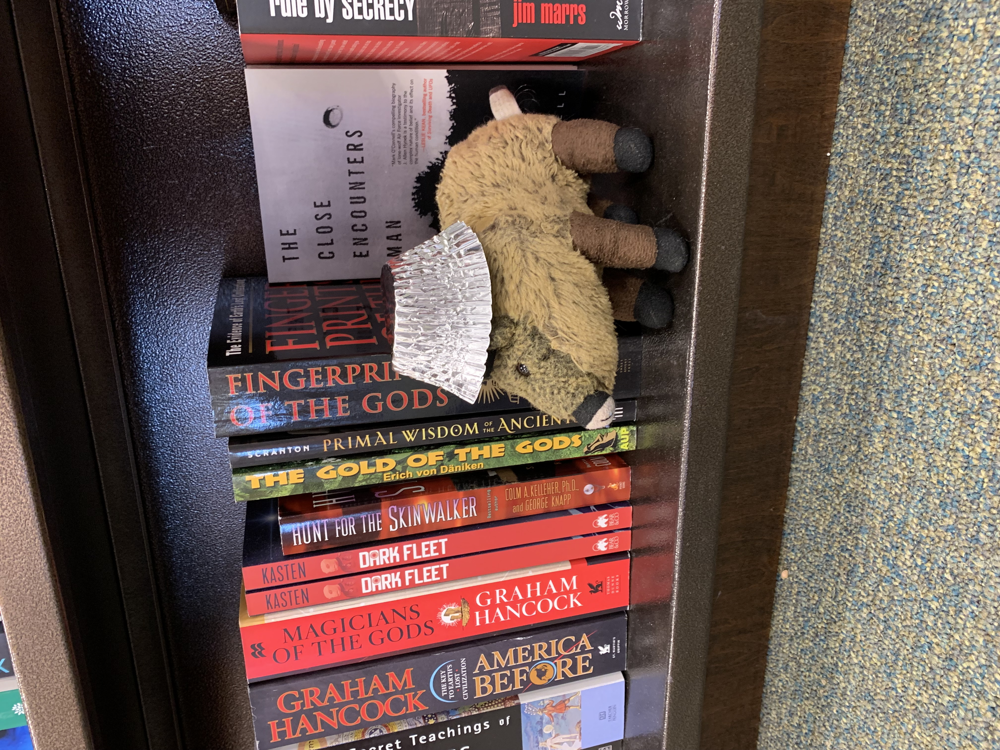
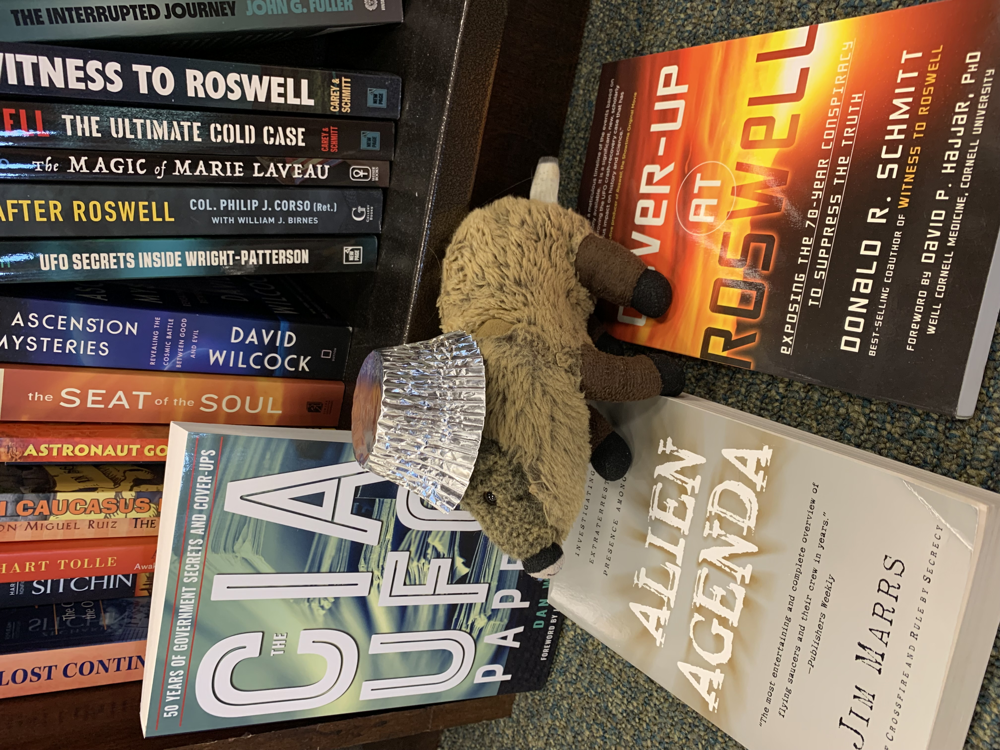
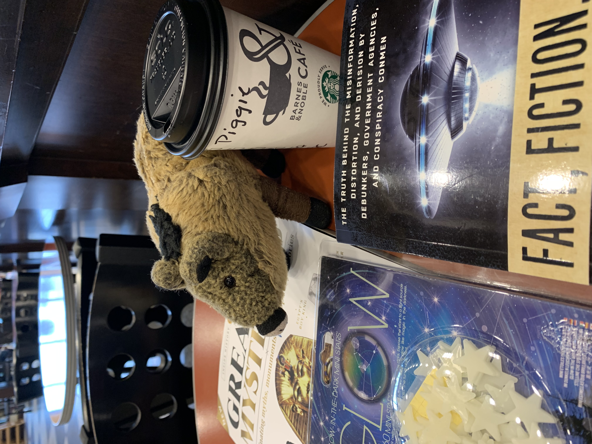
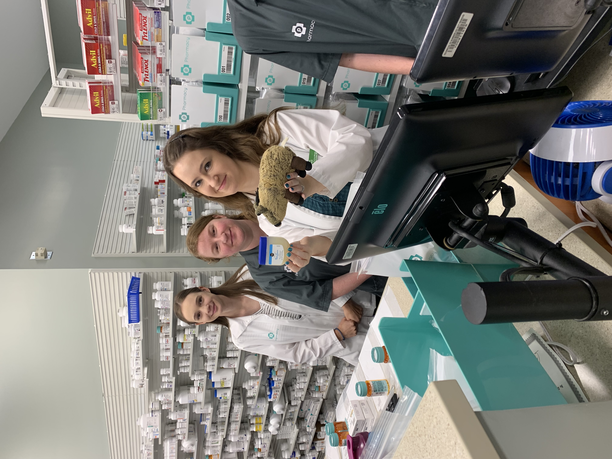
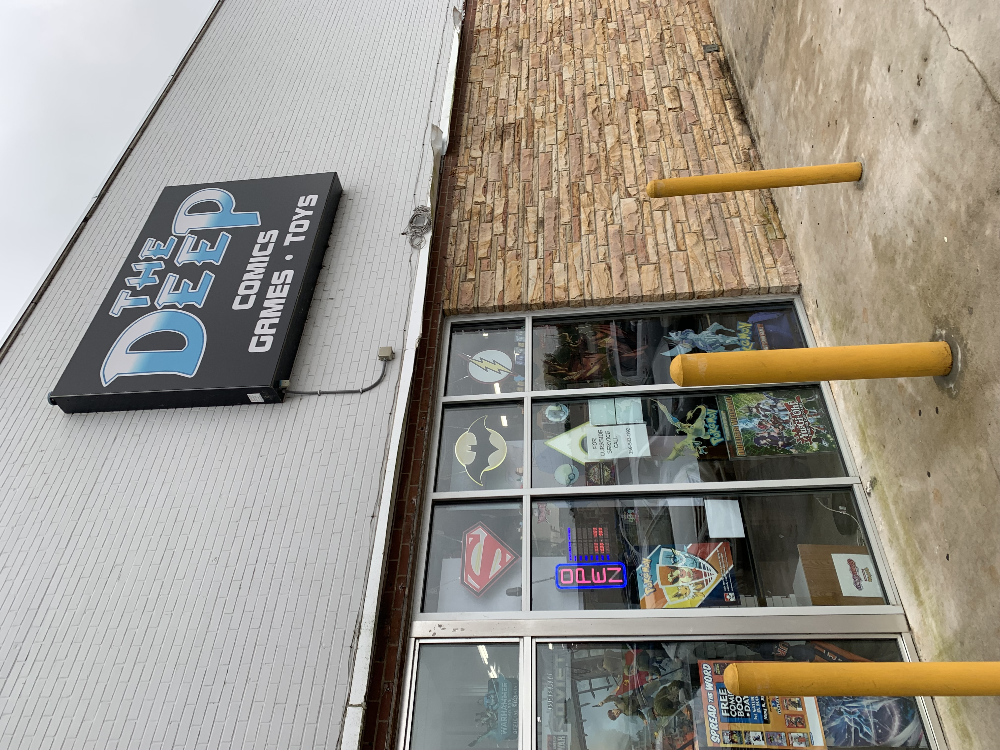
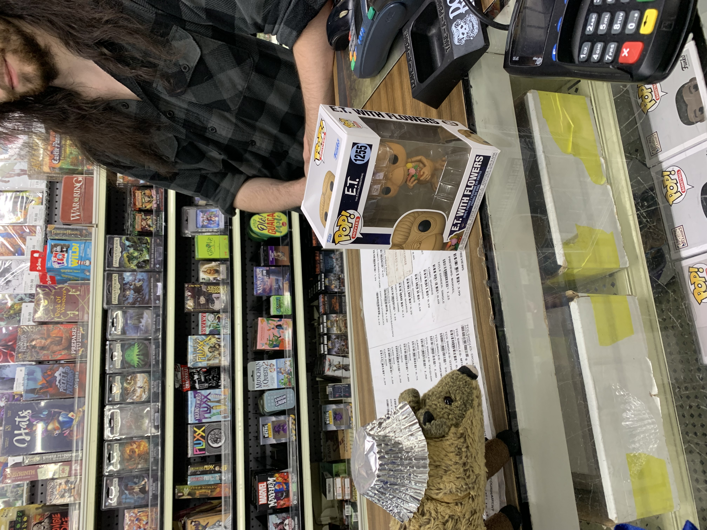
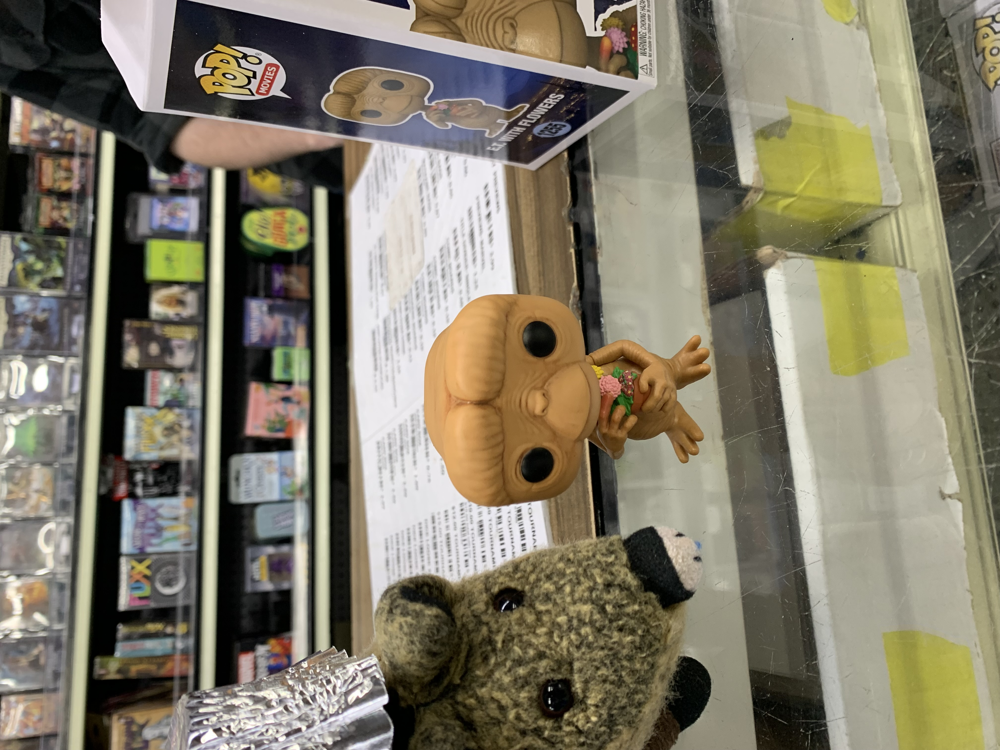
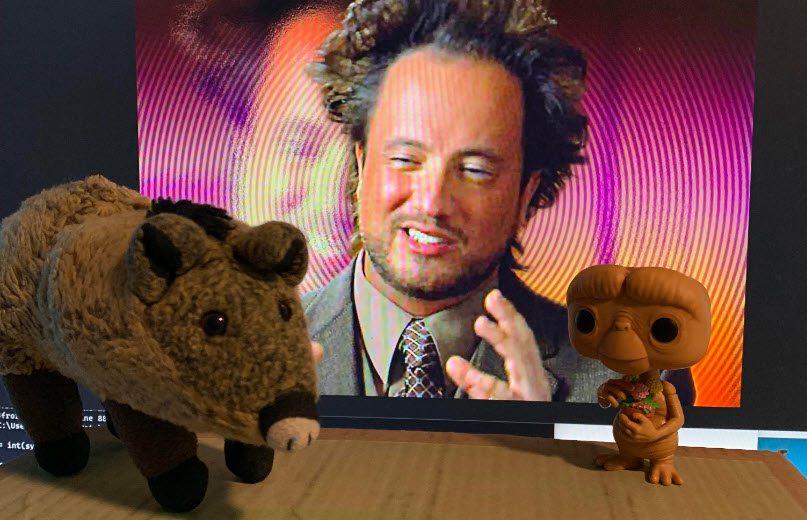
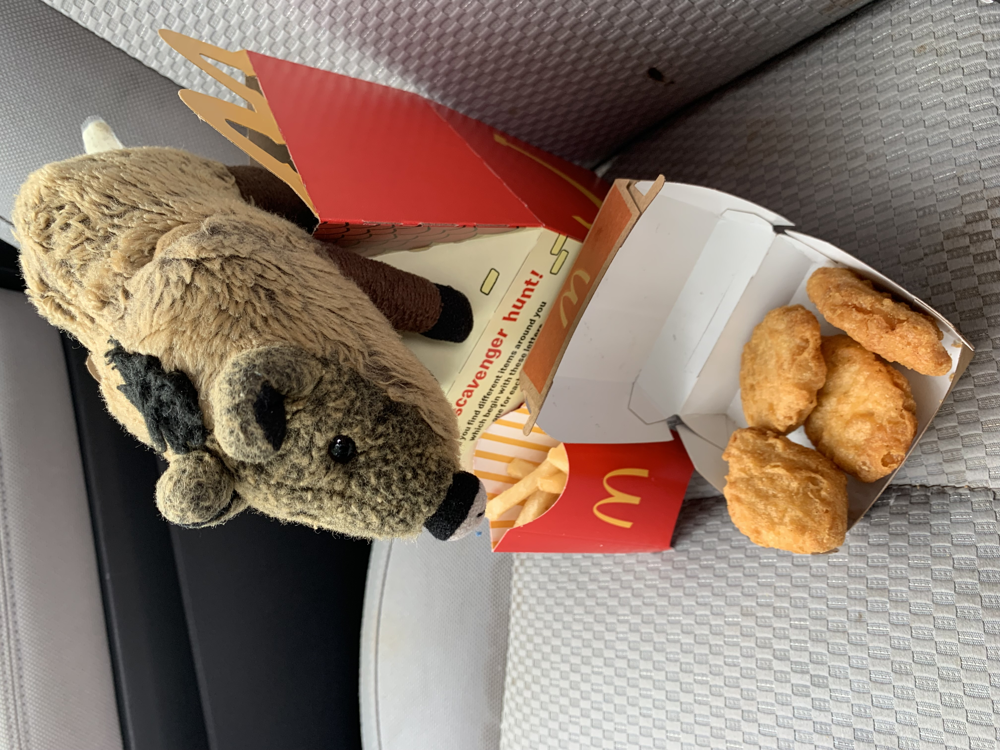

# UFOs and Aliens

> May 21, 2023

We watched youtube videos the other day, and Weird Al’s "Foil" came on.

I’m sure you’ve seen it. It starts out helping you keep your food fresh, but then it takes a darker turn into alien abductions and government conspiracy theories. One verse really got my attention:

```
Wear a hat that's foil-lined,
In case an alien's inclined,
To probe your [rump] or read your mind.

- Weird Al Yankovic
```

Piggies have "rumps," so I sing it differently than you do. But just who are these Aliens, and what do they want? Why the heck are they running around probing our rumps? If they really can read our minds, they know we really don’t like that!

Well, I decided to get to the bottom of all this (pardon the pun). Dad and I spent the day at the bookstore doing some heavy research.





There were SO many books to digest. I lucked out: the section I wanted was on the lowest shelf where I could get to it.

Do you like my sporty aluminum foil hat? Mom made that for me so the aliens wouldn’t read my mind and know I am researching them. If you want a hat but don’t have one yet, here is how to make one. First, get a pack of foil cupcake liners. Next, take one out and plop it on your head.

Then use the rest of the liners to make cupcakes. I recommend carrot cake with cream cheese frosting.

One nice feature of this particular brand of liners: they have a layer of paper on the inside for extra comfort, but they still block all alien brain-scanning rays.



Research is hard work! I took a break for some hot chocolate in the coffee shop.

I learned so much about the aliens and the coverups, but I still wasn’t sure if I had been probed or not. I decided to find out.



I visited my friends at the Publix pharmacy. They checked, assured me I had not been probed, and recommended some salve in case it ever happened.



Be careful if you research on the web. I found out there is so much misinformation and conflicting reports out there. I decided to interview a real alien and get the facts straight from the horse’s mouth.

I stopped at The Deep Comics to talk with the most famous alien of all: E.T.



Piggie: "Excuse me, Mr. T, can you answer a few questions?"
E.T.: "Please, call me E."
Piggie: "OK, E, what bought you to planet Earth?"
E.T.: "One word: CANDY. Specifically, Reeces Pieces. I just love peanut butter and chocolate, and these bite-sized morsels don’t leave chocolate on my fingers. I have long fingers, you know!"



Piggie: "Oh, I love those too, but you probably already knew that from reading my mind."
E.T.: "I can’t actually read your mind."
Piggie: "I know! That’s because I have this foil-lined hat on! But tell me, do aliens really probe rumps?"
E.T.: "Absolutely not! That idea is just conspiracy theory fodder advanced by pharmacies to sell petroleum jelly."



Piggie: "Mr. T … err, E, if you have a few more minutes, I’d like to invite a leading alien expert to join us on a Zoom call."
E.T.: "Ah yes, Giorgio A. Tsoukalos! Always a pleasure. Your hair is looking spectacular as always."



What an adventure I had today! I’m afraid I’m left with more questions than answers. But at the end of a long day of alien research, a McDonald’s Happy Meal is always the best answer!
