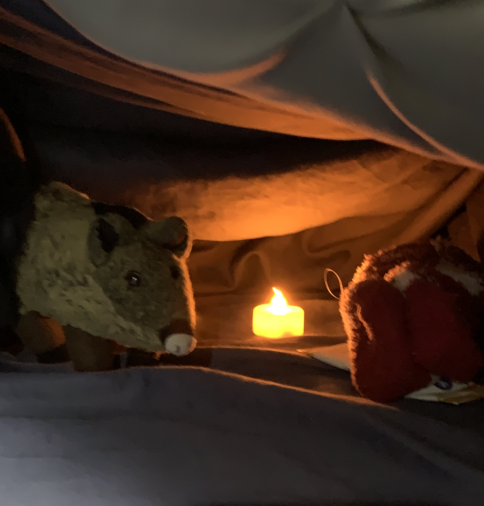
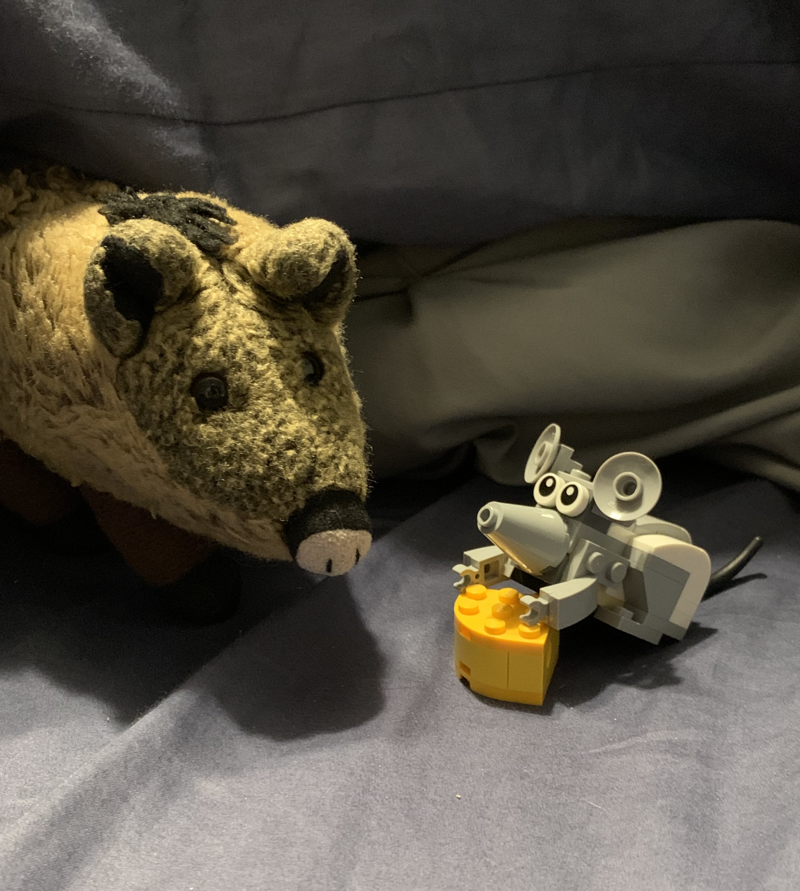

# The Cover Cave

> July 11, 2023

What are you doing out in this storm?

> ---

Come on in and get out of that weather! Let me hold the mouth of the cave open for you a bit — hurry in here. Wow! Just look at those trees shaking in the wind. Listen to that pounding rain and rolling thunder. But it’s nice and cozy in the cover cave.

I know what you are thinking: a cave is a cold, damp place. But this cave is special. I built it myself from the covers of this giant bed. I dug down to the soft and springy cave floor mattress and propped up the roof with pillows and folds in the comforter.

Don’t worry! It’s perfectly safe. Piggies are great cave-makers — especially on dark stormy nights like this.

And tonight, we have a particularly good cover cave.

Let me give you the grand tour.

Over here in the corner, we have a cozy campfire. Go ahead and warm your hands over the flickering flame. It’s just an LED candle, but it gives off a nice soft glow.

There are no wild animals living in this cave except for my friend Nibbles. He’s a cute little gray mouse who squeaks in from time to time — especially when there are snacks. Well, there are always snacks, but he really likes the cheesy ones.

Here, help yourself to the snacks. I have an assortment of free crackers from Jason’s Deli. We can share a pack if you like. One cracker is more than enough for me. And don’t worry about leaving crumbs. Nibbles will get those.

I’m not really sure where he goes. I think he lives in one of the many small tunnels at the back of the cave — on the other side of that giant foot.

Oh yes, that’s a live foot! If you watch it long enough, you might see one of those toes twitch. I know what you are thinking, but trust me: don’t bite those toes! I did one time and woke the monster that lives on the other side of the cave wall. See that far wall — see how it slowly rises and falls? That’s the Sleep Monster breathing, and that is its foot. If you wake the monster, it’ll grab you and put you into a deep sleep. We don’t want that!

We have to stay awake and guard the treasure. This cave has a wonderful treasure. It’s not money or jewels — it’s Mom’s red, fuzzy socks! She wears them on particularly cold nights. She doesn’t need them tonight, so I balled them up by the fire to keep them dry and toasty. We must guard them and keep them safe from the Sleep Monster! Although, I don’t think her sock will fit on that big old stinky foot. Hmm.

You stay here by the fire while I step out and check on the storm. Don’t worry, I’ll be fine. See those rustling trees? That’s just a box fan blowing on the curtains. I like to keep a big box fan running at night for the breeze and the noise. And look — it’s not even wet out here. The storm is just "Thunderstorm Sounds" playing on Alexa. See? She’s right up there on the headboard. Let me pull the cover back a bit so you can see …

Oh no! I woke the Sleep Monster! Here comes its giant hand! Everyone to the back of the cave as fast as you can!

"Night-night time, Piggie," the Sleep Monster whispers.

Oh no! The giant hand caught me! It’s pulling me into a snuggle. Anything but that — I can’t resist the dreaded snuggle. Sigh. But now that I think about it, I really am very tired. It has been a long day.

I’ll leave it to you, my new friend. Keep the fire going and guard the treasure. I’ll relieve you in the morning.