# Renaissance Faire 2023

> October 28, 2023

Time for the Alabama Renaissance Faire!

Chris is wearing his usual: the monk ensemble. I’m making a suit of armor. The chest plate is an aluminum can, and the helmet is a foil cupcake liner. Pig Knight is ready for battle!

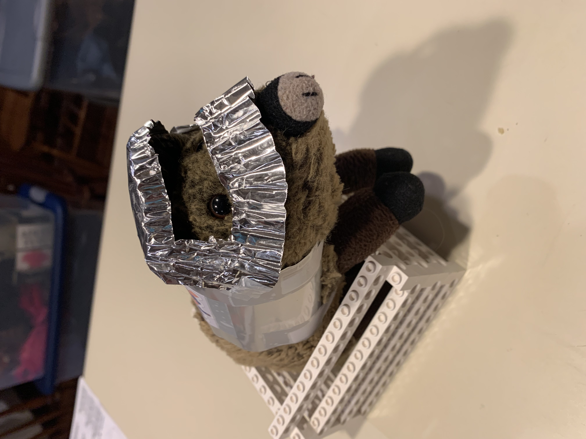

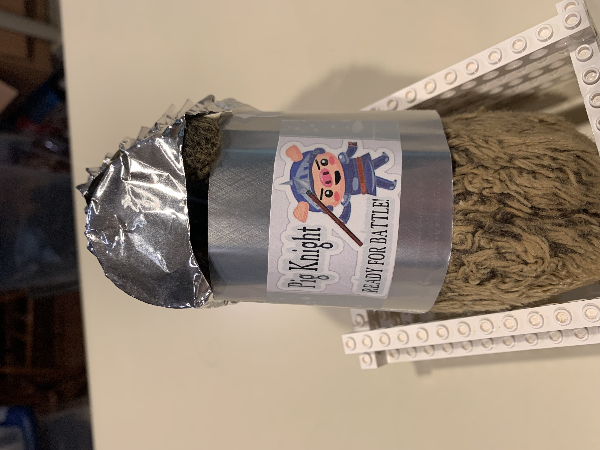

Here we are going into the fair. Chris’s reading glasses are definitely an anachronism. And monks don’t have wedding rings, but I kept my mouth shut:

Kids have fun walking around the fountain at the center of the park pulling these wooden ships through the water. But it is much more fun to ride on the ships!

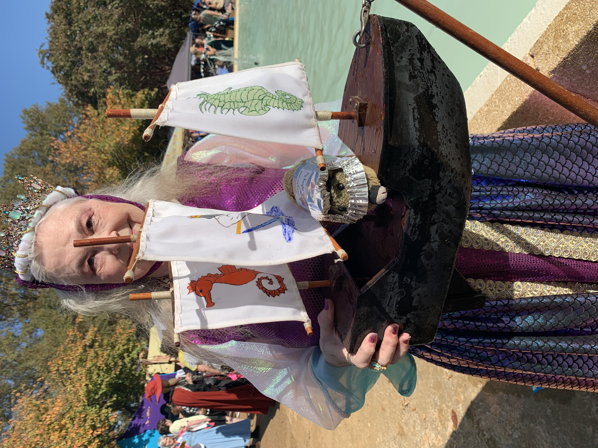

I got a little woozy on the tilting ball maze:

I met lots of interesting people at the fair.

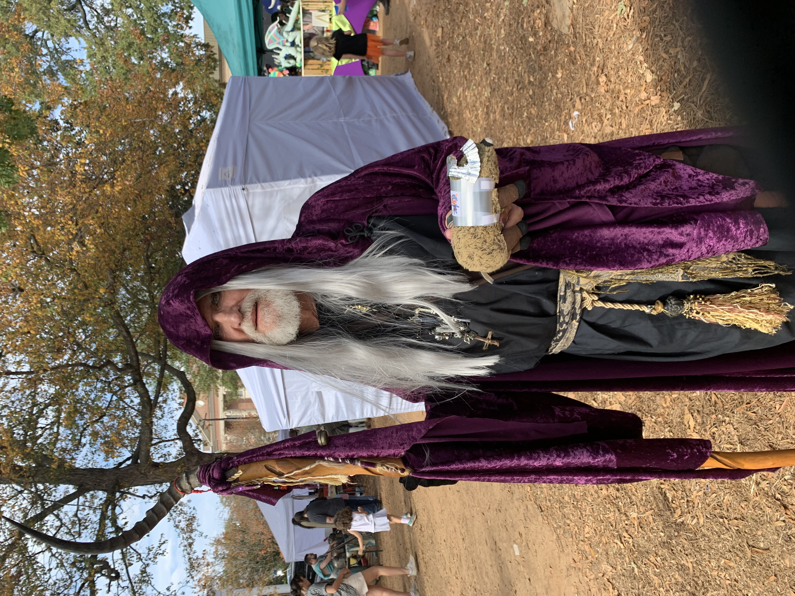

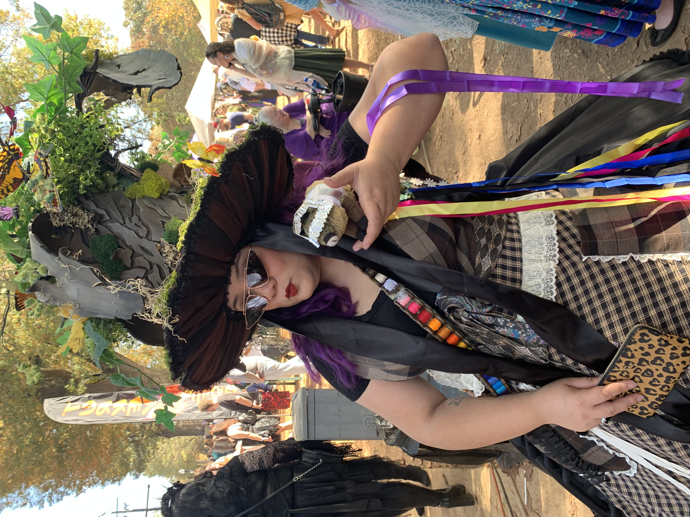

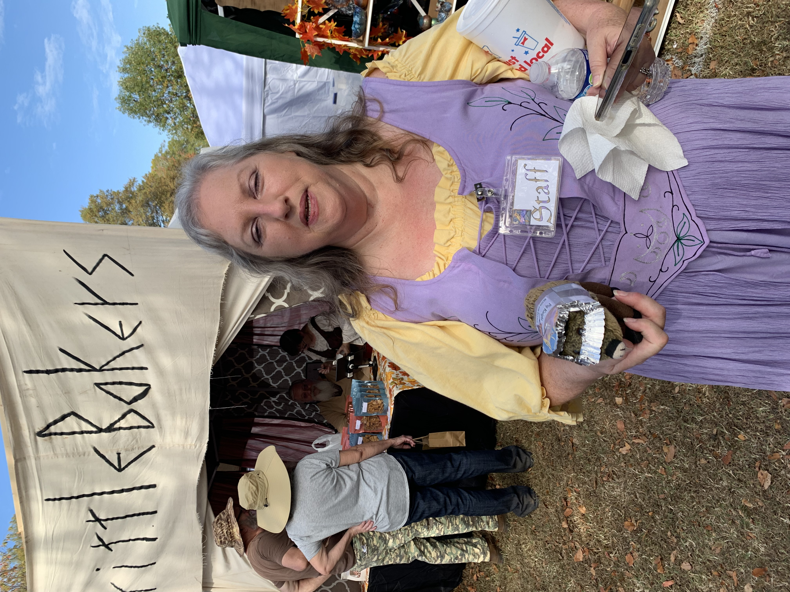

One guy wore a Mimic on his back. A Mimic is a fake treasure chest that bites you when you reach in. But I wasn’t scared.

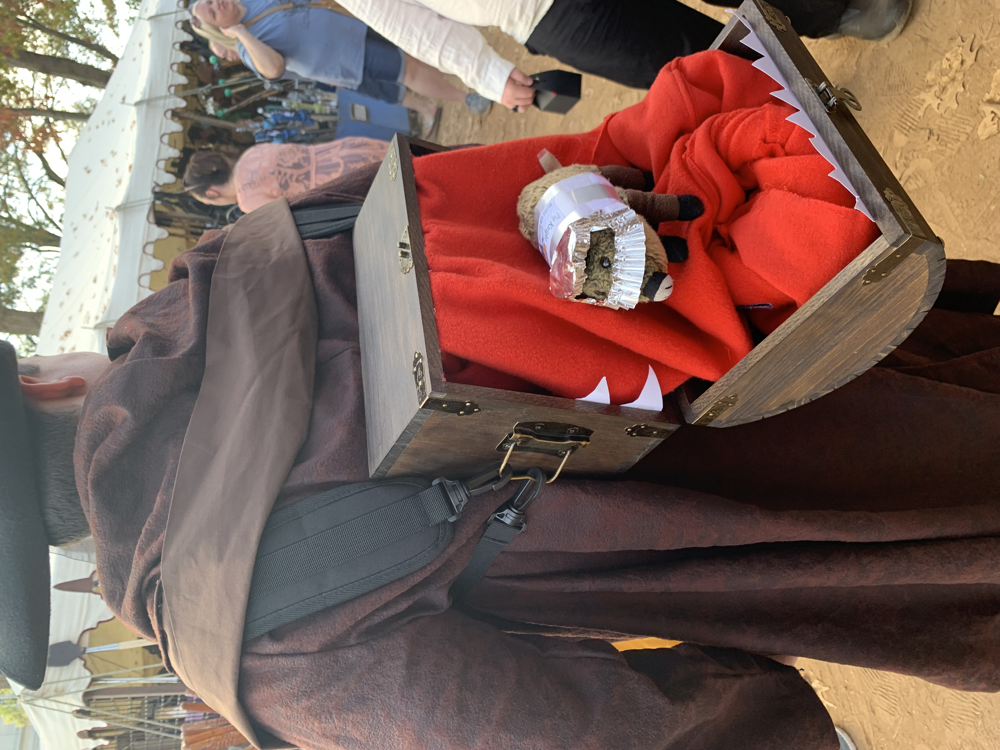

I hung out a little while with L.U.T.E. The Living Statue. She gave me a feather to wear on my helmet.

Then it was time for lunch. Chris and I shared a giant corndog and French fries.

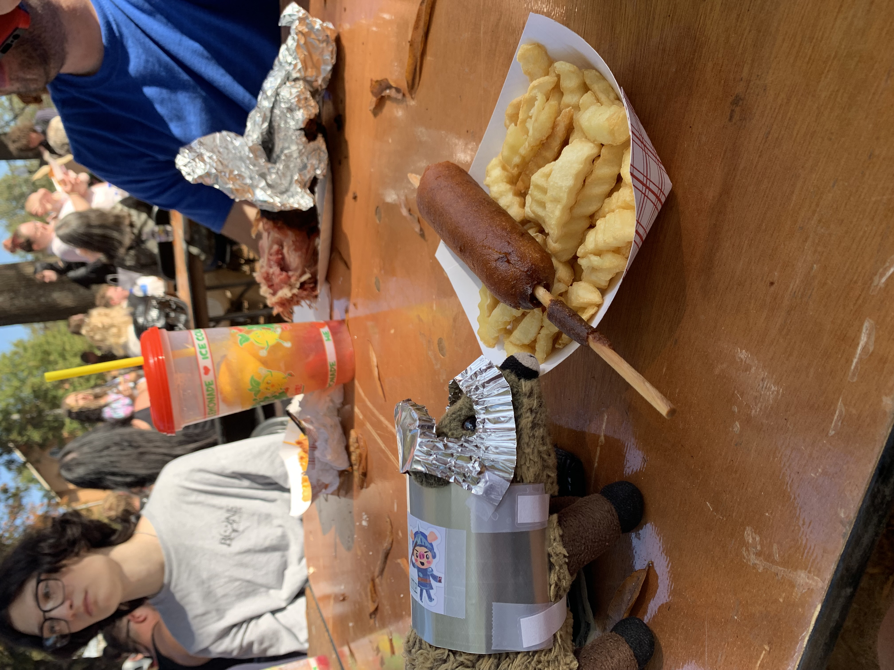

Then, I was off to meet some of my knight brothers. This guy went all out on his costume: cardboard and a McDonald’s bag. Let’s call him McKnight, The Greasy.

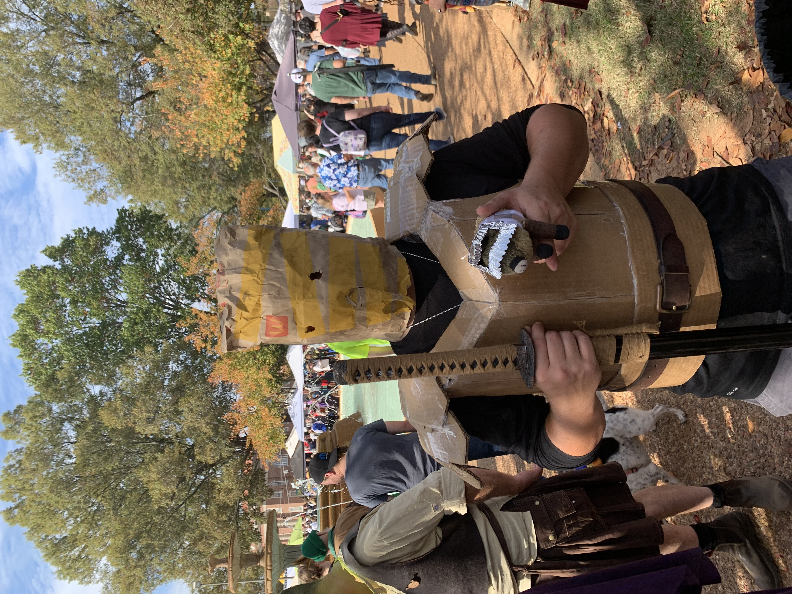

I did meet a real knight though:

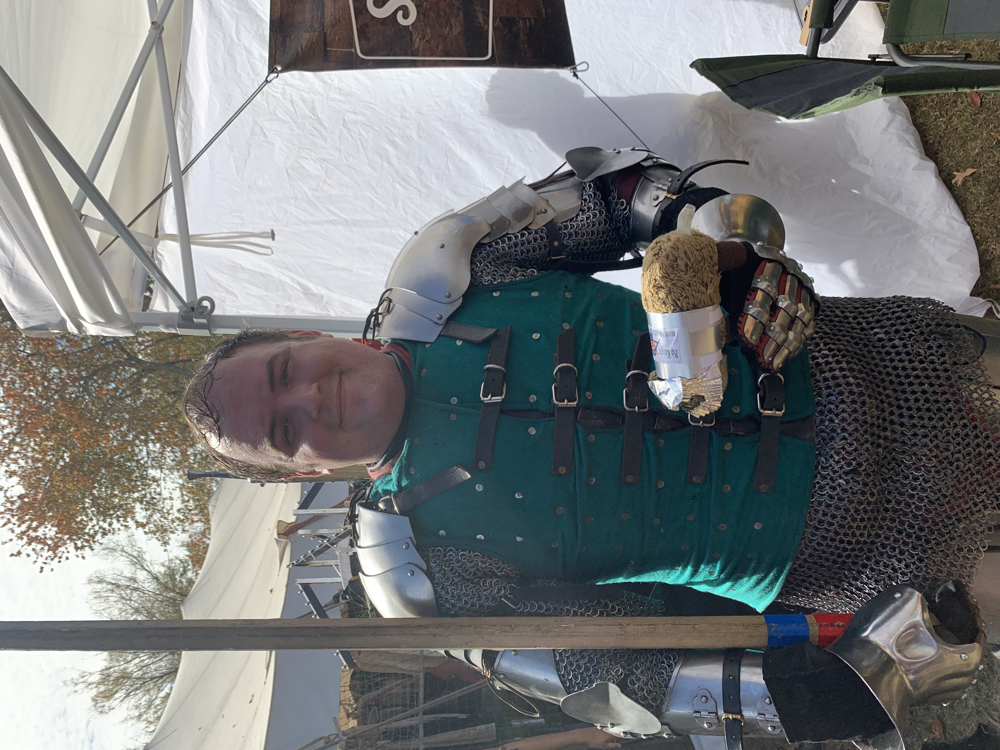

He got me thinking: I really need a sword to complete the look. First, I examined the wooden practice swords.

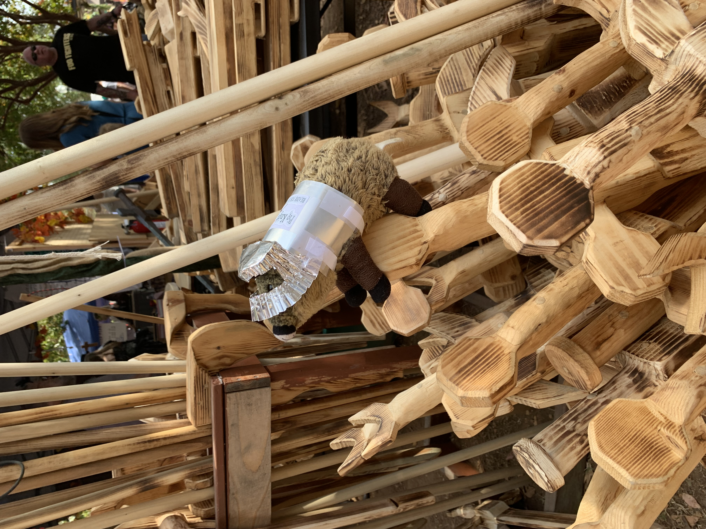

But forget that! I’m going for the real deal.

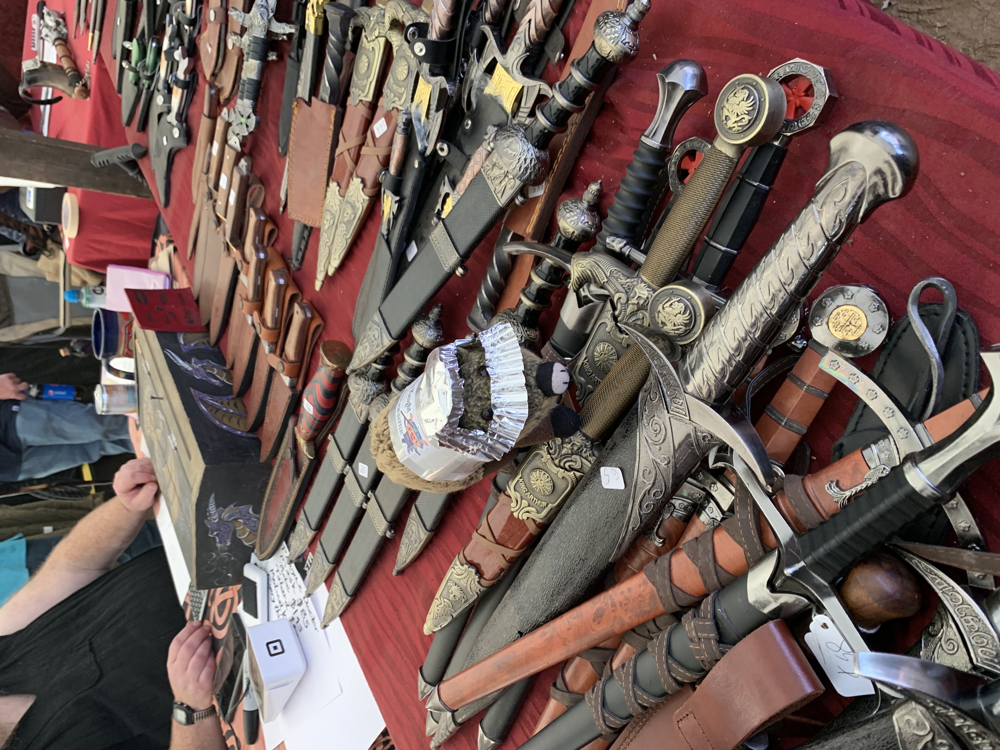

We rounded out the day with a big bag of kettle corn and a glass bottle of root beer. The bottle even has a real cork stopper! Now, somebody get a can opener and get me out of this costume!
