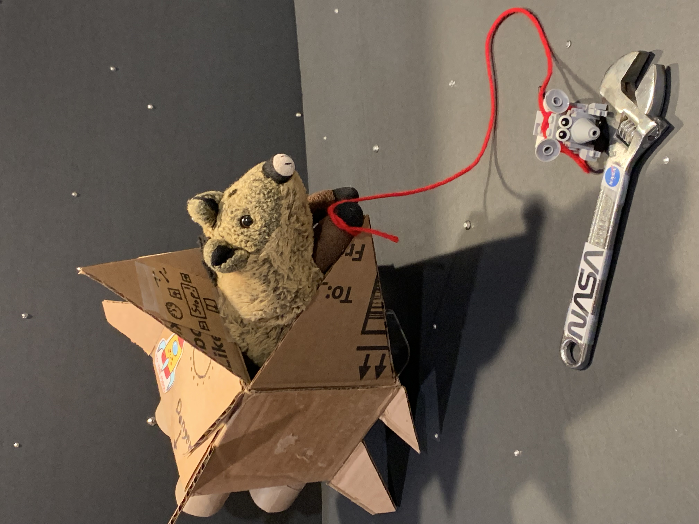
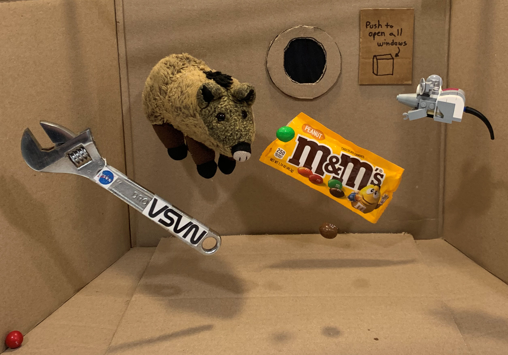

# Moon or Bust, 2: Interview From Orbit

> December 21, 2023

Hello, planet Earth!

This is Piggie and Nibbles talking to you from near-Earth-orbit on our way to the moon. We have a few minutes to answer questions before our scheduled transfer burn out of orbit. Are there any questions?

Good question: why did we stop in orbit? Why not head straight to the moon?

Even astronaut explorers have to work! We are here because NASA paid us to retrieve a tool someone dropped from the International Space Station. Specifically, they paid us in rocket fuel. And they waived the box of forms normally required when taking delivery of said rocket fuel.

Nicole Mann was outside repairing the bathroom plumbing when her specialized hi-tech tool slipped from her grasp and floated away. Our rocket is smaller, faster, and more maneuverable than the NASA rockets. We easily retrieved the tool before the crew had any potty emergencies.

Here, you see Nibbles on a spacewalk to retrieve the tool. Funny story: he asked me if we were sure this was the missing tool. But how many NASA tools could be floating around out here? One less, now.

Another question? Did we get to visit the ISS?

The ISS crew was relieved (literally) by our visit. They gave us a warm welcome! We got to tour the station, and they explained all the experiments they were working on.

Once we knew our way around, we joined their daily hide-and-seek tournament. Nibbles was a natural and won every round!

We sampled the exotic ISS cuisine at dinner. I thought it was delicious, but there were too many pouches and tubes for Nibble’s taste. Then it was off to bed. We were more tired than we thought. You use different muscles to float around in space — all those little core muscles for turning and catching yourself before you float into a wall.

We were worn out and bunked in the station’s observation module — the cupola. We fell asleep listening to classical music and watching the Earth turn beneath us.

I think we have time for one more question. Ah, great question! Does our busy schedule include time for snacks?

As you know, snacks are very important to Nibbles and me. We try to schedule four good snacking events every day.

We also use snack time for relaxation, fun, and games. Different snacks suggest different games. For instance, here you see us playing a zero-gravity game called "Bounce the snack off the wall to your friend." Nibbles invented this game, and there was a moment of panic when a Peanut M&M accidentally hit the "open the windows" button.

We scrambled frantically to close the windows again — not because of the air; neither of us requires air pressure. But all the snacks were floating out into space! That’s what we call a class-one red-alert emergency!

What’s that, Nibbles? Time for our burn? Well, Earthlings, that’s all the time we have for now. We are on our way to Christmas on the moon. Thanks for calling! Piggie and Nibbles from the SS Hominy — over and out.
