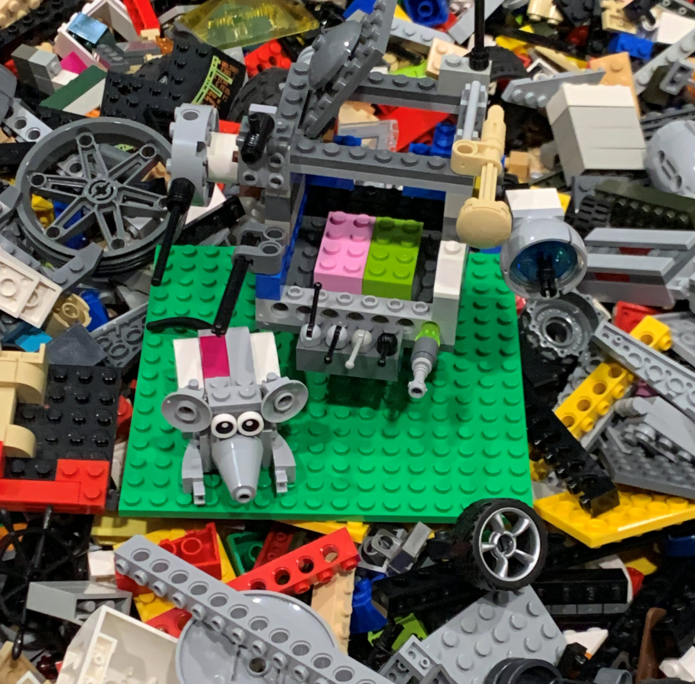
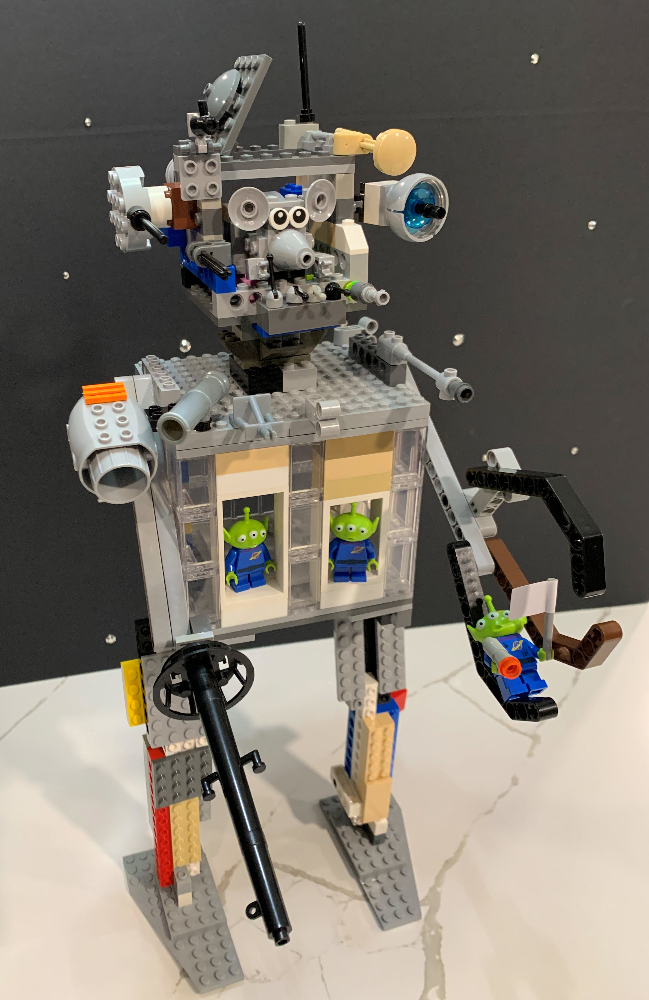
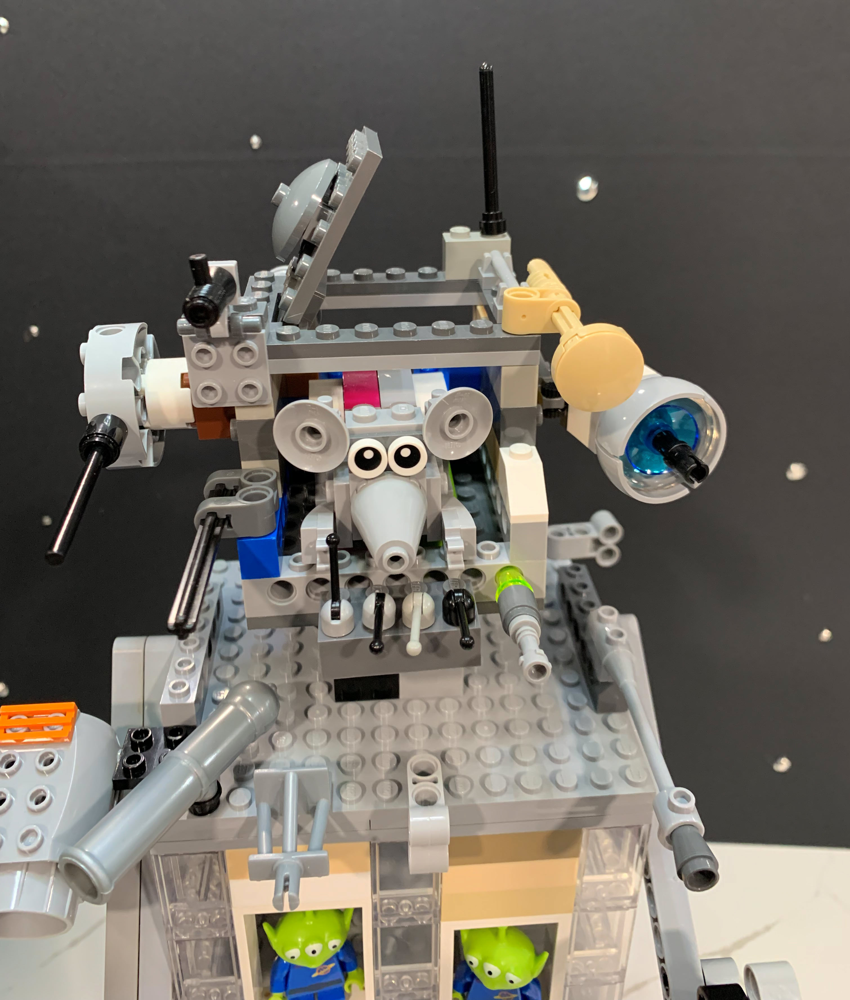
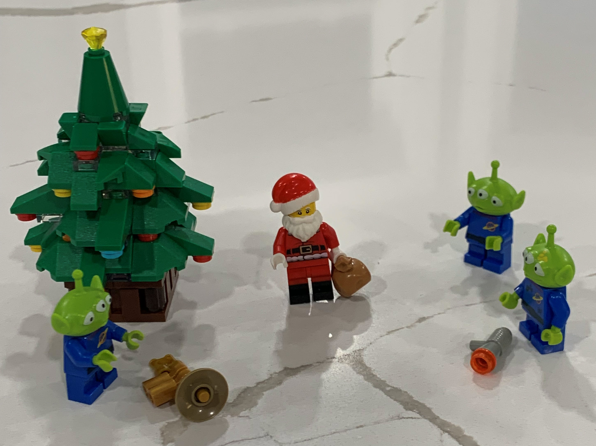
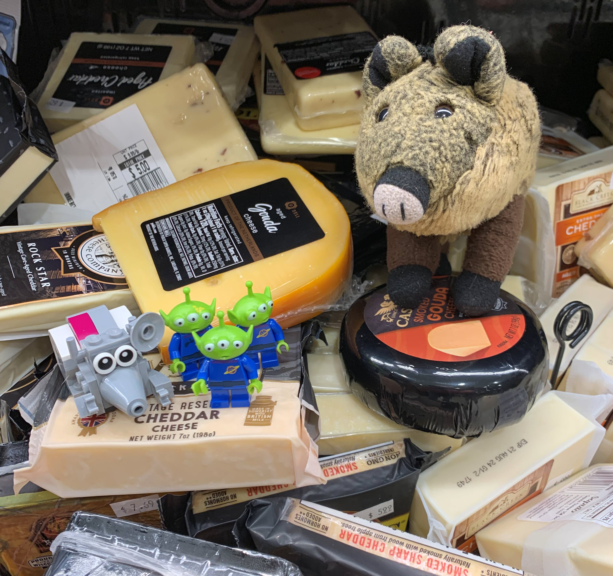
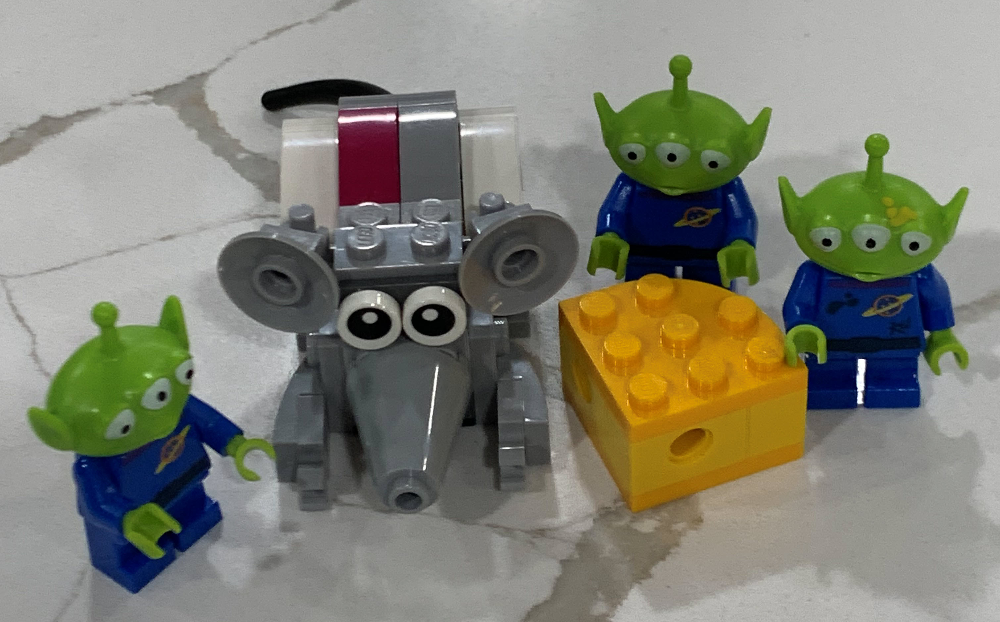
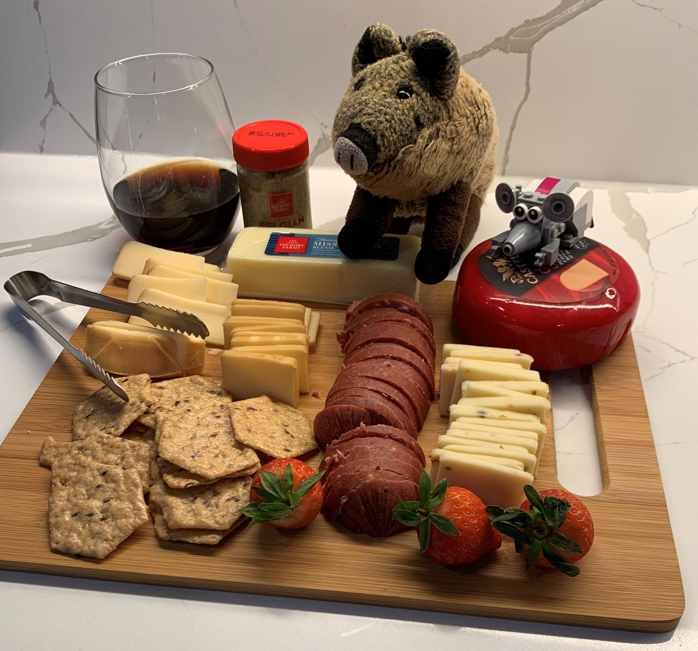

# Moon or Bust, 3: Aliens and Cheese

> December 23, 2023

Captains Log, star date December 23, 2024.

> ---

While on a routine mission to determine the moon’s composition, Nibbles and I detected strange green and red flashes of light near the moon’s North Pole. We have altered our course to investigate.

If you have never been to the moon, let me describe it for you. It is dirty white with splotches of black and gray. There are black and gray mountains surrounded by rolling hills and gaping craters that are — you guessed it — black and gray.

There is the occasional black-and-gray giant boulder, the more frequent black-and-gray rock, and a covering of pebbles and dust. These are gray and black, just to mix things up. And that is the moon, from horizon to horizon, as far as the eye can see.

Oh, and we are seeing one spectacular red and blue castle smack dab in the middle of a two-mile crater near the North Pole! The crater floor all around this castle is as white as … snow?

“Nibbles, is that snow?” I asked.

“That’s what the sensors say,” Nibbles read from his computer screen. “Frozen water as packed flakes. But those are NOT trees. Those are giant candy canes!”

A forest of lime-green candy canes surrounded the castle. The two foot-thick trunks poked out of the moon’s soil at random angles. Each “tree” had a color stripe of orange, purple, or yellow.

“And that,” Nibbles pointed, “is where the light flashes are coming from.”

A sleek, silver flying saucer sat on the crater rim facing the castle. The center of the disk was as plump as a house, but it tapered off to a razor-sharp edge all around. A blue smoked-glass dome pulsated slowly at the center of the saucer. One edge of the saucer hung over the crater wall. Underneath the saucer, all along the rim, was an army of three-eyed green aliens. Each was armed with a massive laser gun. Each alien poured green laser fire onto the walls of the castle.

All around the castle ramparts, laser turrets answered the alien fire with blazing red bolts. These bounced harmlessly off the saucer’s shiny skin.

The radio crackled with static. “… you … hear me? Piggie … can you hear me?” A deep voice echoed through the ship. Nibbles worked two big knobs on the radio console to clean up the signal. “I was afraid you wouldn’t make it in time! Ho, ho! Join me in the clearing in front of the castle!”

As we made our way down to a small clearing, a candy cane tree exploded below us. The green laser fire bounced harmlessly off the castle, but it was turning the forest into candy powder and charred black stumps.

A smaller flying saucer roared around us and splattered the castle’s double door with a green ball of energy. With a loud creak, the metal door flexed inwardly. It shuddered and strained for a second. It held, but it wouldn’t take many more blasts like that.

Another small craft zoomed around us, chasing the saucer. No, it wasn’t an aircraft — it was a deer! It was a flying reindeer with two elves riding on its back.

The rear elf pointed a laser cannon at the saucer and fired a red laser bolt. The saucer dodged to the left, but the lead elf pulled hard on the reins to follow. The gunner elf waved to us as they zipped out of sight.

Nibbles landed the Hominy between the castle wall and a large boulder, and I rolled the main hatch open. For a moment, gray and black dust blew into the ship, but the engines soon powered down. Then, all was silent. I looked at Nibbles, laughed, and hopped through the hatch to the dirt below. I began to scratch and dig playfully, my inner piglet taking over.

“First Piggie on the moon!” I shouted back at the hatch, but Nibbles was already beside me, tasting a fist full of dirt.

“Blech!” He spit dust. “This is definitely not cheese!”

The huge castle door groaned open a few feet, and a tall man in a red suit stepped out into the clearing. He wore black boots, a fur-lined red hat, and white gloves to match his thick, white beard. Nibbles and I needed no introduction; this was Santa Claus.

“Piggie and Nibbles! I need your help! The aliens are attacking the castle!”

A large reindeer emerged from the castle. His nose looked like a red lightbulb, and it blinked on and off angrily. He whispered into Santa’s ear.

“Rudolph says a large army of aliens is approaching from the forest. They’ll be here any second.” No sooner had he spoken than a green laser bolt whizzed over our head and exploded into the castle wall.

“Quick,” Santa shouted, “into the castle!”

The door began to close, and we scurried inside, dodging green blasts that powdered the snow around us. With an echoing slam, the door closed and latched. We listened to the muffled explosions of lasers on the other side.

“That should hold them for a few minutes,” Santa said, “but then they’ll soon be on us. Piggie, I’m out of ideas. Can you help us? What can we do?”

I thought for a minute and asked, “What do they want?”

“This is the Lego factory where all the cool Lego sets are made, ho ho!”

Santa gestured for us to turn around and take in the giant room behind us. Huge piles of Lego bricks covered the enormous room. Conveyer belts moved all around the room, carrying elves past each pile. Each elf had a checklist and a green bag. As the belts moved, the elves dove into the Lego piles to retrieve specific bricks. They dropped the brick in their bag, checked the parts off of their list, and rode the belts to the next pile.

“Rudolph thinks they want our Mindstorm robotics parts. The Mindstorm kits are packed with considerable technology. Rudolph thinks the aliens could build an army of robots and take over the universe! We have to stop them!”

This gives Nibbles an idea. I recognize his deep-thinking mode. His ears twitch, and his gaze darts rapidly around the room. He’s too excited to speak clearly; he squeaks rapidly at me and points around the factory. I translate for Santa.

“You see, Nibbles is made of Legos. And he is what you would call a Lego Master Builder. With your permission, he’d like to borrow some bricks to build a …” I squint at Nibbles. I don’t think I heard him correctly. “He wants to build a device of some sort to fight the alien invaders.”

“Ho! Nibbles, the place is yours! Help yourself to whatever you need!”

Nibbles dives into the nearest pile of Legos and emerges with several Lego motors. He sets those aside and dives back in for several long technic beams.

Soon, he is a little gray blur running from pile to pile. The giant room echoes with the sound of shuffling Legos and parts snapping together. A cloud of bricks and dust conceals whatever he is making, but one thing I know for sure: it will be gigantic!

With a final furry of banging, the room fell silent except for the muffled laser blasts outside the door. Then, a long Lego leg stepped from the settling dust cloud. I craned my neck upward as the rest of the giant Lego robot moved to stand over us.

The robot was humanoid, with two legs and two arms. The left arm lifted, and a giant three-finger claw opened and closed like some terrible jaw. In place of a hand, the right arm was tipped with a black laser cannon.

The robot’s torso was a large cage made of clear bricks. The cage had two open doors, the perfect size to stuff aliens through.

At the very top of the robot was a box-shaped head crowned with antennas and laser guns pointing in all directions. And there, sitting in the middle of the robot head, was Nibbles, the master robot builder. His tiny hands worked the lever controls in front of him, and the robot gave us a thumbs up as best it could with three fingers.

The Nibbles Bot stepped over us and pushed forward. Santa was stunned into silence, but I yelled, “Open the doors!”

The giant doors parted again, revealing a squad of five three-eyed green aliens, each holding a deadly laser gun. They started through the door and froze when they saw Nibbles Bot towering over them. One alien raised his gun and fired a shot into the robot’s abdomen. The green bolt bounced harmlessly off the sleek plastic Legos. Nibbles Bot reached down with its claw and snatched the alien from the ground, shoving it into the robot’s clear chest cage.

Another alien fired. Nibbles Bot stuffed the second alien into the cage. Then the bot stooped to grab another invader, but the middle alien dropped his gun and stepped forward with his hands up.

“We surrender,” cried the squad leader. “Call off the creature!”

The remaining aliens laid their weapons on the ground, and Nibbles Bot took a step back. I followed Santa as he approached the invaders.

“Why? Ho, ho, why have you attacked us? Why do you want our Legos?”

“Legos?” The leader spoke. “You mean all these plastic blocks? We have no interest in your toys.”

I started the introductions. “This is Santa Claus, and I am Piggie. We are from the planet Earth. If not the Legos, then what do you want?”

“My name is Borelium. I am the leader of planet Tulia. We were returning to our home world after exploring the Andromeda Galaxy, but we ran out of food. Our sensors detected an abundance of coagulated-dairy-product on this moon. It is a delicacy on my planet. My crew is starving … we stopped for food.”

Nibbles climbed down from the head of Nibbles Bot. He opened the cage doors and released the two captives. They all climbed down and joined the gathering.

Santa thought for a moment. Then his eyes lit up. “Coagulated dairy product? Ho ho ho, you mean cheese! Yes, we mine and package cheese here for the people of Earth!”

I asked, “You MINE cheese?”

“Why, of course! Everyone knows the moon is made of cheese! But it is deep under the surface, covered by rock and dust.

I tried to avoid Nibbles’ stare. He whispered, “I told you so!”

“Ho ho! Why didn’t you just ask us for food in the first place? We have plenty of cheese! You are welcome to all you can carry!”

The aliens looked at each other, confused. Finally, the leader spoke.

“You are just giving the cheese to us? In all our galactic travels, we have never encountered a friendly planet.”

He gestured to the army of fifty aliens making their way to the castle door. They had heard the surrender. None of them carried weapons.

“We’ve always had to fight for what we need.”

“Well, Borelium, you will find Earth is a friendly planet with generous people. Let me prove it!” Santa directed his voice to the army at the door. “Come, my friends. Everyone grab a bag and follow me to the cheese room!”

The elves worked through the crowd, handing out green bags. I looked for Nibbles. He was close on Santa’s heels, and he was dragging two empty bags.

Santa’s cheese vault was a walk-in two-story wooden pantry lined with shelves of cheeses wrapped in plastic. Nibbles darted from shelf to shelf, selecting various cheeses and dropping the packages on the floor below. “OOOO! That’s a nice Gorgonzola! Nooo … not the Asiago … Wow! Look at the creaminess of this Camembert!” Nibbles chattered excitedly, and we waited on the floor below for the cheese rain to subside.

At last, Nibbles hopped down to the pile of cheese he had made in the middle of the room. The aliens moved in and began filling their bags. Nibbles handed them selections of his favorites and gave them culinary instructions: “Now, this one pairs nicely with a rich grape Kool-Aid. That one is best served cold with fruit of some kind. Do you have fruit on your planet? If you carve pips into the cheese blocks, they will stack better on your ship — kind of like Legos.”

That evening, we had a giant cheese buffet. Then everyone—aliens, elves, mice, and piggies—helped load Santa’s sleigh with Legos and cheese. All three craft left the moon at the same time. The flying saucer turned for deep space, but the aliens had promised to return with cheese samples from their own planet. Santa waved bye and pointed the reindeer towards the North Pole of Earth.

“Nibbles, set a course for home!”

This is Nibbles and Piggie checking in one last time from Earth orbit. It’s good to be home. Do you have any final questions?

Ah yes. The question is: what about Walter at mission control? Don’t worry about him! We are stopping by his home with a special bag of cheese Nibbles packed just for him.

Another question. Do we have cheese left? Ha! I think we have enough cheese for the rest of our lives, but Nibbles disagrees. In fact, you should join us for dinner tonight. If you’ve never had cheese fresh from the moon, you are in for a treat. We’ve made a lovely board of meats, crackers, and cheeses.

And think you’ll agree that Nibbles and I put the CUTE in charcuterie!

