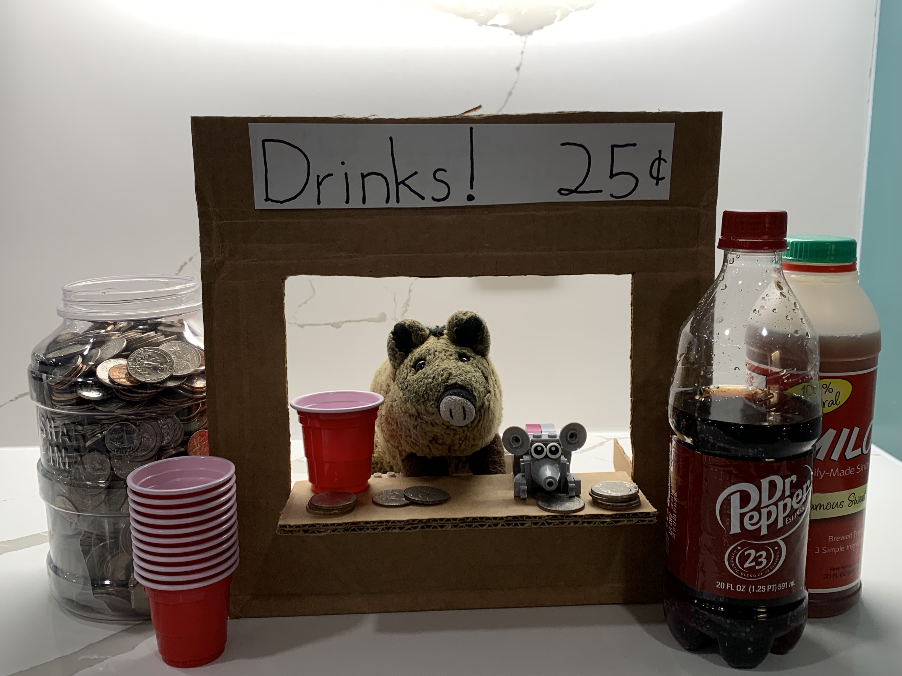

# Drink Stand

> February 11, 2024

Ice cold drinks for only a quarter!

Renovations are complete on the new kitchen, and it looks great! We have new floors, new appliances, and lots and lots of counter space. Nibbles and I celebrated the grand opening by putting up a drink stand on the island in the middle of the kitchen.

Our drink selection is limited, but so is our clientele; we only have one customer, the Big Guy, who only wants Dr. Pepper and sweet tea.

Our stand is strategically placed on the path between the TV room and the bathroom. He can’t pass by without buying something. We raked in a fortune on Saturdays during college football season. The Piggie bank is almost full!

We started with only Dr. Pepper, but Mom asked us to add sweet tea to the menu. She buys the tea for us as long as we secretly mix the sweet tea and unsweetened tea — half and half. The Big Guy is none-the-wiser; Nibbles and I are all the richer. Let me do the math for you: that’s 100% profit.

The Super Bowl is tomorrow night. Nibbles suggested we add hot chocolate to the menu with an additional charge for mini marshmallows. I sent a text message advertisement to the Big Guy, reminding him to get a roll of quarters from the bank!

Getting the dark chocolate mix was MY idea! Mom can’t pass up hot dark chocolate, and we give her free marshmallows because she smiles and scratches our heads.

Speaking of marshmallows, we are running low already. I think Nibbles is sneaking them when I’m not looking. And what is that he’s building at the other end of the bar? Is that a “corn chip” stand? On, no! There goes my allowance.