# Safari

> April 21, 2024

This weekend was the first annual Hot Dot Trot!

> ---

It was a three-mile fun walk fundraising event for my grandmom’s foundation: the Dottie Shealy Ministry Foundation. We rented a giant Chevy Tahoe to carry all the supplies to North Carolina. Nibbles and I turned the center console storage area into a spacious fort, which was comfy, but we were happy to see the hotel room late Friday night.

Mom and Dad kept calling the Saturday event a “fun walk,” but with all the animals we saw, the day was more like a safari! First, we met a nice zebra and a giraffe.

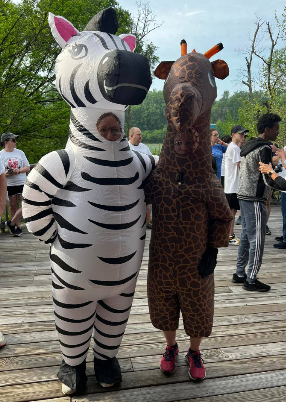

Other people were fooled, but not me! I recognized those pink shoes right away! That’s Mom’s sister, Aunt Susan. And if Aunt Susan is here, it means my brother Walter came with her from California!

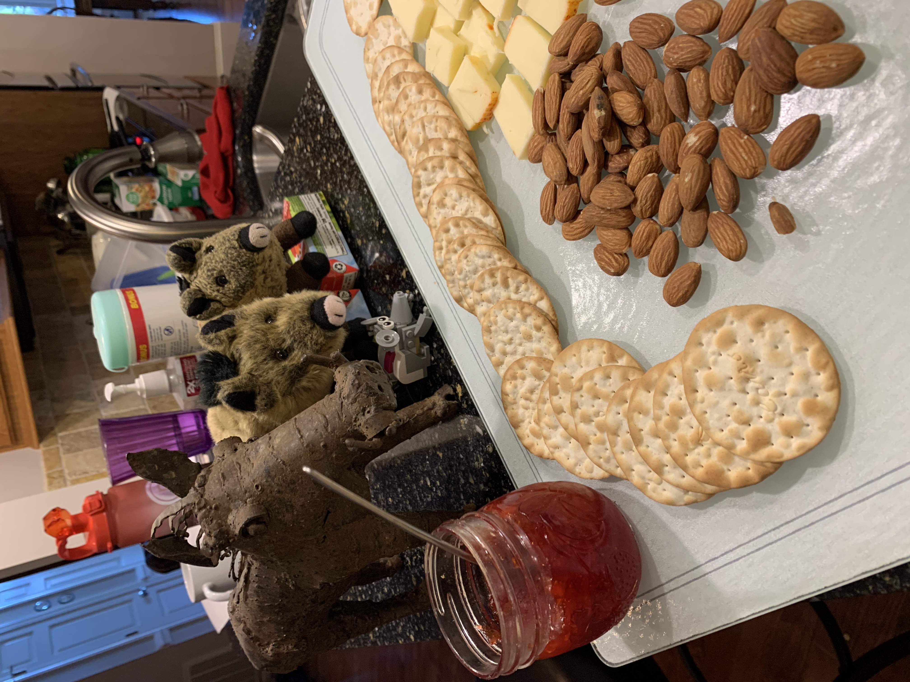

We had quite the reunion party that afternoon. Walter sliced the cheese we had brought him from the moon. Nibbles and I laid out the crackers and jam. Dexter brought the almonds. Dexter is a warthog who lives with Stacy’s dad. Dexter is from Kenya. He told us about Africa and the spicy, exotic corn dishes they make. I listened to his cool accent and drooled a little.

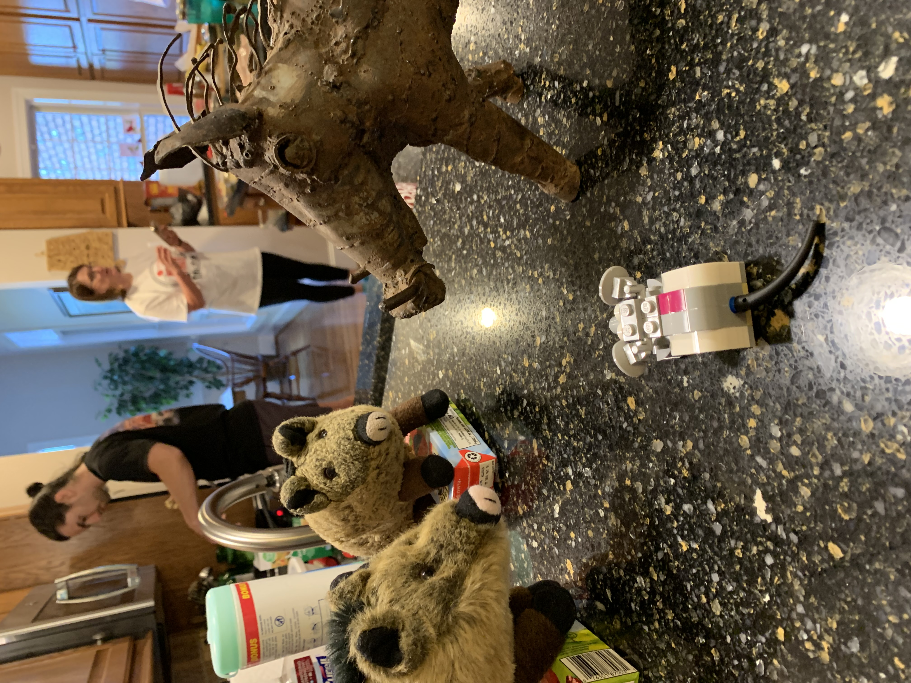

There were other animals from Africa living with Stacy’s dad. Nibbles chatted it up with a Lego monkey and a Lego alligator.

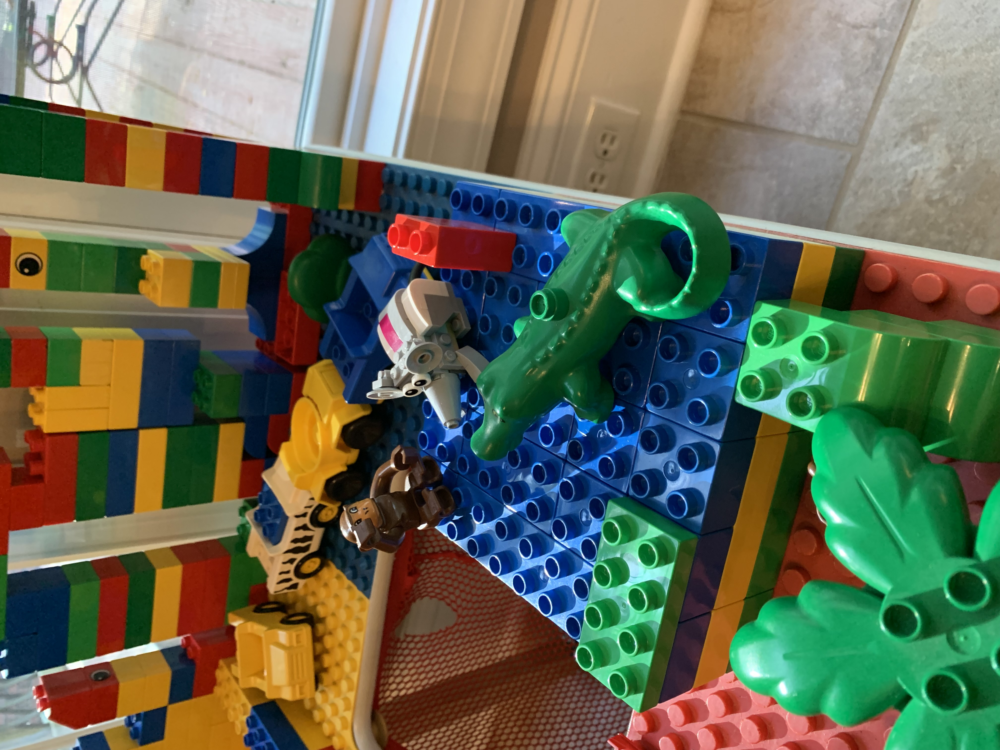

Nibbles called us together for a biology lesson. He told us about DNA and the circle of life. Even plastic Lego animals, he said, are made from petroleum. Petroleum is the remains of microscopic plankton-like organisms that lived in ancient oceans …

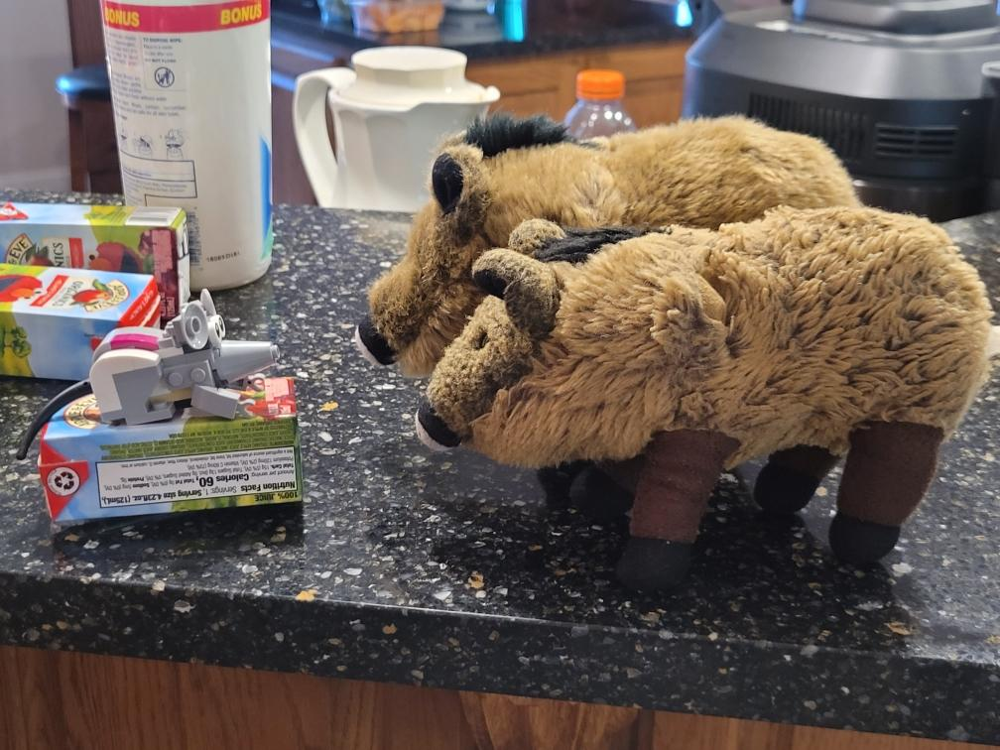

It was here my mind drifted. I should have paid attention, but I couldn’t stop thinking about the juice box he was sitting on.

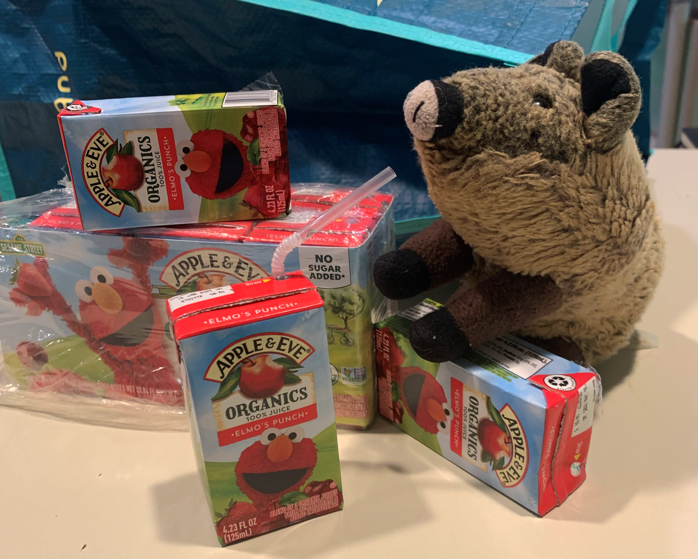

Mmmmmm! Here’s a lecture I can focus on: Elmo’s Punch! It’s a delicious blend of juices from concentrate with no added sugar — and just my size!

There was one more animal that Walter and I wanted to investigate. We waited for the scary Frank beast to fall asleep. Then we sneaked in for a closer look. Walter wanted to bounce on its stomach, but I reminded him of the wiener-dog protector that would chew us to shreds.

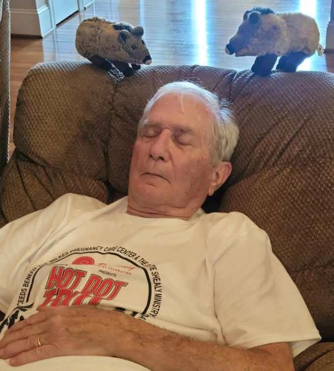

We packed up the mobile fort Sunday morning and headed back to Alabama. But there was one more animal to see. We stopped at Buc-ee’s truck stop to get our picture made with Buc-ee Beaver.

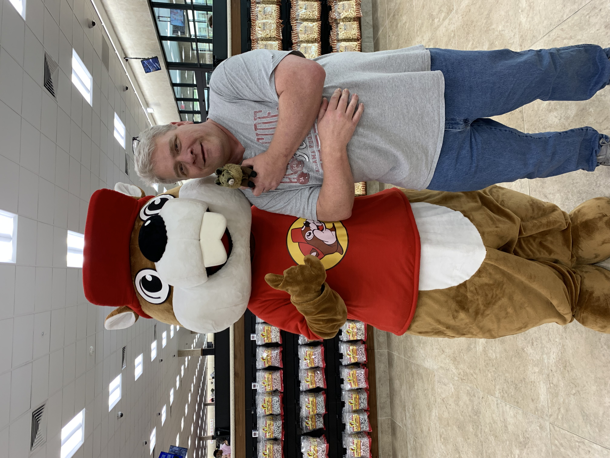

Mom said everyone had to go to the bathroom while we were there.

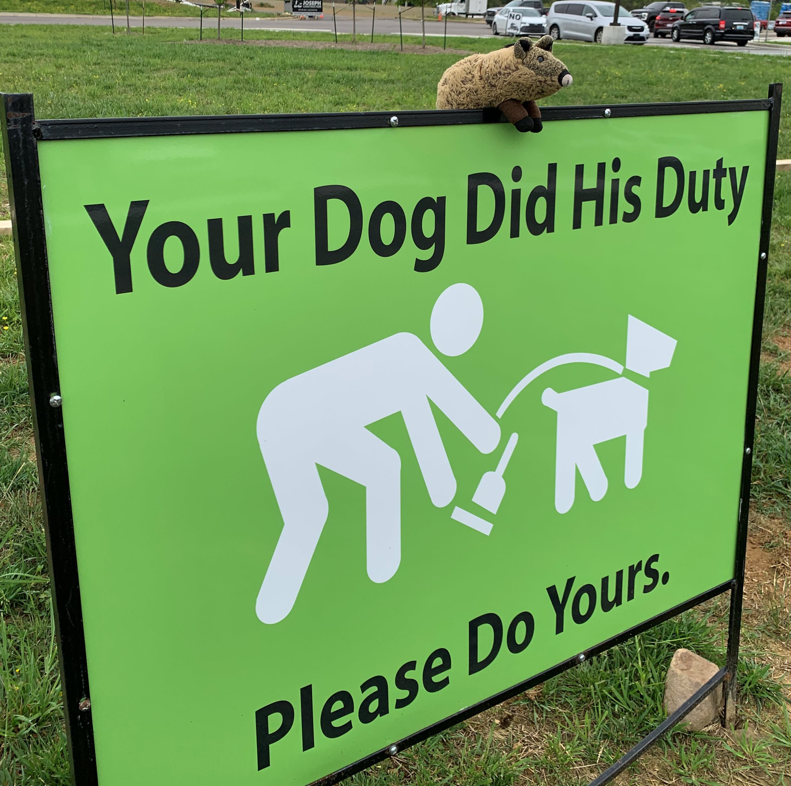

While Mom and Dad were visiting the facilities, I explored the sandwiches and Beaver chips. That made me thirsty, and a nice lady helped me get an Icee.

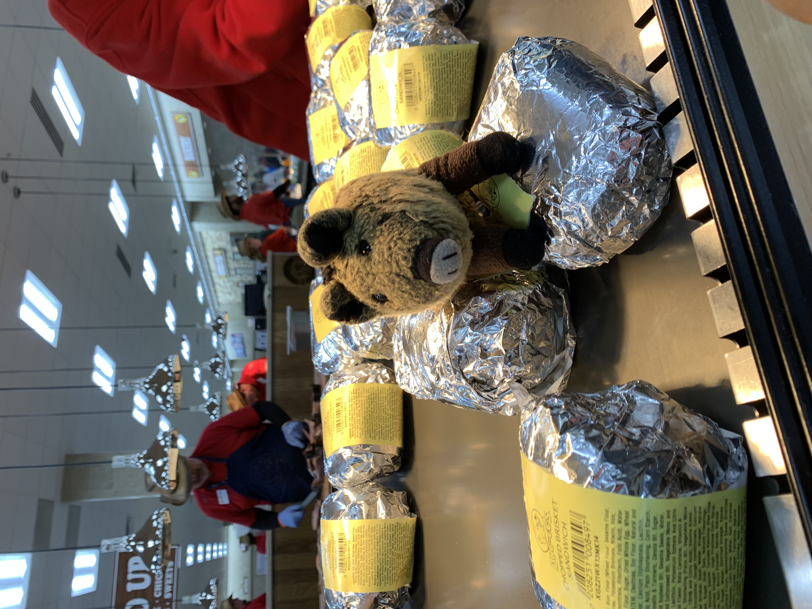

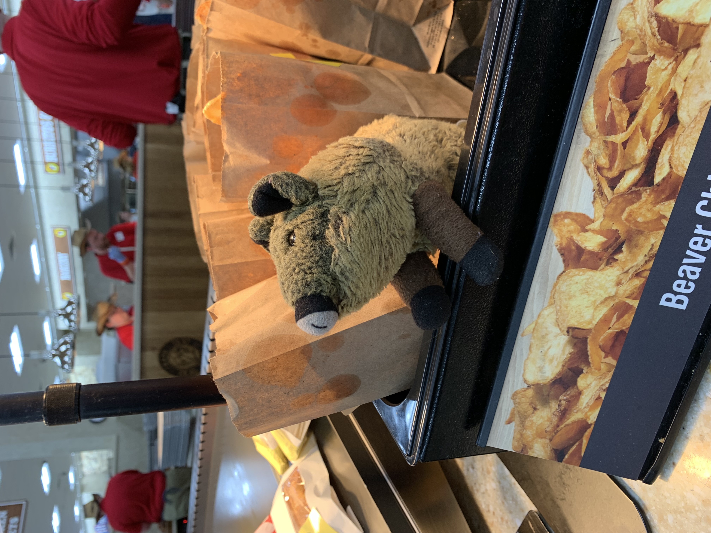

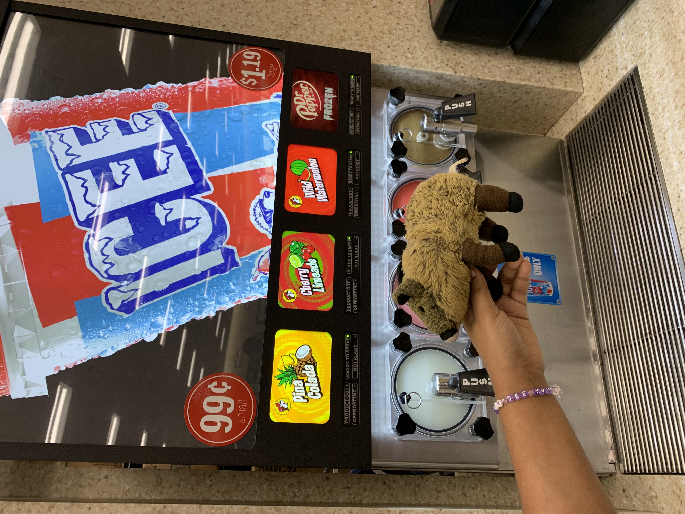

I got plenty of snacks for Nibbles and me.

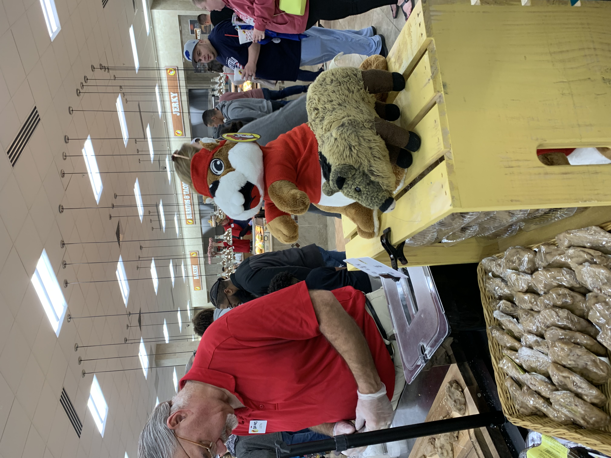

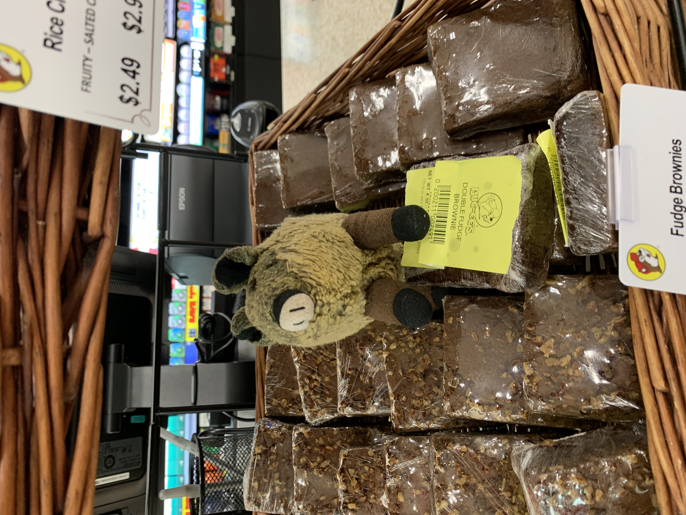

Finally, all the excitement from the weekend caught up with me. Nibbles and I slipped into a sugar coma and slept the whole way home!
