# The Birthday List
> April 30, 2023
> by Piggie

Happy birthday, Mom!

Stacy's brithday was Sunday (three days ago). She was on a business trip, but she left us a wish-list. Chris and I knocked them out over several days! And we even sneaked in some surprises that weren't on the list.

Her list:
  - Sweep all the downstairs floors
  - Put pine straw in front of the garage and in front of the stairs
  - Pressure wash the upper part of the driveway

# Saturday, April 29, 2023

Saturday morning, we are off bright and early. You know the old saying: "The early Piggie catches the Corn." Or something like that.

We went to Home Depot to get a water hose and pine straw. I picked out this hose, which worked perfectly.

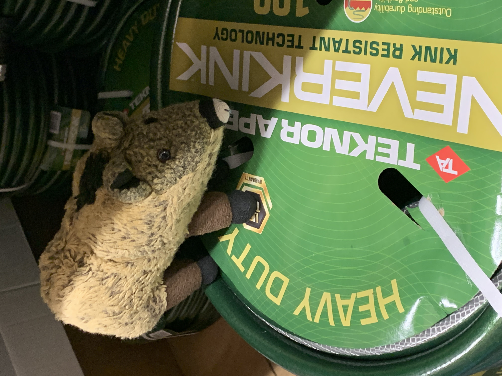

Everyone was buying plants for their gardens. I'm still deciding what I want to plant this year — I mean, besides corn.

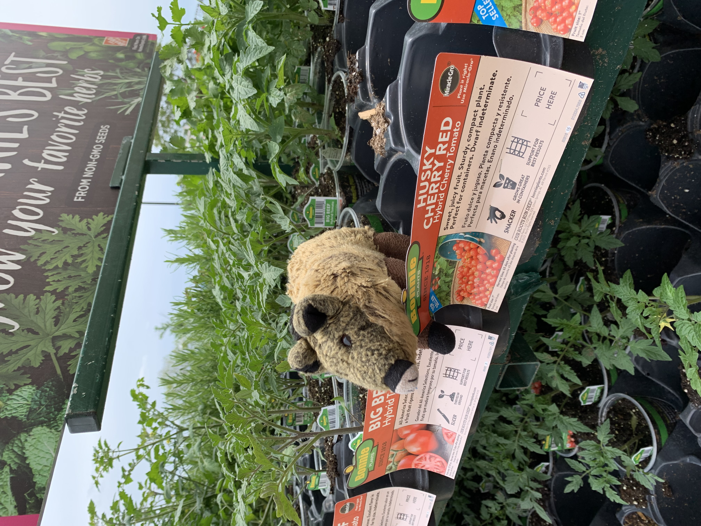

Chris wanted me to "try out" an expensive grill. He seemed to find that funny, but I didn't get the joke. Oh well.

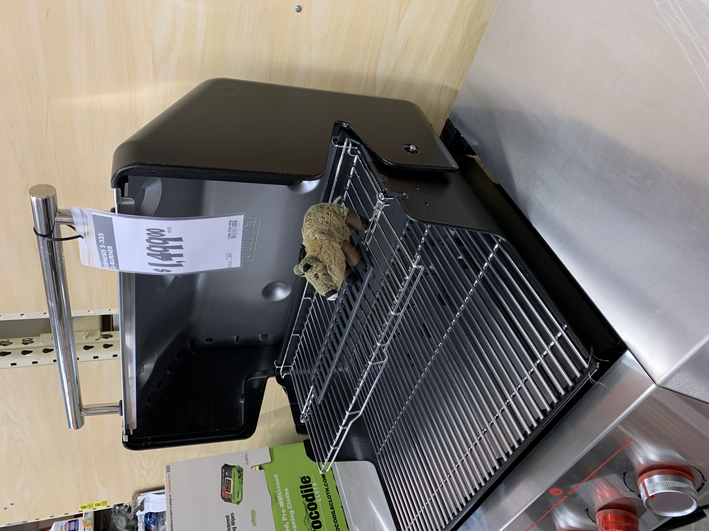

Next up was Subway for lunch! Mmmmmmmm ... oatmeal-raisin cookie. My favorite!

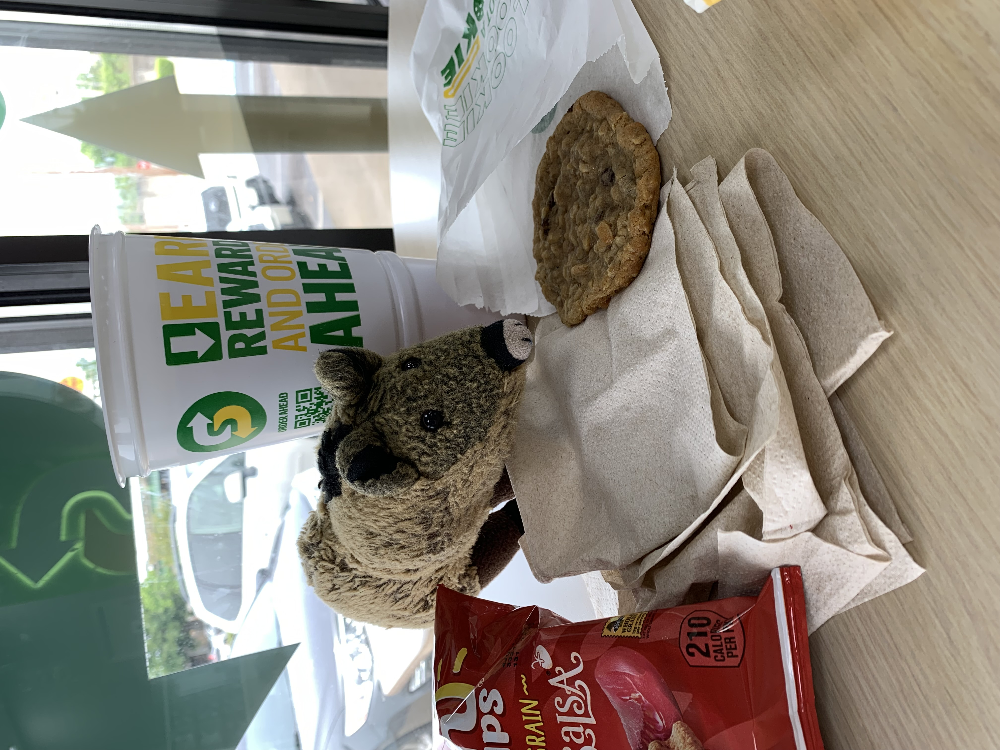

I know he didn't eat all the chips. There must be one or two left in here.

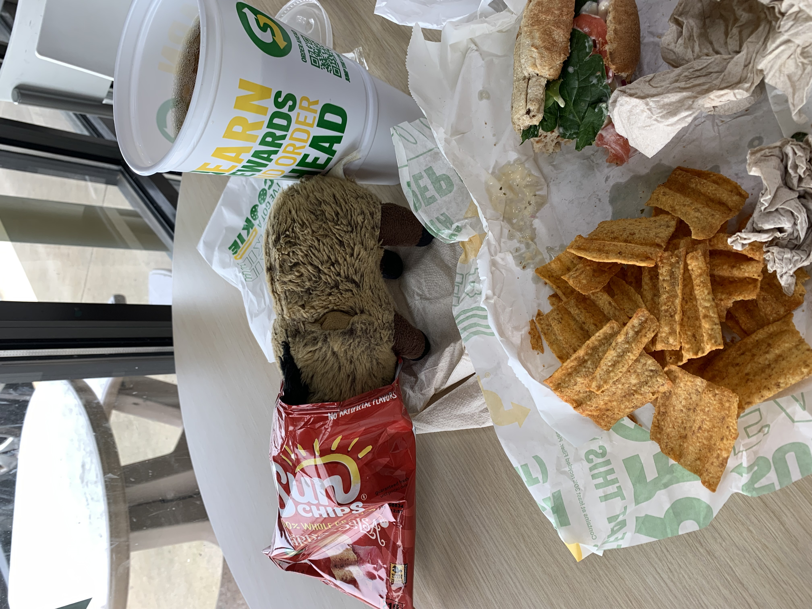

# Sunday, April 30, 2023 !!! HAPPY BIRTHDAY !!!

Today, we spread pine straw in the front beds. I did most of the detailed work, of course.

In the afternoon, we fired up the pressure washer. Chris wanted to play in the water, but there was work to do!

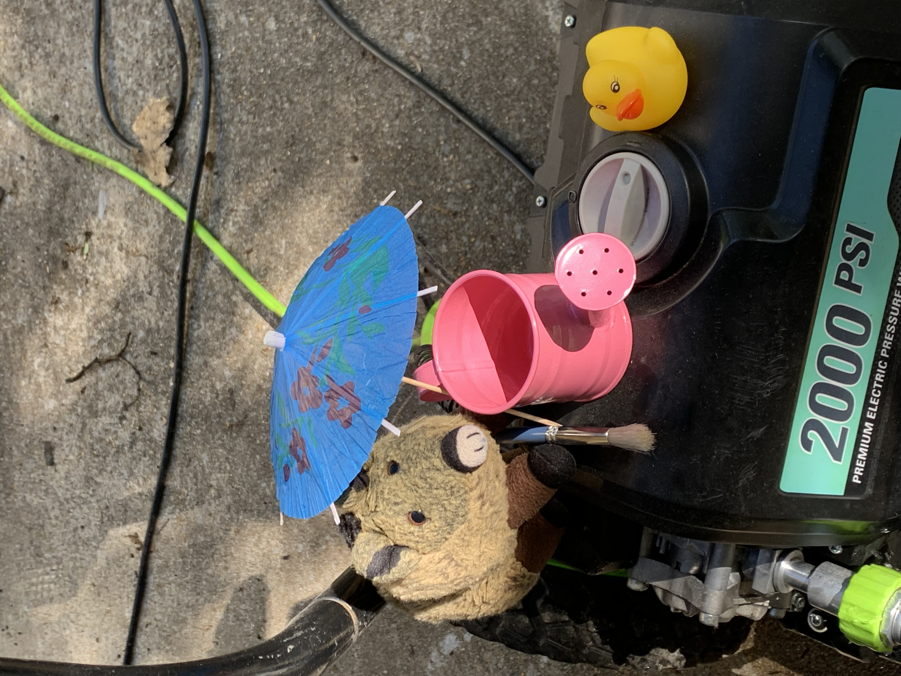

# Monday

We've had old paint cans by the front door for months. Today, we finally took them to the hazardous household waste facility. You can see all the pine straw in the back of the car. I swear I'll be picking straw out of my fur for months.

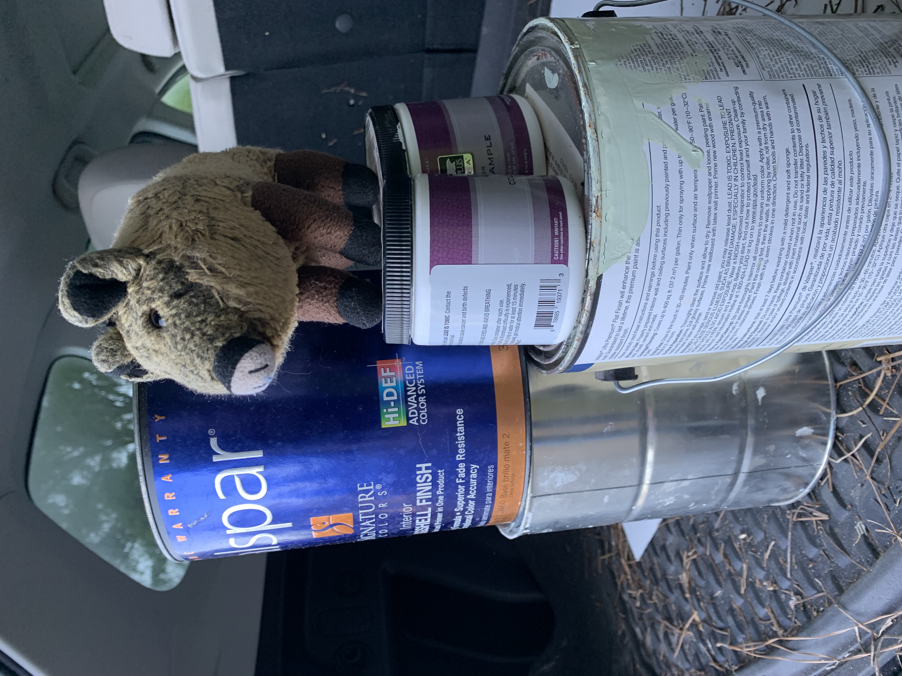

And some more driveway washing. Look what a difference it makes! That black stuff is the remains of the great oil spill of 2021.

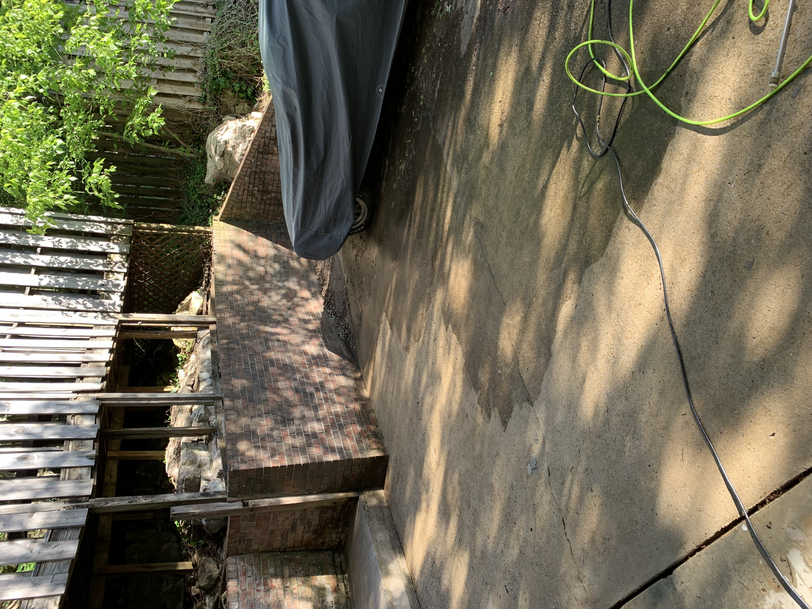

We rounded off the day by sweeping all the floors downstairs. Boy, what a mess! The baseboards were my specialty.

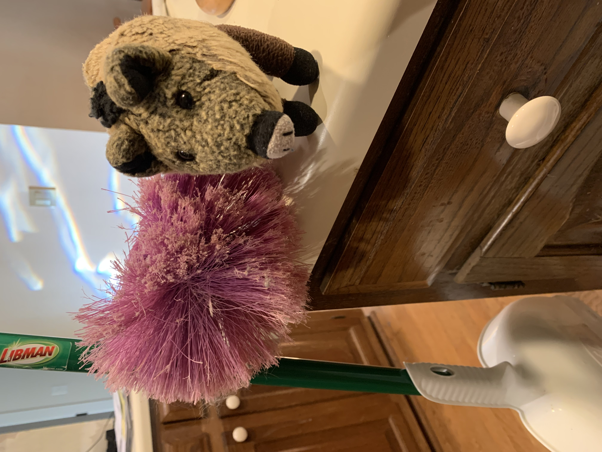

# Tuesday

Tuesday afternoon, we finished up the driveway. It isn't hard work, but you must take your time and sweep slowly, holding the sprayer close to the ground for maximum cleaning.

And tomorrow is the first Wednesday of the month — recycle day! Yeah! Chris rolled the big bin down with all the plastic and cardboard. I took care of the heavy tubs of glass.

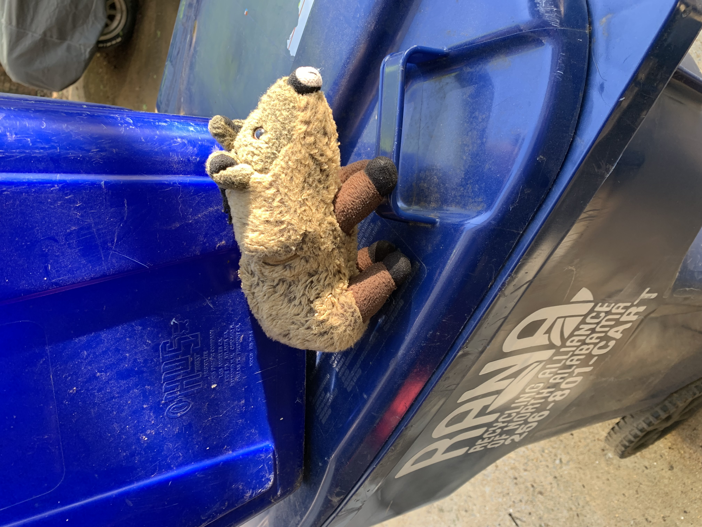

I made time for a little laundry while Chris cooked dinner. These are clean, but I still have to fold them. That's not easy when your arms are as short as mine.

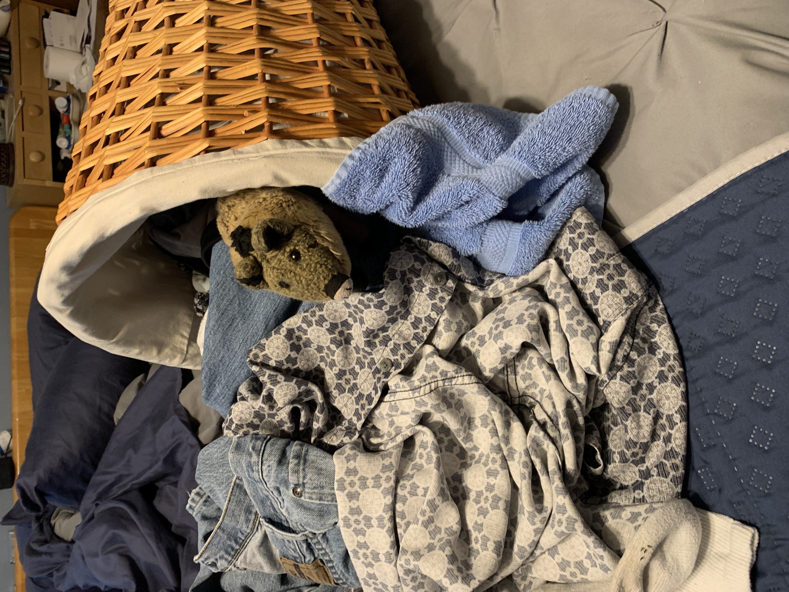

Whew! The work is done. I have a little energy left for a Piggie Dance Party before bed. The disco ball is flashing brightly tonight.

Happy birthday, Mom! I love you! We dance to celebrate you!

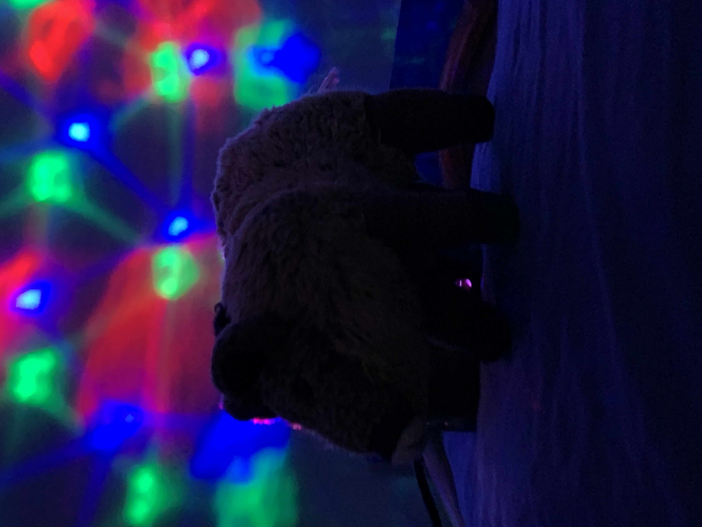

> Comments
