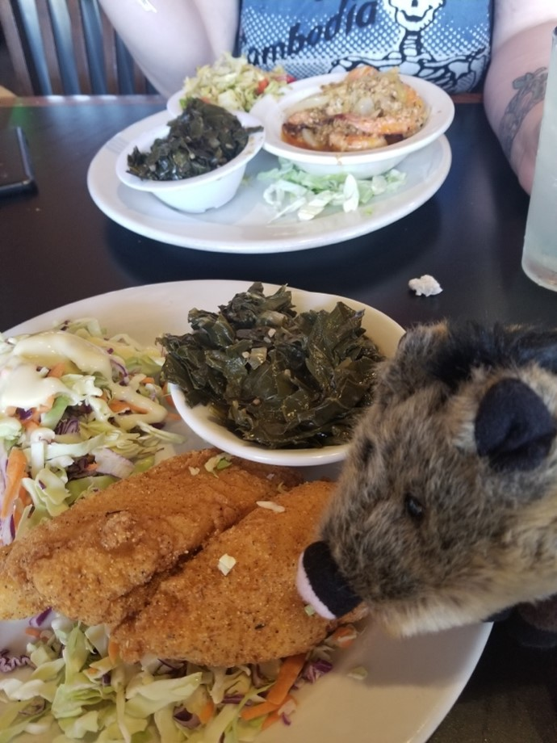
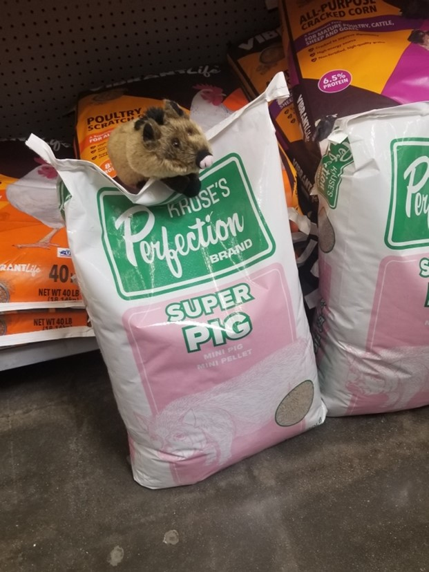
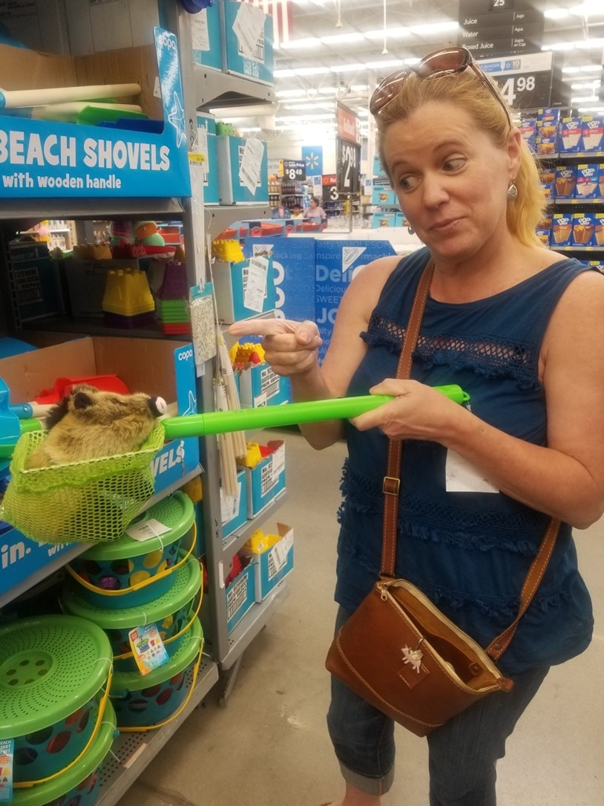
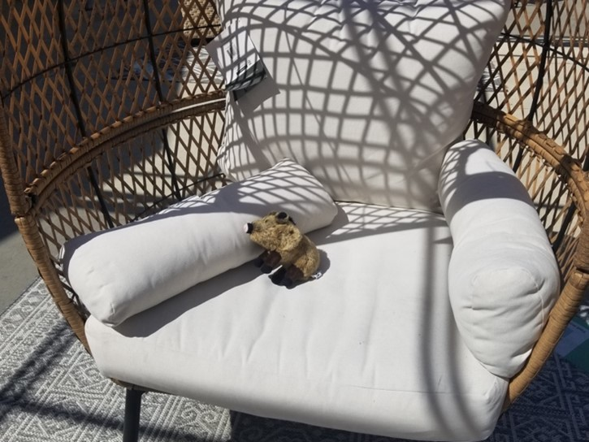

# The Chronicles of Walter Pig, Episode 1
> May 6, 2023
> by Walter and Susan Utting

Let me tell you about my adventure with Mom and Sophie this weekend.

My name is Walter. I am Piggie's brother, who lives in Oceanside, California!

I visit my brother, Piggie, when I can. Actually, FedEx overnight rates are fairly reasonable.

# Porcine shenanigans during lunch and shopping

I just love a good lunch out. The food, the ambience, the intellectual conversations...

I couldn't decide between iced tea and lemonade, so Mom ordered something called an "Arnold Palmer" Yummy!

I totally pigged out on the corn bread muffins!

And the fried green tomatoes!

And I went hog-wild over the catfish and collard greens

I wasn't sure about the steamed cabbage, but I was persuaded to try a bite. Not bad!

Afterwards, we went shopping...

Something to keep me looking handsome

Ooh, I wonder if this will make me grow up big and strong?

Piggie treats, my favorite!!!

I got in a little trouble for playing hide and seek, but I just couldn't resist!

Mom was getting mad, so I tried to run away

But she was too fast for me!

Sophie tried to help me get-away on this ridiculous little bicycle.

Then I decided this tank was way more my style!

All the excitement was wearing me out, so I decided to lay down for an afternoon nap.

But not before stopping to smell the roses. What an adventure!

> Comments
