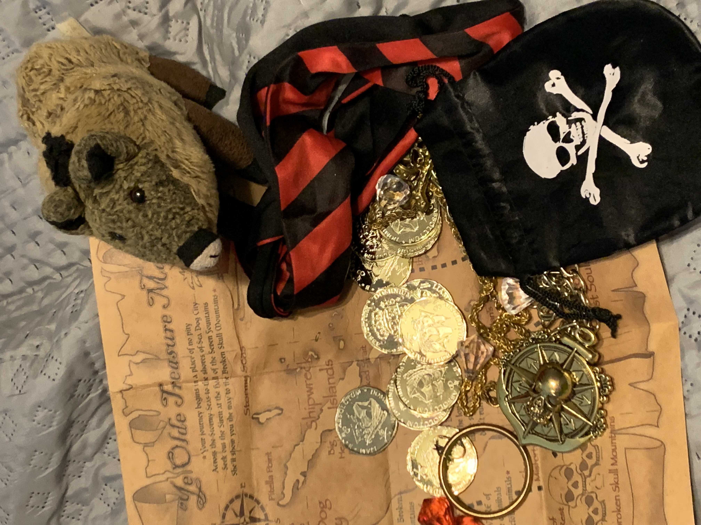
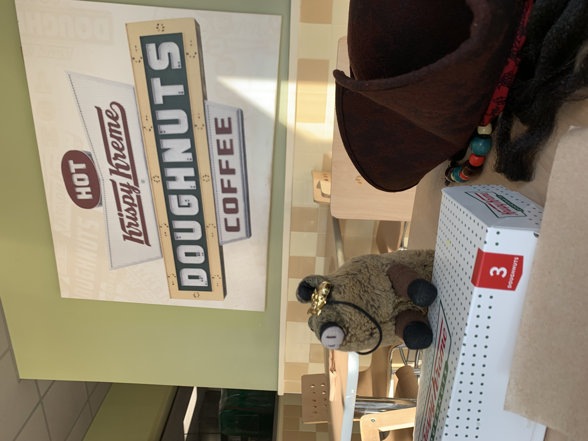
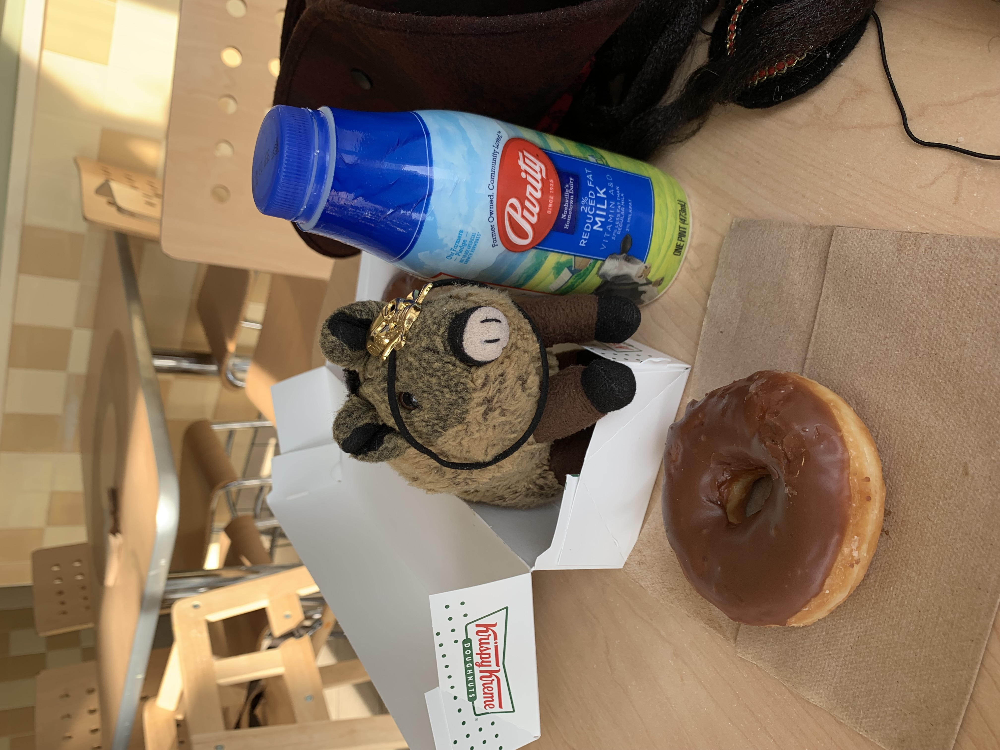

# Talk Like a Pirate
> July 11, 2023
> by Piggie

‘Twas the 19th o' September in the year 2023.

As the mornin' sun climbed o'er the horizon, I climbed the ladder t' the helm o' me ship. I took in a long, deep breath o' the dry, sea air ‘n slowly exhaled o'er me chin t' dry the breakfast ale from me beard.

Chris: What? We were drinking orange juice on the porch ...

Arrr, dear reader. Chris be me first mate, and he be a bit gusty of tongue. This be my story, matey. I'll tell her my own way. I'd hang ye from a yardarm, but ye'd break the mast, ye grog-shy, bloomin' cockroach! ... Avast!

Chris: OK, OK. But ease up on the online English-to-Pirate translator/insulter.

Aye! That be a good idea, lad.

Now, where was I? Oh yes. September 19, 2023. The most famous holiday for inspiring pirates all around the world! It be International Talk Like a Pirate Day! (google it)

First, we braved the damp and dark basement and dug up our storage box labeled "Pirates." Every year, we ramble around in the costumes, swords, and gear in that musty box. There is even a paper mache parrot, Booty, to ride on your shoulder. We selected our garb for the day. This year, I stuck with a simple eye patch. Chris chose the hat with built-in dreadlocks.

We also found "Ye Olde Treasure Map" in the box. That brings back memories from the great treasure hunt of 2002. Chris and I relived the adventures of that day. And we battled with the plastic swords. I won, of course. We Piggies are natural swordsmen.

Then, it was time to board our ship, the Subaru Forrester, and plunder for doughnuts at the local Krispy Kreme! See, every year on this day, Krispy Kreme offers a free doughnut to anyone dressed like a pirate. They say "free," but that doesn't stop me from barging in and demanding one in a gruff, pirate voice. "Arr! Hand over the goodies!"

We circled the Krispy Kreme island for an hour, waiting for them to let their guard down by turning on the "Hot Now" sign. Then we pulled on our eye patches and made our move!

We left the plastic swords on the ship, though. In this day and age, you can get arrested for wielding a pretend weapon.

There I am at a table in Krispy Kreme, hoarding my sugary treasure! We ended up buying three doughnuts — one doughnut was just not enough after all that plundering and pillaging.

And, of course, I got milk to wash it down! I've put on a few extra ounces this year; my eye patch is a little tight. So, I opted for the healthier 2% milk. Yes, even pirates watch their weight.

Overall, we had a great International Talk Like a Pirate Day. Drop me a line next year, and you can join my crew!

> Comments
