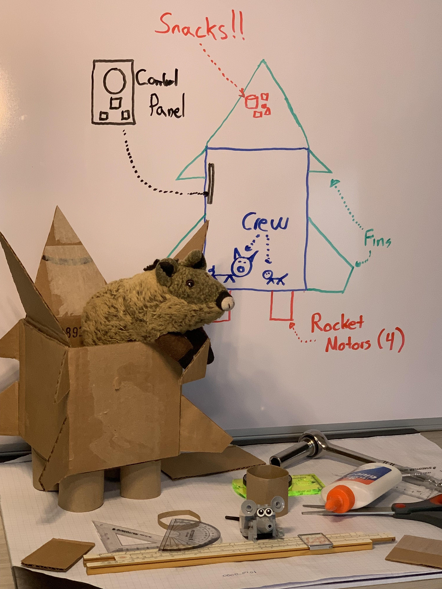
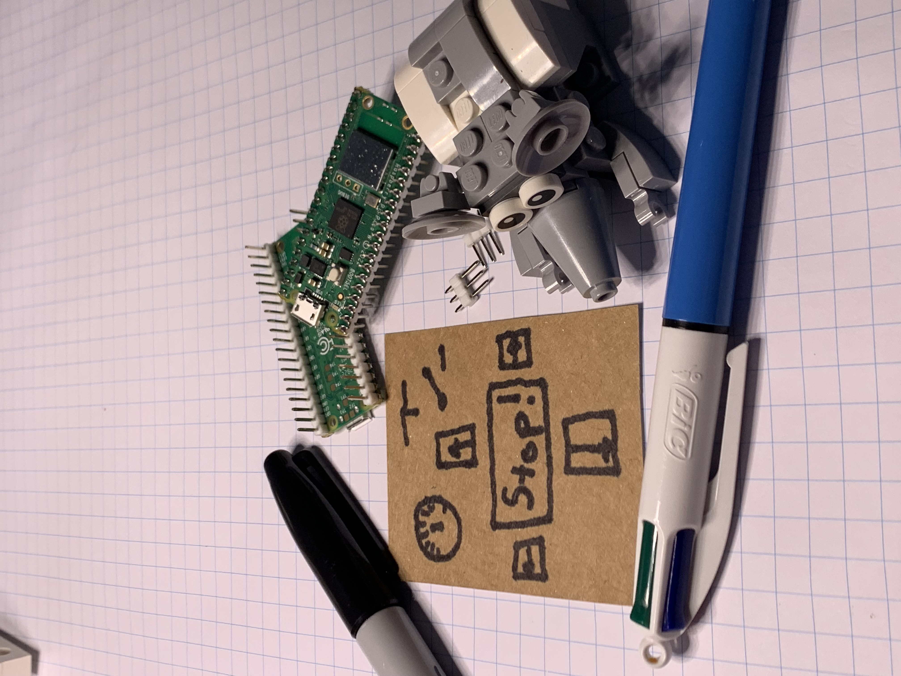
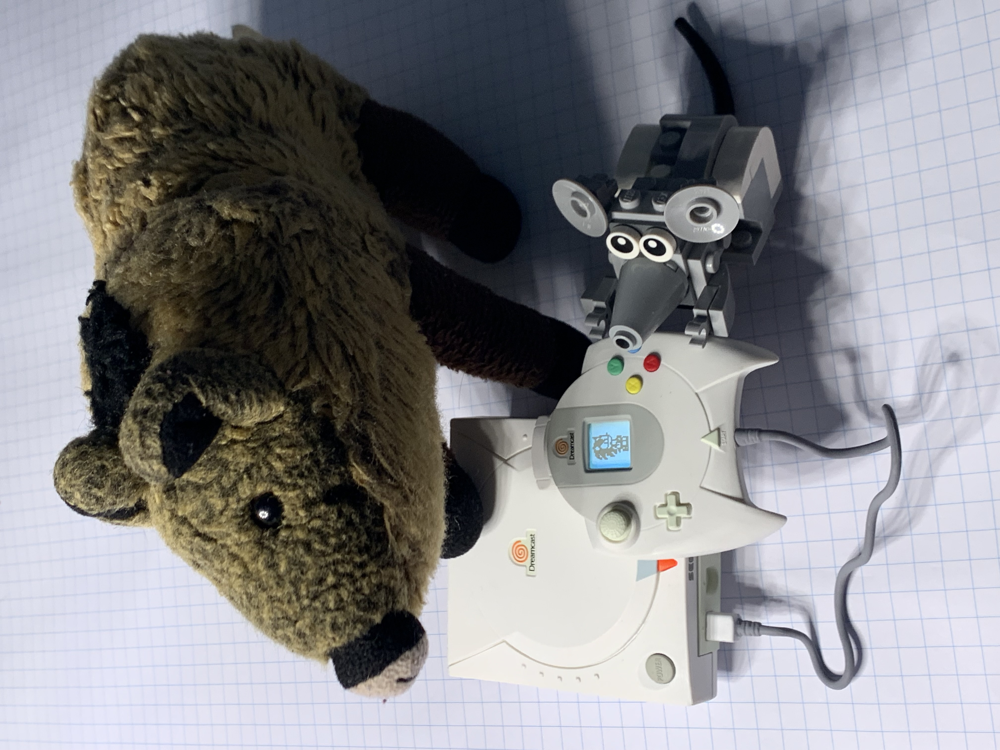
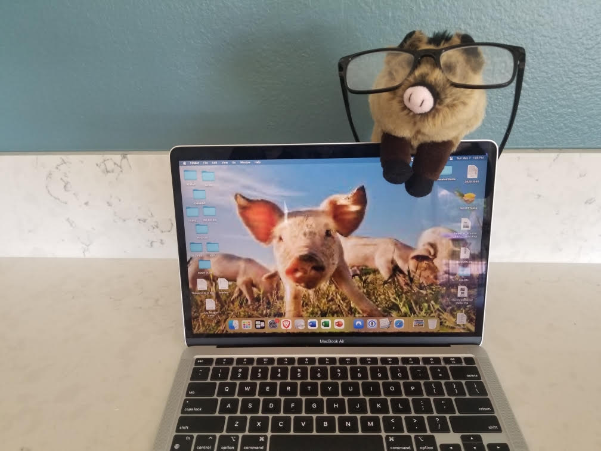
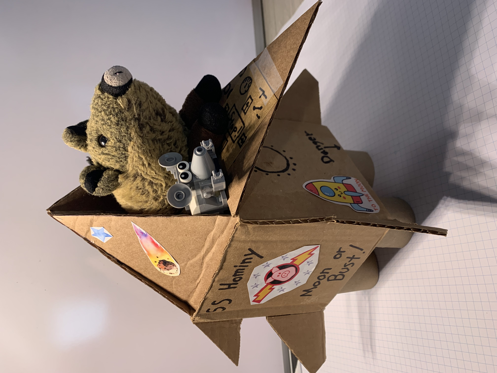

# The Moon or Bust, 1: Cosntruction
> December 20, 2023
> by Piggie

The moon is NOT made of cheese!

## December 4, 2023

The Thanksgiving holidays are behind us, and Nibbles and I spent way too much time watching old TV shows. Late one night, we caught the Wallace and Gromit episode where they go to the moon for cheese.

Nibbles' eyes got big when he heard the moon is made of cheese. Nothing I say will convince him otherwise. When the rest of the family gets ready for bed at night, Nibbles is perched on the window sill, looking up at the moon and drooling.

I guess the only way to prove it is to go to the moon and let him see for himself! So here we are, building our rocket.

We designed our entire ship by hand on the whiteboard. We did all the calculations by hand using Papa Post's slide ruler for the tough math.

Chris and Stacy are back at work this week, but they've been very patient, answering our text questions all day. Things like: where is the Elmer's glue, and what's the secret code on the back of the credit card, and where do we keep the rocket fuel?

It turns out we don't have any rocket fuel around the house. But that's OK. I have connections at NASA, and they agreed to bring us some fuel if we would help them with a small problem on our way to the moon. More on that later.

## December 11, 2023

Here is Nibbles, working hard on the electronics and control panel.

I had the important job of preparing the entertainment for the long voyage. We don't want either of us to crack in the isolation of deep space.

## December 14, 2023

My brother, Walter, in San Diego, will be our Mission Control. The moon is over California this time of year, and we'll be in constant contact with him using our ham radios. (There goes Nibbles snickering again. Why does he laugh every time I say that?)

## December 20, 2023

T-minus 17 hours to launch. We are too excited to sleep. I'm giving the Sailing Ship Hominy some fresh glue in its joints. Nibbles is polishing our cheese knife for the third time today.

> Comments
