# My Most Excellent Trip to Japan
> March 2, 2024
> by Walter and Susan

Well, when Mom told me we were going to Japan I just couldn't believe it!

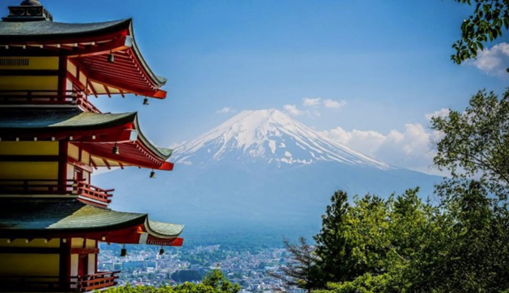

I mean, Japan! Home of the most delicious food in the world, the most beautiful babes in the world, and Mom and Dad kept going on about the amazing "powder," which I guess has something to do with the snow? Whatever, I couldn't wait for the trip! Here I am in the car. Do you think I can take all of this luggage carry on?

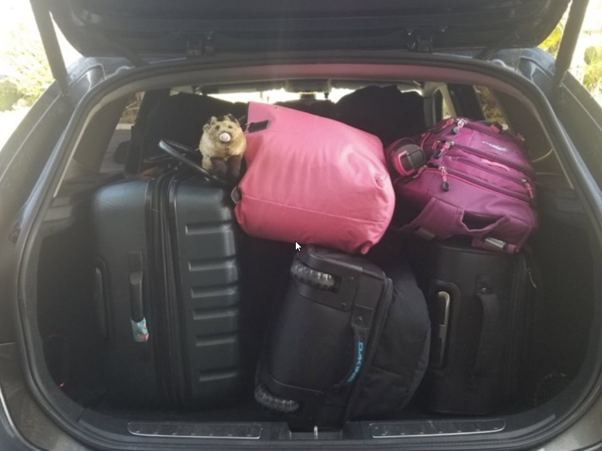

Of course, even before we got on the plane Mom put this ridiculous collar on me! I was all ready to make some smooth moves on the flight attendants but Mom has to totally ruin it, just because she was worried I might get lost on the plane. (Actually, it was a really big plane).

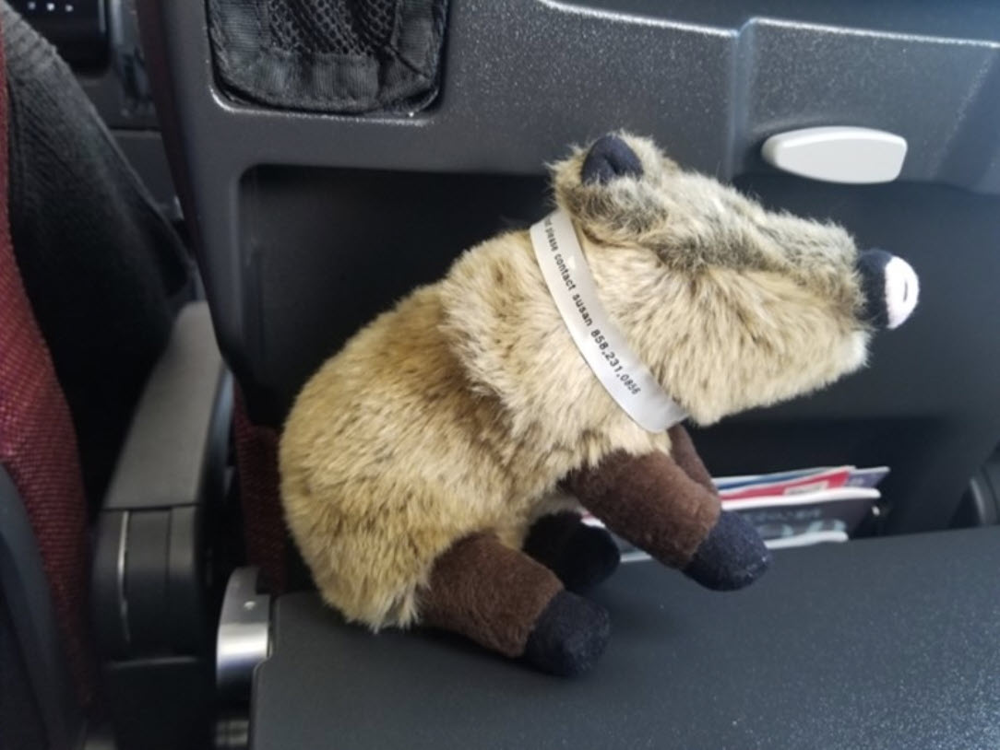

This is definitely not the first-class accommodation I was expecting either.

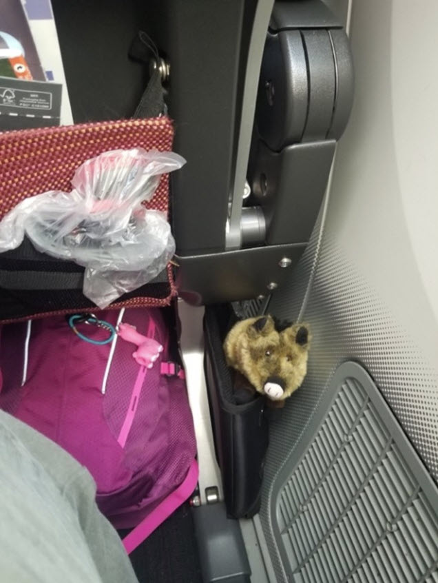

The food on the plane was excellent. I'm just not sure how to work these little sticks. Maybe I'll just go snout in when no one is looking.

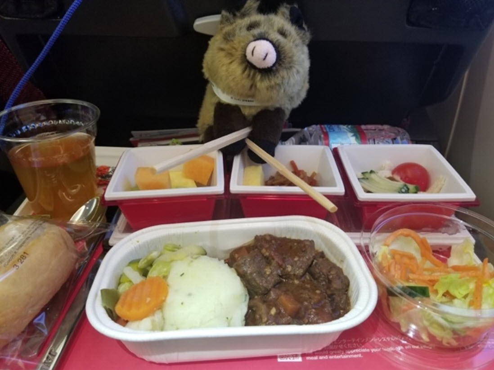

Once we got to Tokyo I had a little trouble getting around on the train, but eventually I got the hang of it. Weee!

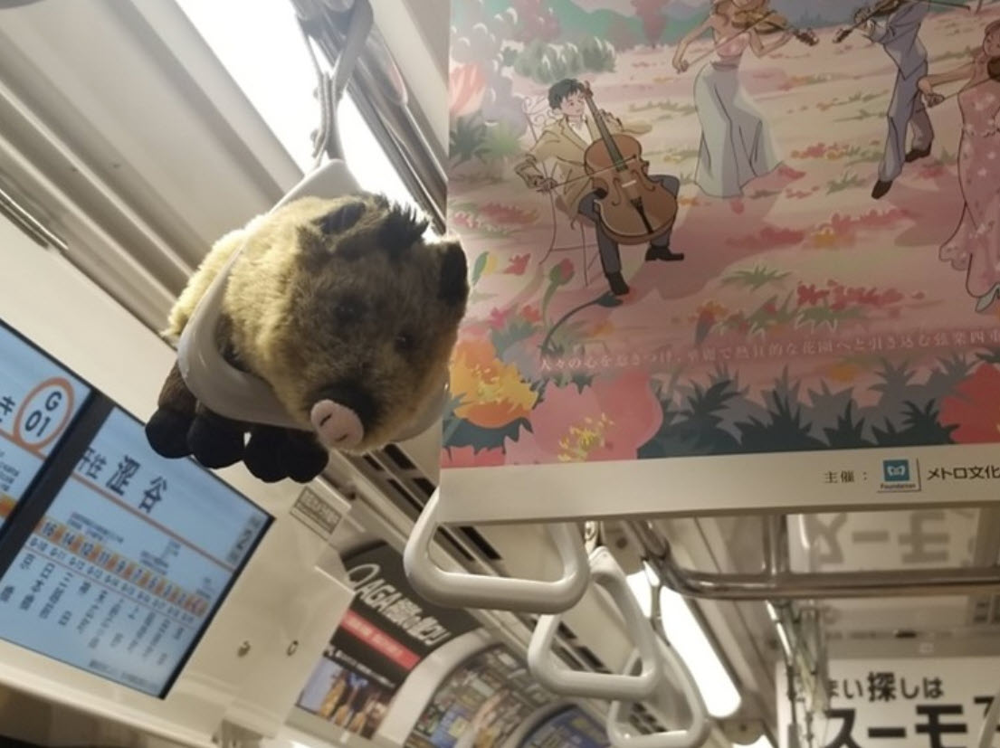

Breakfast at the hotel was also delicious, although something on the plate looked very suspicious and I didn't try it.

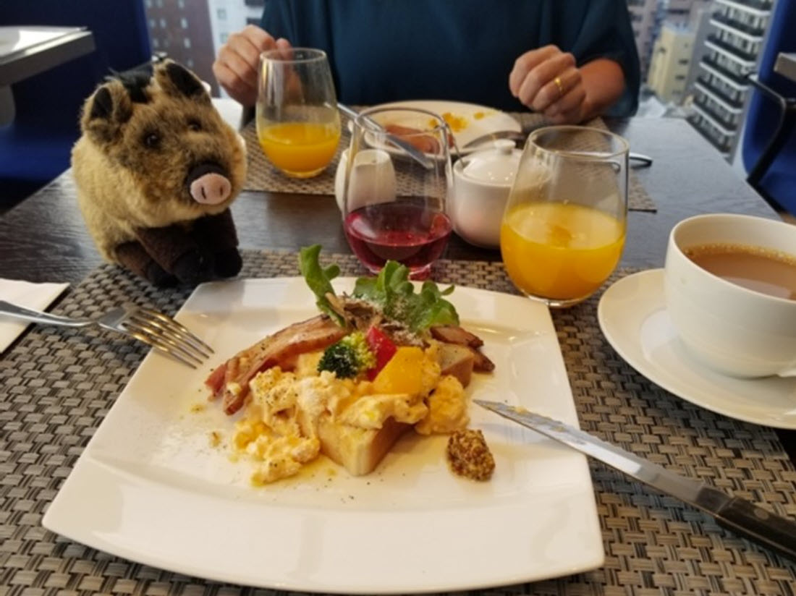

We had a good time at the museum. I'm not sure what these funny little clay figures are, but we sure had fun (even if Mom refused to buy me a samurai sword).

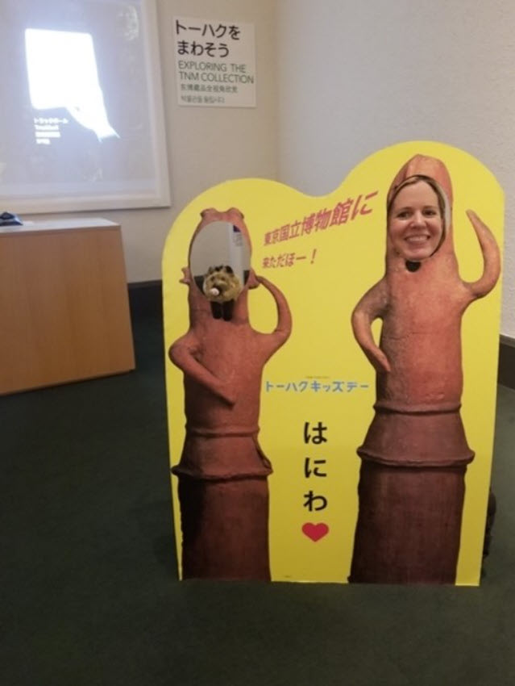

And then it was the best surprise EVER!!! Finally, I got to spend time with people I really felt comfortable around. This is really my kind of crowd!

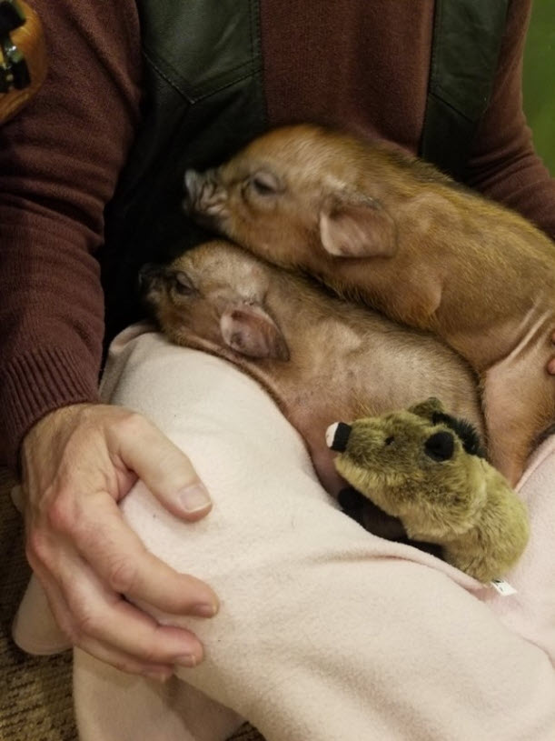

These guys really know how to chill.

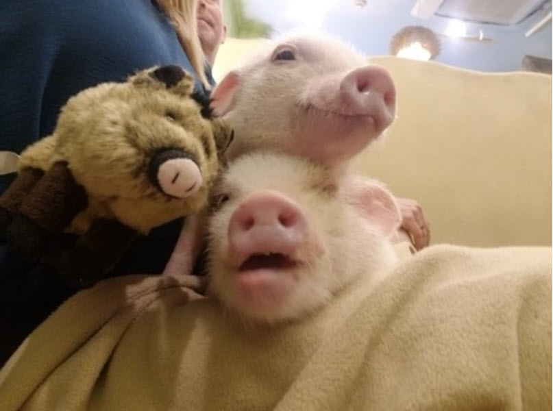

Best.

Playdate.

Ever!!!

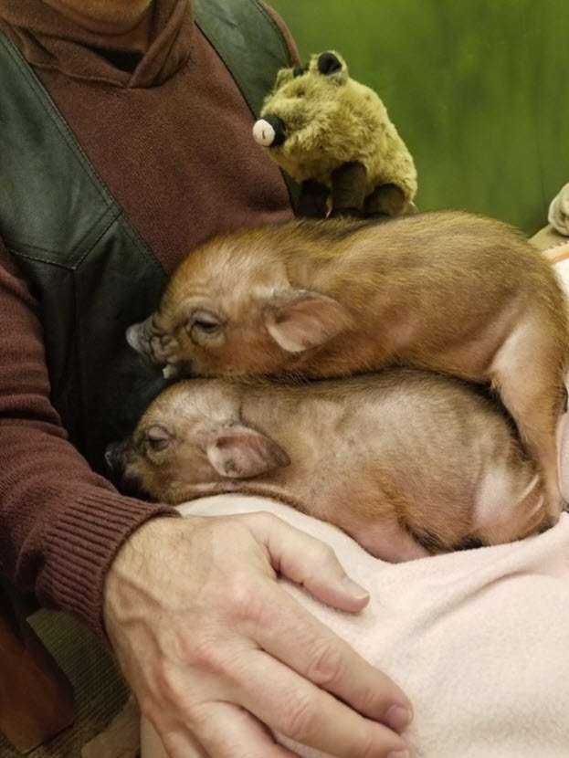

Afterwards, yet another delicious meal. Nothing suspicious on this plate!

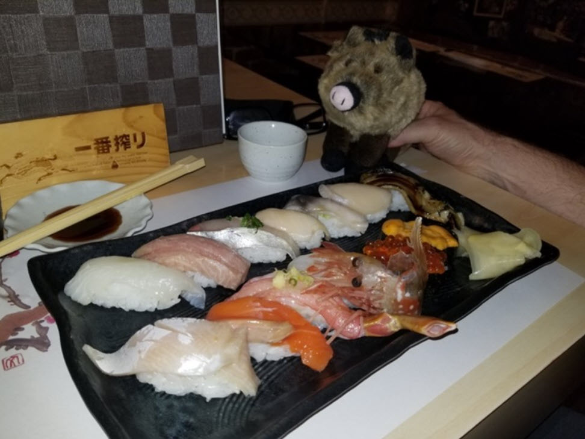

The trip wasn't all snuggle play dates and big meals. I found time to meditate and ponder the meaning of life. The big guy here helped me. You could say he "gave me a hand," Hahahaha!

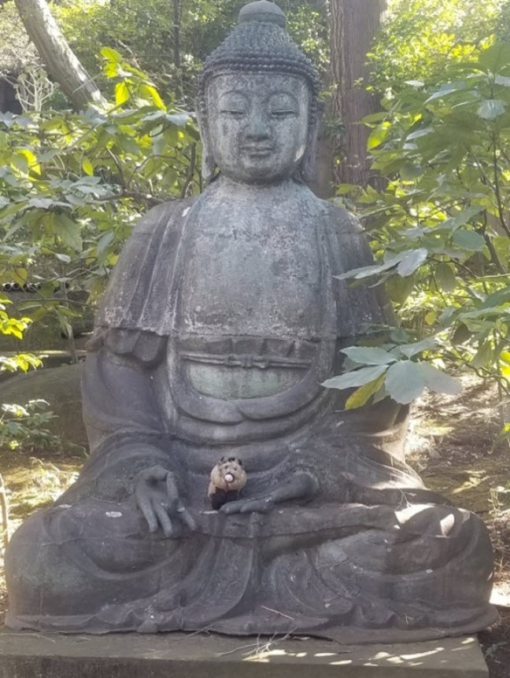

Eventually we left Tokyo and headed to Niseko to check out the "powder". Here I am taking a skiing lesson. Personally, I don't see what all the fuss is about. It's cold and I can't figure out how to steer this thing.

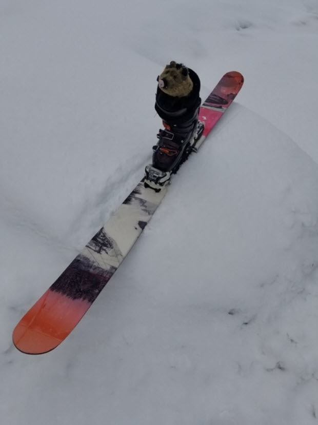

After some bumps and bruises on the slopes we got to go relax in a Japanese "Onsen" which is like a jacuzzi but you have to go in completely naked! (I kept my fur on)

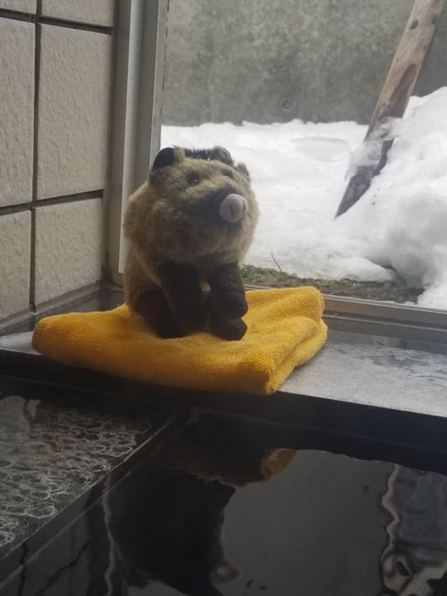

But maybe the best part of all is that I made a new friend, and Mom let him come home to live with us. Apparently he's a little potato who likes to ski, and he's the mascot for the little town we stayed in. Whoever heard of a skiing potato! Did I mention that the Japanese are kind of quirky, and like weird, cute little mascots? Well, we named this little fella "Yuki" which is Japanese for snow. Here we are enjoying a nice cup of sake after getting home safely.

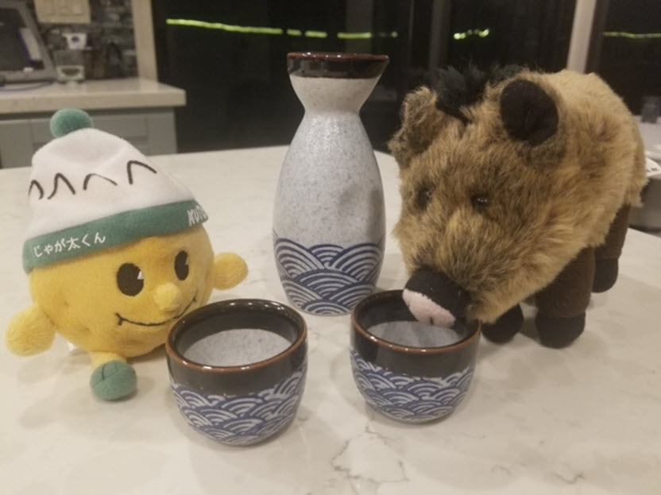
