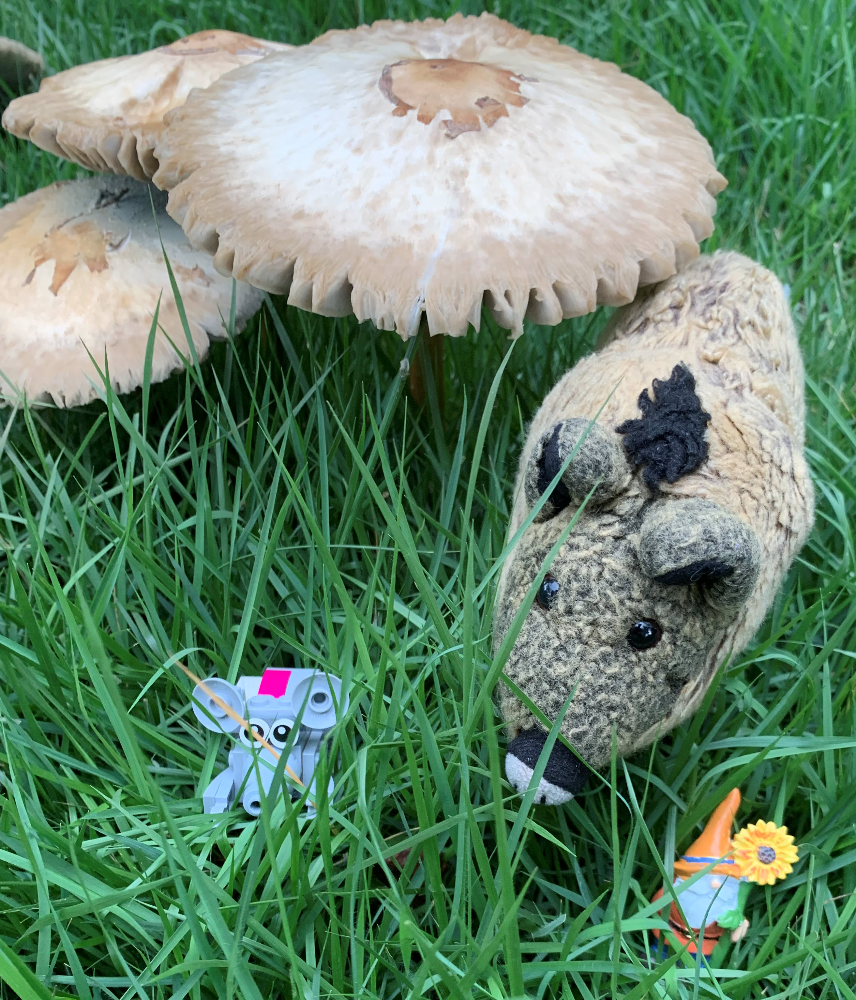

# Mushrooms
> June 12, 2024
> by Piggie

It's been hot and wet this early summer. That's perfect weather for mushrooms!

Nibbles and I packed a lunch and set out to explore the giant mushroom field that sprung up in the yard overnight.

From a distance, we could see that the mushrooms grew around a central clearing.

Perhaps someone or something made the clearing, or maybe the pattern is a natural phenomenon? We tossed around theories as we made our way through the forest of grass and fungus.

Nibbles is shorter than I am, so he couldn't see the clearing very well. I helped him climb onto a tall mushroom for a better view.

We were almost to the clearing when we met a tiny man with a white beard. He was dressed head to toe in orange clothes and carried a yellow sunflower.

We introduced ourselves. His name is Ziggy. He's part of a family of Yard Gnomes who live down the street. They came over to harvest the mushrooms, a delicacy in Gnome cuisine.

Nibbles got big-eyed with excitement — you can eat these things? No! I warned him never to eat mushrooms growing in the wild. Most of the ones you'll find are safe, but a few are poisonous. It is tricky to know the difference. We should enjoy looking at them. Leave the eating to the Gnomes!

All this talk of eating made my stomach growl, and I got an idea. I ran back to the house and got my portable food stand that I keep ready for just such emergencies! I loaded up all the ingredients to make mushroom soup and headed back to the clearing.

Mmmmmm. The smell of the soup cooking on the open fire was so enticing. We made enough for Ziggy's whole family. One Gnome tried to pay us ten GBs (Gnome Bucks) for a bowl of hot mushroom soup. We explained that the soup was free, but another Gnome insisted we take five GBs for our effort. That would pay our entrance fee to the Yard Gnome Fair coming up in September. Nibbles and I are looking forward to that!

During lunch, we shared our raw mushrooms from Publix. I assured Nibbles these were store-bought and perfectly safe. The secret to a good soup, I explained to the Gnomes, is the right salt. I use only fresh Himalayan salt. Nibbles mined this jar of pink salt from deep in the mountains of Punjab, Pakistan. But that is another story.

The Yard Gnomes sampled our different mushrooms, but they agreed their favorite was this canned Campbell's mushroom soup. I guess it's hard to improve on a classic.

Before we headed home, I had one more type of mushroom to share with them, which was my favorite! Behold the golden sweet goodness of the "corn" mushroom!

> Comments

>> Suzy
>> August 18, 2024
This is a delightful and imaginative story!

>> Susan
>> August 18, 2024
I'm so glad that Piggie keeps Nibbles safe from eating poisonous mushrooms!
