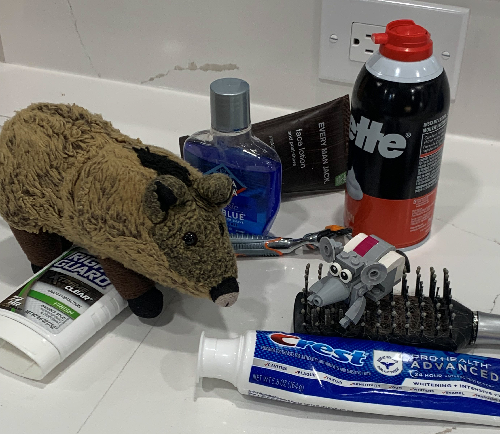
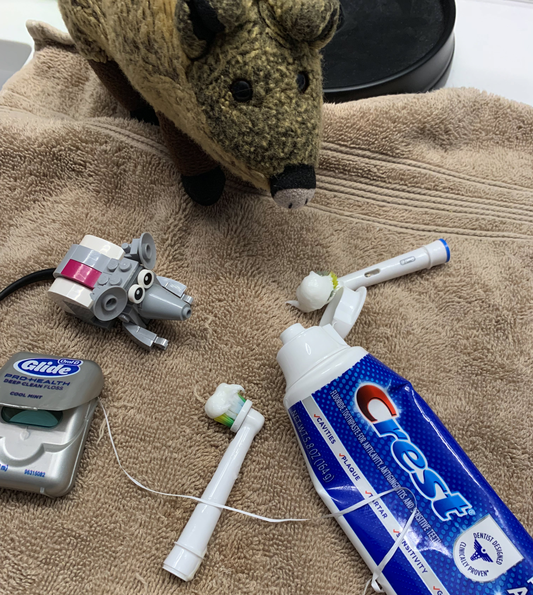
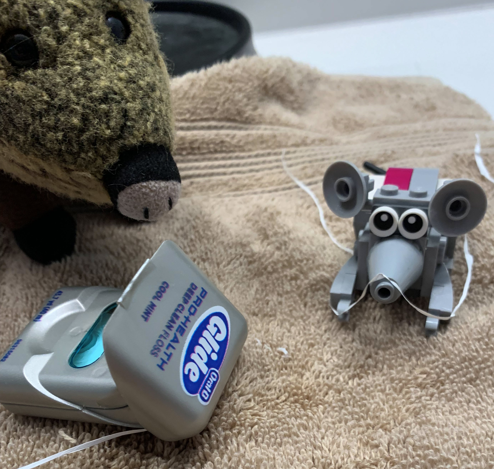
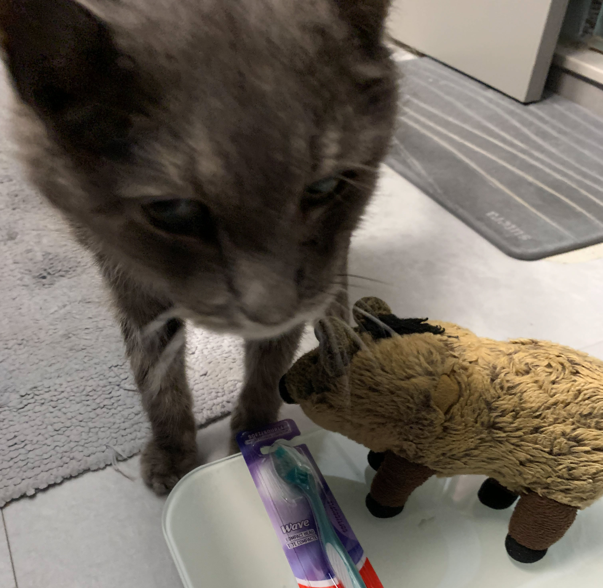
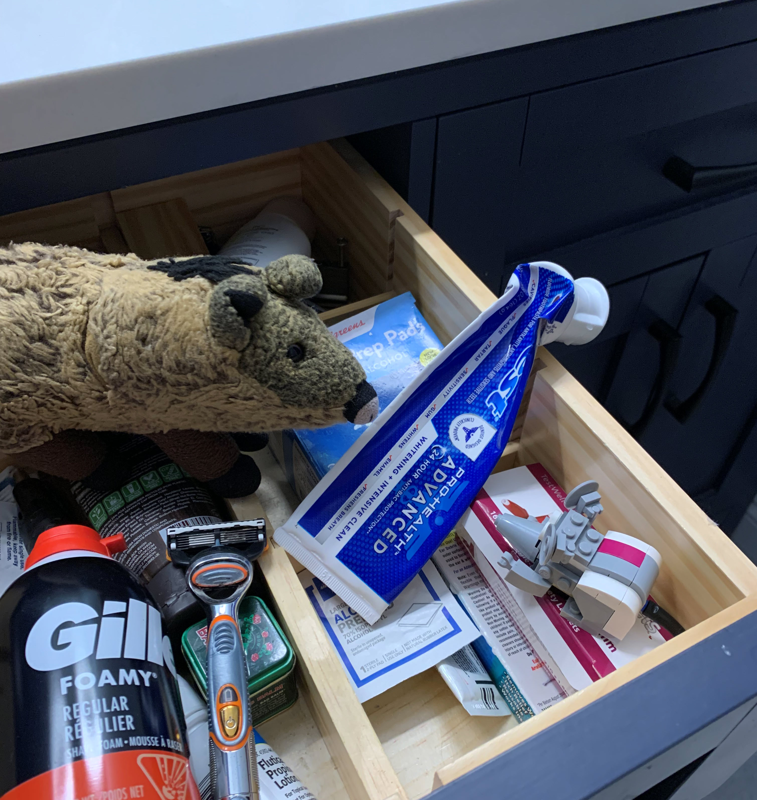
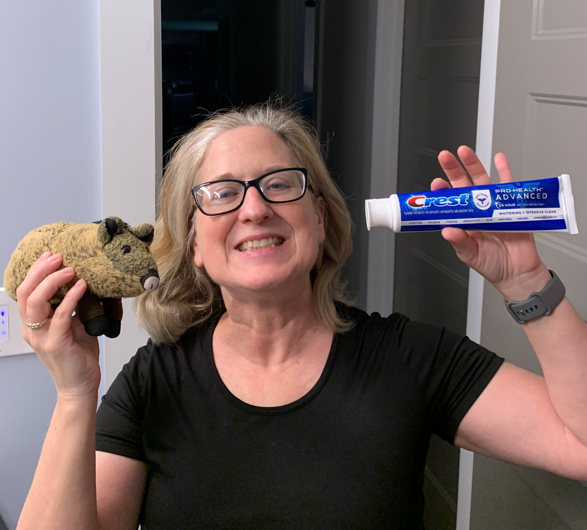
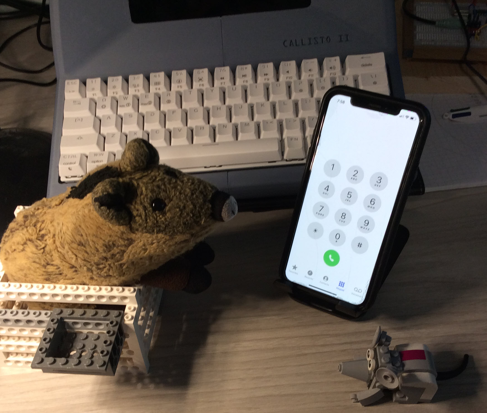

# A Tale of Two Fairies
> September 10, 2024
> by Piggie

Nibbles and I were brushing our teeth one morning and got into a lively debate.

Who refills the toothpaste tube when it is empty?

"It must be the Tooth Fairy," I told Nibbles. "She comes around at night when we are sleeping and squeezes in the new paste."

"Why would the Tooth Fairy encourage us to brush?" He asked. "She wants your teeth. She wants them to fall out. Brushing keeps your teeth healthy. Toothpaste keeps her from getting them!"

He makes a good point. We brushed some more and spat in the sink.

"There must be a Toothpaste Fairy," Nibbles said. "Yeah, and she is the younger sister of the Tooth Fairy. They have a sibling rivalry going — one wants to collect your teeth, and one wants to protect them! It's a classic battle of yin and yang fought in our mouths since time immemorial."

Where does he come up with these ideas? Well, there is only one way to know for sure: we'll have to catch the Toothpaste Fairy in the act of refilling. The only problem is that our toothpaste is full!

Time for a family meeting. I clanged my fork into my glass at dinner that night to get everyone's attention.

"OK, family. Nibbles and I have noticed a lot of dirty teeth around here lately."

Nibbles winked at me and gave me the thumbs up.

"I recommend we increase brushing to four times a day," I continued, " And really squeeze into that toothpaste — don't be bashful about globbing big piles onto your brush! In fact, Nibbles and I are going to brush right now! Come on, Nibbles."

Good job, Nibbles! We'll use this tube up in no time.

Yes, flossing is essential, too. Be sure to get in there around all those little plastic pips.

Silver, let me have a look at those choppers. Oh, Silver, my man! Those teeth are positively filthy. Here: I bought you a brand new toothbrush. The best way to break in a new brush is with lots of toothpaste to soften it up. Now, get to work!

It took a week, but we did it! The toothpaste tube is almost flat. Now, we hide in the bathroom drawer overnight and wait for the Toothpaste Fairy. OK, Nibbles, push on the back of the drawer, and close us up.

Wow, it is dark in here. What's that smell? Nibbles, are you in the Aqua Velva again? Quit playing with the floss — you will get us tied up. Wait? Shhhh! Someone's coming!

Mom? No way! Nibbles, our mom is the Toothpaste Fairy! What are the chances that OUR mom is the Toothpaste Fairy?!

But now it all makes sense. Nibbles was right. If mom is the Toothpaste Fairy, then that makes her sister, Aunt Susan, the rival Tooth Fairy. Think about it: Aunt Susan is a dental hygienist! She spends all day poking around in mouths looking for loose teeth!

Come on. Let's call Walter.

Hello, Walter? This is Piggie and Nibbles. Are you sitting down? Your mom is the Tooth Fairy! We want you to search the house for her secret tooth layer.

> Comments

>> Suzy
>> September 10, 2024
Delightful! I always knew Stacy was the Tooth Fairy.

>> Susan the tooth fairy
>> September 10, 2024
Hahaha you'll never take me alive! I want those teeth!!

>>> Piggie
>>> January 18, 2025
I knew it, Aunt Susan!

>> Janice Cambron Stephenson
>> November 4, 2024
So wonderfully clever! Stacy, you certainly wear many hats.