# Cretaceous Piggie
> October 4, 2025
> by Piggie

It's high time we explored the cave in the backyard!

It was a beautiful Saturday morning. We were out back on the deck raking leaves into a big pile, climbing up on the wrought iron patio table, and jumping off into the leaves - Geronimo! As we lay in the pile catching our breath, we set about planning our day. Nibbles suggested we finally explore that cave in the rock wall beyond the deck.

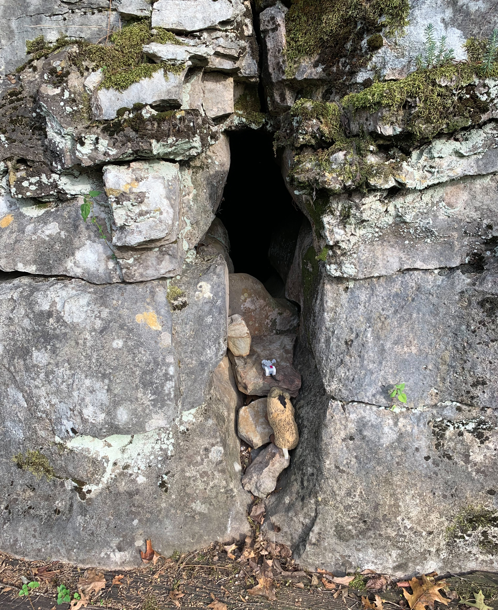

We gathered our supplies: some ropes, a whistle, and a couple of flashlights with fresh batteries. And, of course, we packed lunch!

Nibbles and I recommend peanut butter and jelly sandwiches for all cave exploration. We prefer the white "Bunny" bread (mostly because of the cute bunny on the wrapper). Nibbles likes to cut the crust from his sandwich.

And don't forget your juice box. Our favorite flavor is Elmo's Punch. It pairs well with peanut butter.

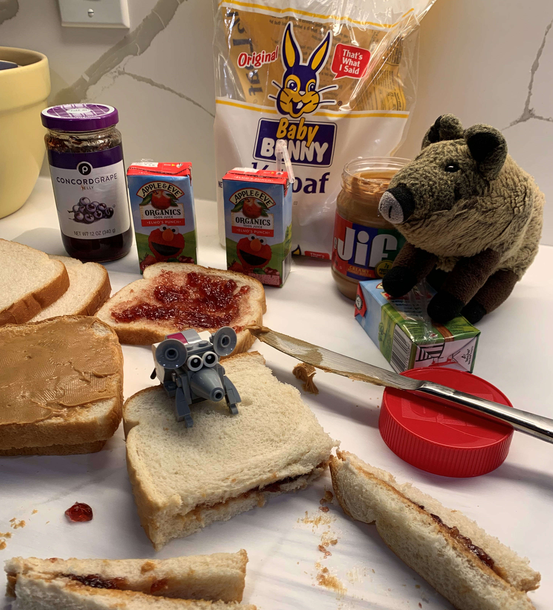

This cave is dark and scary up close. Nibbles, maybe you should lead.

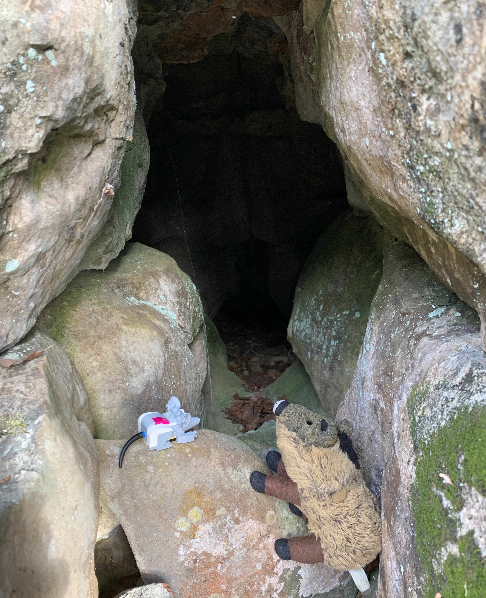

We made our way down the dusty passage. What will we find? Monsters? Nibbles hopes there are no cave spiders — he hates spiders. Will we find a pirate treasure? Maybe we'll find a genie in a lamp, but probably not since the cave entrance isn't a talking lion's head.

"Wait! Nibbles, shine the light over there. Look! A drawing on the cave wall. This must have been painted by cavemen thousands of years ago."

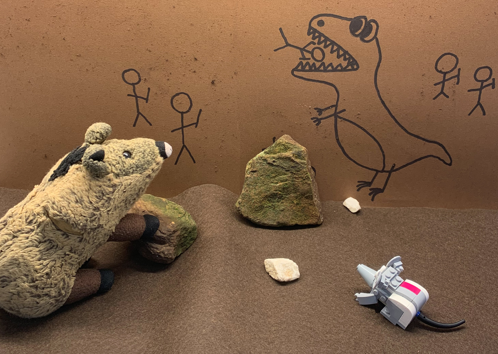

"It looks like a T-Rex!" Nibbles said. "Those men are fighting an angry Tyrannosaurus Rex. Can you imagine what it was like to hear a T-Rex roar? Wow, I'd love to meet one."

"Maybe not," I pointed out. "It didn't go so well for that one guy! But maybe from a distance. I know, let's go back to the house and get our time machine. We'll go back in time to when this was drawn and talk to the cavemen. Maybe we can even see the T-Rex - from far away!"

"Piggie, we don't have a time machine."

"Oh, that's too bad."

Nibbles headed back the way we came. "Well, come on, Piggie ... let's make one!"

If you have forgotten about our trip to the moon, Nibbles is quite a scientist and engineer. He drew up a pretty good plan for time travel. The math is too complicated for me, but I can still beat his plastic rump at tic-tac-toe.

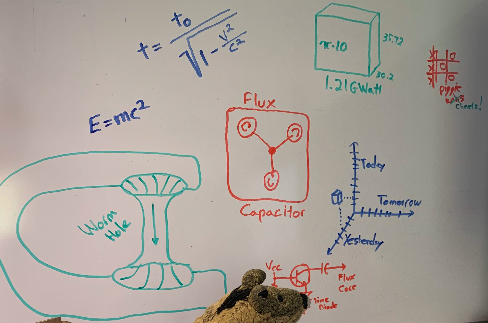

Look at all those wires and electronics! I hope he knows what he is doing.

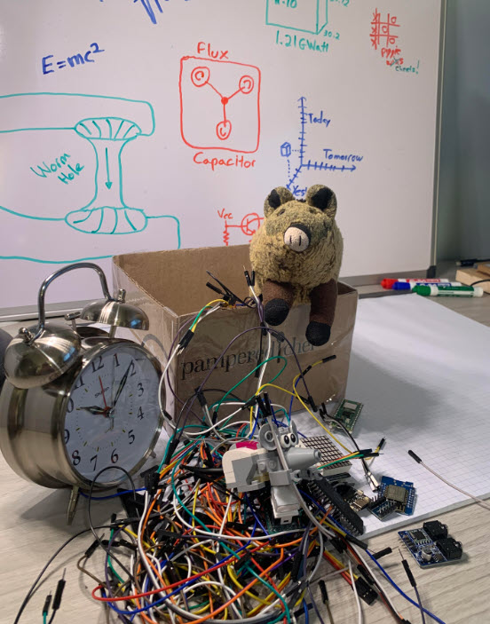

I am making the control panel. I like to keep it simple. Three buttons should be enough: past, present, and future. I already have the "present" button working. I keep pressing it, and here we are in the present!

Nibbles saw all my colorful pens and came over to help. He loves coloring. "Let's take the pens with us," he suggested. "We can have drawing time with the cavemen and compare our techniques. Where is the big, fat, black Sharpie? That's perfect for drawing on a cave wall."

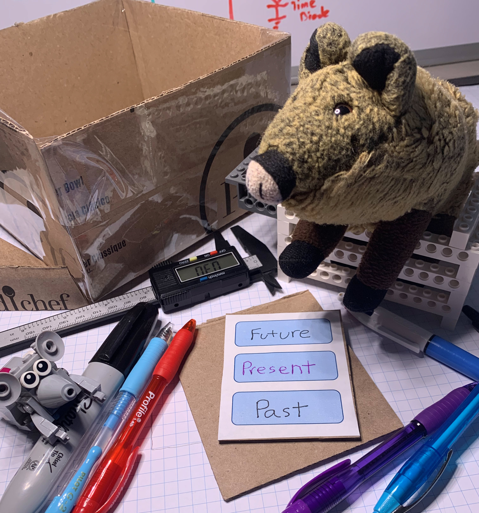

While we were working, there was a bright flash and a loud bang beside us. We turned to see - ourselves - another Piggie and Nibbles in a box about the size of our time machine.

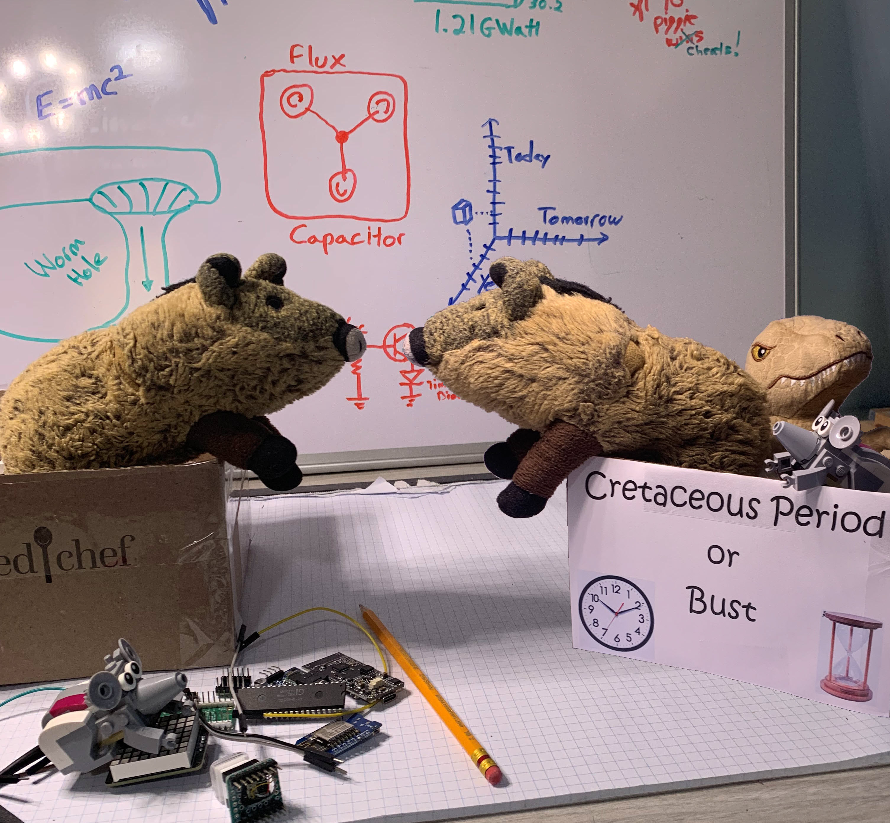

"Piggie," Nibbles whispered, "that is you and me from the future. They are us after we build the time machine!"

Future Piggie spoke to us. "Greeting past us-es! You are about to embark on a most excellent adventure through time. We have stopped here on our way home to give you an important message. Here it is: remember to pack an extra sandwich!"

There was a muffled voice behind Future Piggie from the back of the time machine. Future Piggie turned around and said, "Yes, I'll remind them ... just stay out of sight."

He turned back to us. "And pack an extra juice box!"

Future Nibbles pushed a button on the control panel, and the time machine began to shake. Future Piggie and Future Nibbles spoke in unison, "Catch you later, dudes!". With a flash and a bang, the future us-es were gone.

"Well, Nibbles, I better go to the kitchen and make an extra sandwich."

"I'll stay here and finish the time machine. And don't forget the extra juice box," he called after me.

Later that afternoon, we hauled the finished time machine back to the cave and positioned it in front of the painting. I climbed in nervously.

"Are you sure this is safe?" I asked. "We should have tested it."

"We know it works. Remember, we just saw our future selves using it!"

Nibbles climbed in beside me and pointed his flashlight at the cave painting.

"Here is what we do," he instructed. "I'll hold the light. You keep the PAST button pressed to send us back through time. Keep your eye on the drawing. As soon as it vanishes, let go of the button. That will land us a few years before the painting was made. Then we ease forward in time to the exact moment the cavemen drew it!"

I took a breath and pressed the PAST button. The machine began to shake, and rainbows danced over the rock walls. I was expecting the loud bang, but it still hurt my ears.

I watched the painting, but nothing seemed to be changing around us. Then, I noticed the rocks on the floor were sliding up the gentle slope of the cave floor. Gravity was slowly pulling them down the hill, but I was watching them backwards, in fast motion, a thousand years every second.

A few pebbles fell up from the floor. Then, a big rock that had fallen in front of the painting shot up and lodged in the ceiling above us. I watched it cautiously — afraid it might fall back down on us.

"Now, Piggie!" Nibbles shouted. I looked back at the wall, and the painting was gone. I let go of the button. With a final shake, a deafening bang, and a flash of light, our time machine came to a halt.

"Nibbles, look over here where the painting was — er, will be. The wall is so clean and smooth. No wonder the cavemen chose this spot."

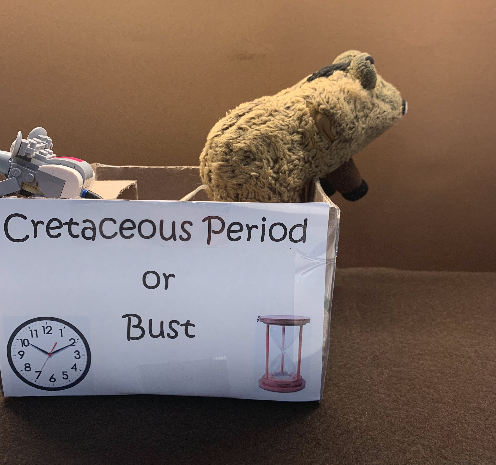

Never mind that!" Nibbles shouted excitedly, "Spider! A giant spider is trying to get me!

"Sure it is!" I kept scanning the wall. "A giant spider. Is it like the ‘big ugly' spider in the bathroom last week? That poor little thing was tee tiny. And it was cute."

"No! I'm serious. This sucker is huge! Get back, you monster! Back, I say! I need a weapon. I'll whack him with this big Sharpie. Oh no, he took it from me!"

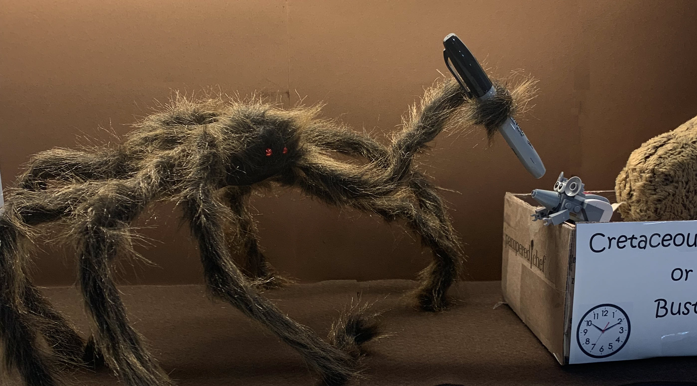

Nibbles punched the FUTURE button, and the time machine lurched forward a few years. "It's gone," he said, "Whew, that was close!"

Nibbles pulsed the FUTURE button repeatedly while we watched the cave wall for the painting to appear. Finally, after a dozen presses, there it was. And beside the painting stood a ferocious Tyrannosaurus Rex holding a black Sharpie!

"Look, Piggie, he's got our Sharpie!"

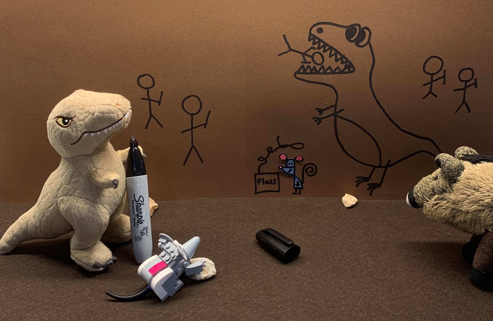

I was reaching for the FUTURE button again for a quick escape when the T-Rex spoke.

"Oh, is this your marker? Herman gave this to me years ago. I've been doodling with it, but this is my first big drawing. What do you think?" He gestured to the painting with one of his short arms.

"YOU drew this?" Nibbles asked.

"Who is Herman?" I asked.

"Herman is the brown spider who lives in the next tunnel over. He's always bringing me little things that he finds — odd-shaped rocks and sticks. Once, he brought me a burnt ember from one of the human's campfires. That's when I first started drawing on the wall. About five years ago, he found this amazing paint stick!"

"He found it, alright! He found it right out of my hands!" Nibbles exclaimed.

"He's only a spider, and he's not very smart. Maybe he thought you were giving it to him? Anyway, you can have it back."

"No, you keep it," Nibbles said. "You might need it to document your next battle — I mean luncheon — with the humans."

"Battle? No, no, no. The humans are my friends! They come over once a month to clean my teeth for me. I have little arms, you know, and it is hard for me to reach my mouth. They bring their toothpicks, which I drew them holding. Ugg, here, takes his work seriously. He climbs in my mouth to get my back molars. In return, I go with them on their gathering parties and shake the fruit from the top of the trees."

Nibbles was happy with this revelation. He hopped down from the time machine and approached the dinosaur. "I like what you've done here with the flat perspective. It reminds me of Caravaggio's early Baroque style. And the consummate V's for teeth — very Trogdorian. Oh, where are my manners? I'm Nibbles. That's Piggie. We are from the future."

"Nice to meet you. I'm Mr. T. The T is for T-Rex." He waved a little hand. "You sure know a lot about drawing!"

"I've done a little scribbling here and there. I brought my pens. Do you mind if I add to your drawing?"

Nibbles carefully selected three markers from our bag. He drew what must be himself and a box of dental floss.

"Nibbles, I don't remember seeing a mouse in this painting in the future!"

"Well, it must have been there. We just missed it." He shrugged. "Anyway, it's there now!"

I grabbed our picnic lunch from the time machine.

"We were just about to have lunch," I told Mr T. "Would you like to join us? We brought extras."

"I would love to. I know a great place to eat. Follow me."

Mr. T led us up a passage, out of the cave, and onto a bright rocky overlook.

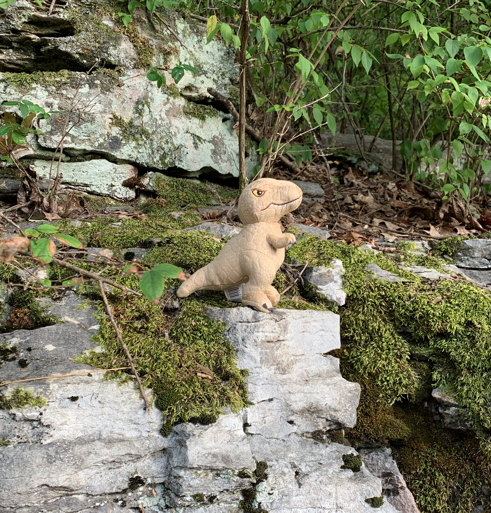

I laid out the sandwiches and juice boxes. Mr. T's little arms fumbled with the juice box. Finally, Nibbles helped him insert the straw.

Mr. T took a bite of his sandwich.

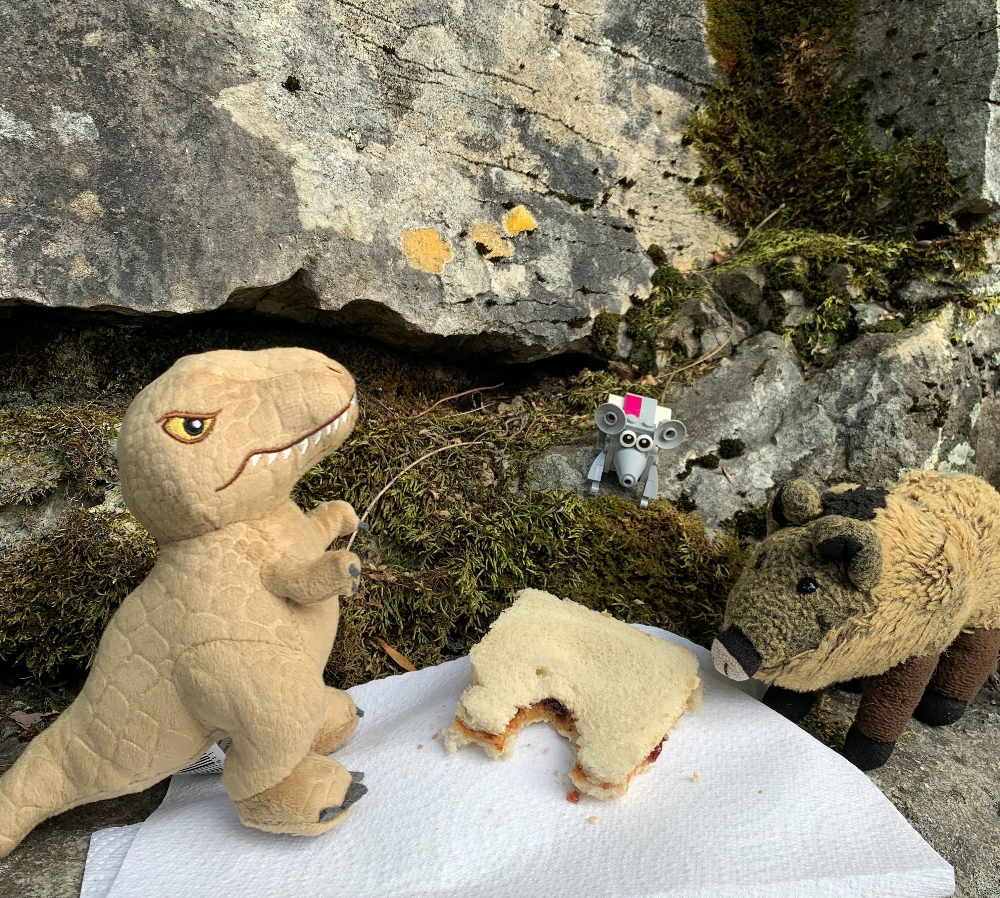

This is delicious," he said with his mouth full of food. "What did you say this is?"

I dabbed the jelly from his cheek with my napkin. "It's a peanut butter and jelly sandwich. These humans are quite clever. In a few thousand years from now, they will invent something called ultra-high-processed foods: butter, jelly, bread — we have a lot of tasty treats in the future."

Mr. T frowned. "We don't have anything good to eat around here. The future sounds great."

I looked at Nibbles. He knew what I was thinking. He smiled and nodded his agreement.

"Why don't you come live with us," I asked, "in the future? We have plenty of room at home and plenty of ultra-high-processed foods."

Nibbles added, "You can join us on our adventures!"

Mr. T gave us a tiny thumbs up. At least, I think it was a thumbs up; he only has three fingers.

We made our way back through the cave to the time machine. We stopped at Mr. T's straw-lined hole in the wall, and he stuffed a few of his belongings into a bag: a hair brush, a flat rock with a painted face, and a tiny pebble of pure silver.

We loaded everything into the time machine and climbed into the box. I reached for the PRESENT button, but Nibbles grabbed my arm.

"Remember," he said, " we must stop on our way home to remind ourselves to pack a lunch for Mr. T."

"But we ... we already remembered ..." I scratched my head and thought about it. Time travel can be confusing.

"OK," I said, "Let me do the talking. Nibbles, you press the buttons. Mr. T, you stay down in the back of the machine. Our past us-es don't know about you yet."

Mr. T crouched down as the time machine hummed to life.

Nibbles released the controls, and we materialized on our desk back home just inches from a pile of parts and wires. Nibbles is a much better time machine pilot than I am. And there we were again: another Piggie and Nibbles from the past.

The past Nibbles whispered to the past Piggie. My Nibbles nudged me to speak, and I tried to remember what I had said to myself before.

"Greeting past us-es! You are about to embark on a most excellent adventure through time."

My Nibbles gave me a thumbs up.

"We have stopped here on our way home to give you an important message. Here it is: remember to pack an extra sandwich!"

Mr. T spoke up from behind me, "Get me a juice box, too, please!"

I turned to him, "Yes, I'll remind them ... just stay out of sight."

"And pack an extra juice box!"

Nibbles pushed a button on the control panel, and the time machine began to shake. Nibbles and I looked at each other and said in unison, "Catch you later, dudes!". With a flash and a bang, we were back in our dusty cave in our own time.

Mr. T examined his drawing and said, "This is in bad shape. It will need some touching up!"

I climbed down to look for the mouse Nibbles had drawn. At some point, thousands of years ago, a rock had fallen from the ceiling in front of his art. Mr T helped me push the rock aside (he's amazingly strong). Sure enough, there was the mouse, faded and dirty from the long ages.

Nibbles led the way from the cave. He chattered excitedly, "We'll stay up all night ... and draw ... and build a pillow fort ... and make popcorn."

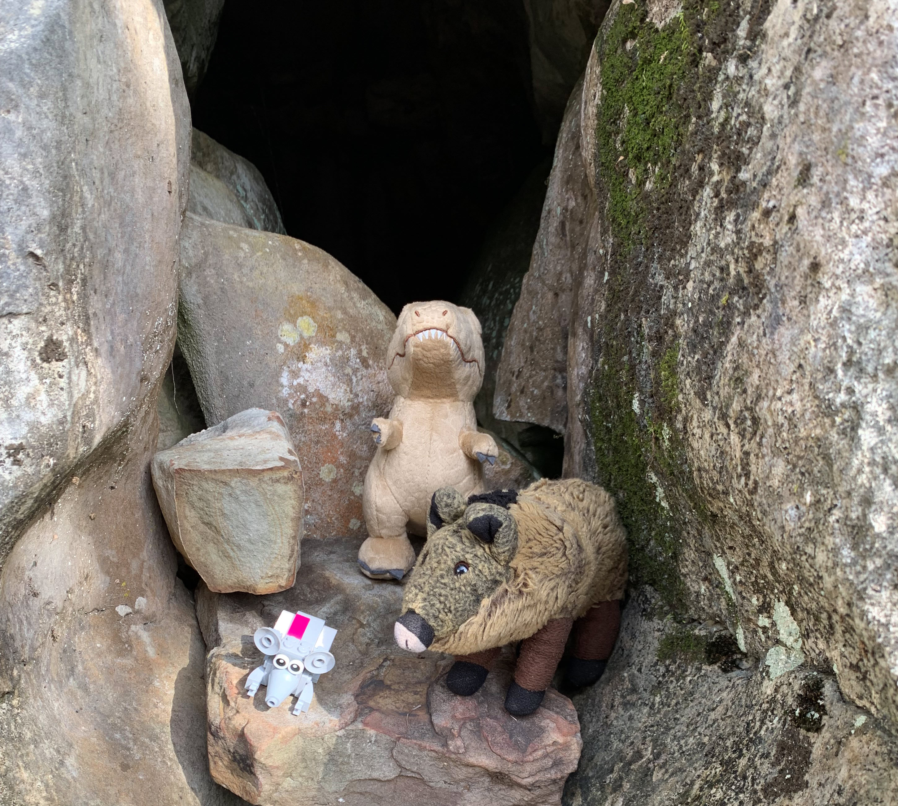

"What's popcorn?" Mr. T asked.

"Heck yeah, popcorn!" Now, I was excited. "Just wait, Mr. T, you will love it."

Nibbles pushed open the back door and shouted, "Mom, we're home! Don't be scared - we brought home a T Rex!"

"What? You're going to clean up after it!"

> Comments

>> Suzy
>> January 19, 2025
What an adventure. I LOVE the cave drawing.
