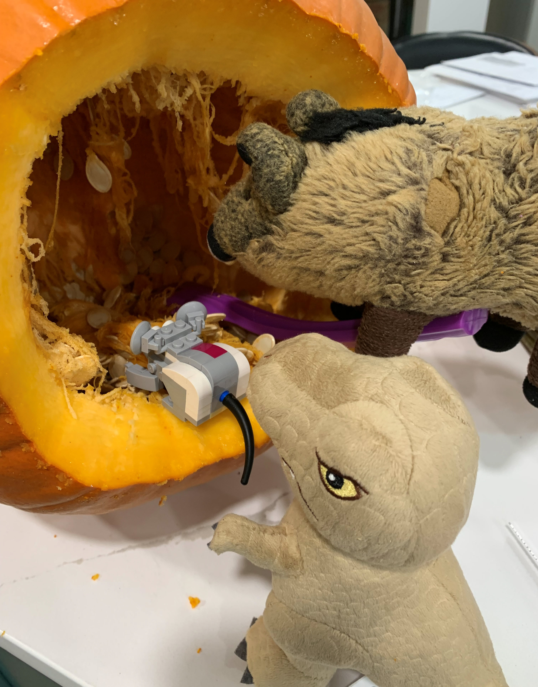
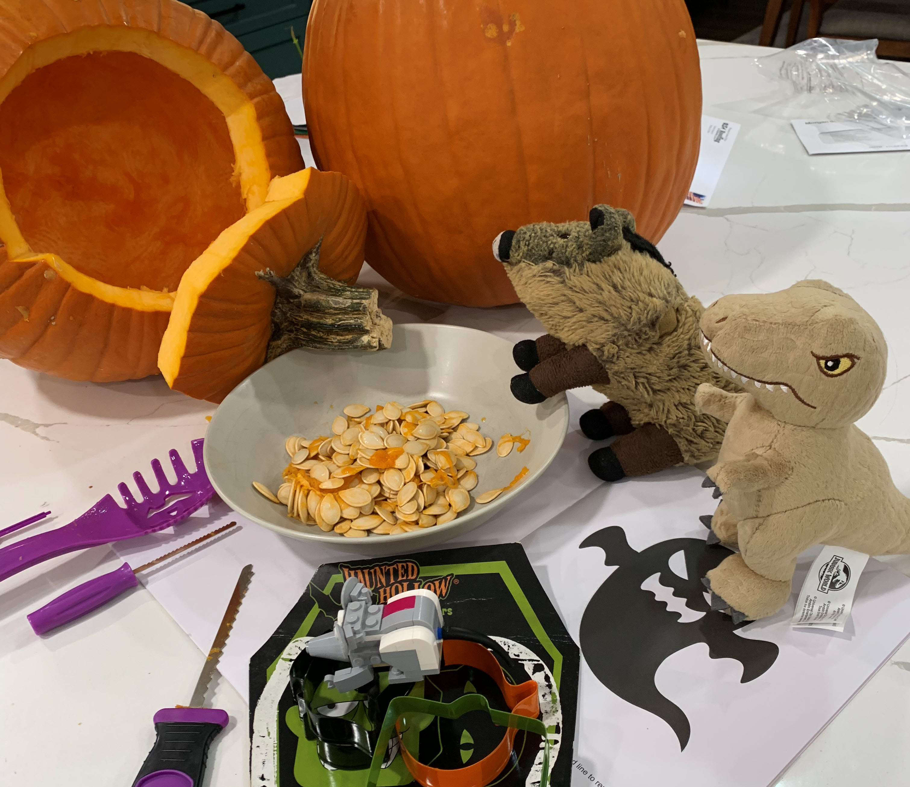
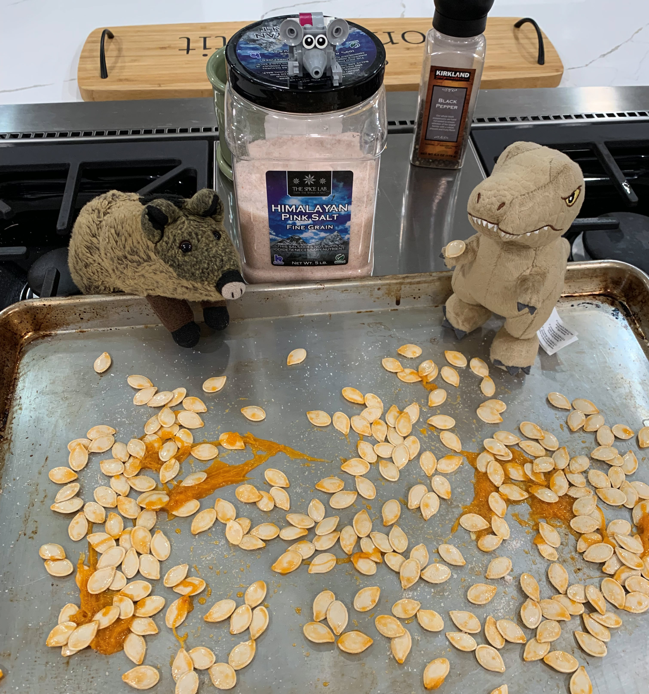
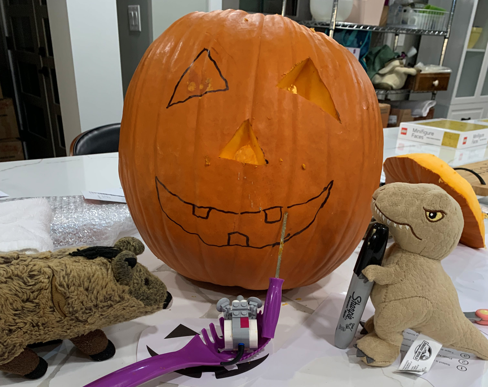
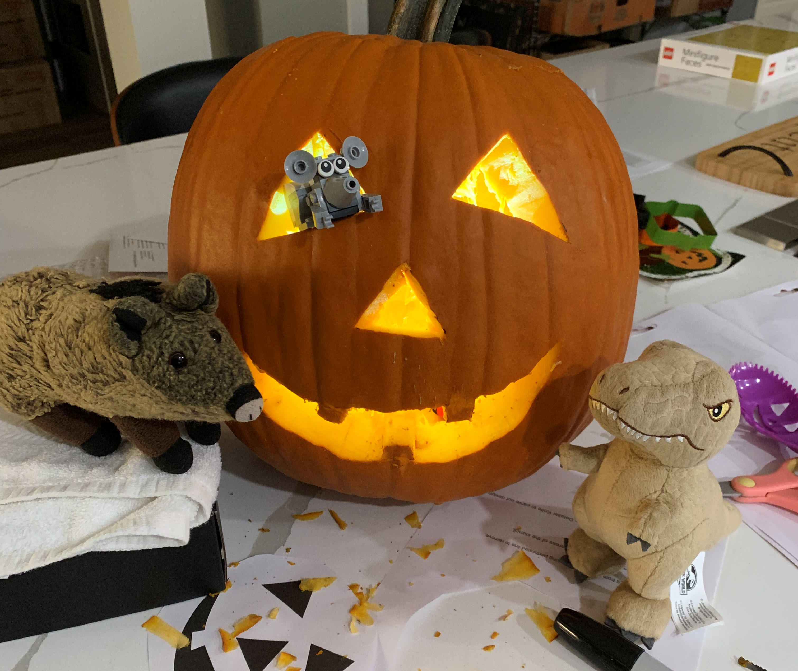
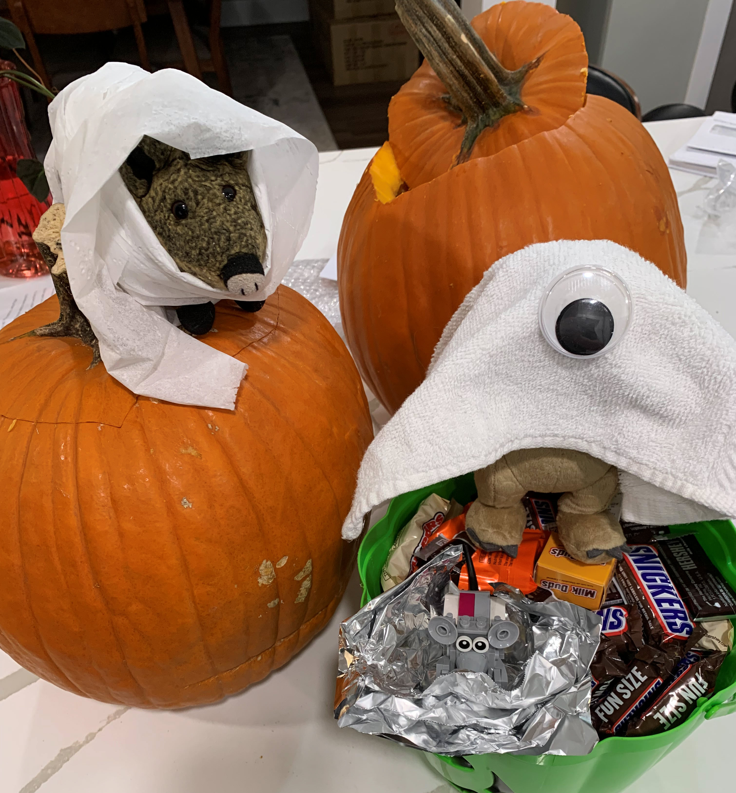
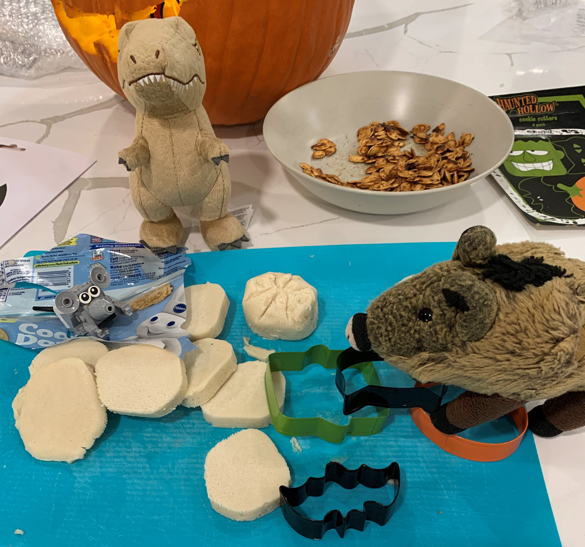
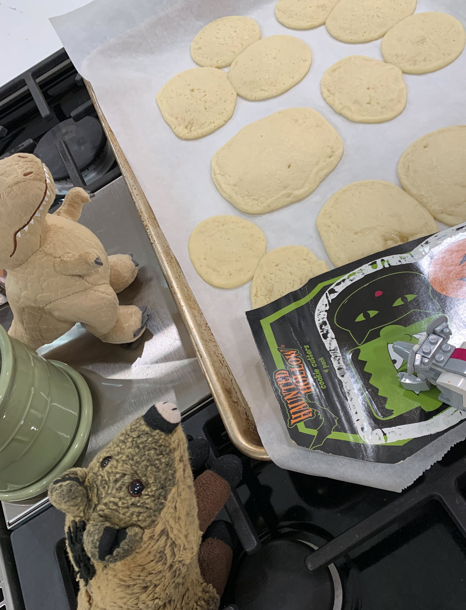
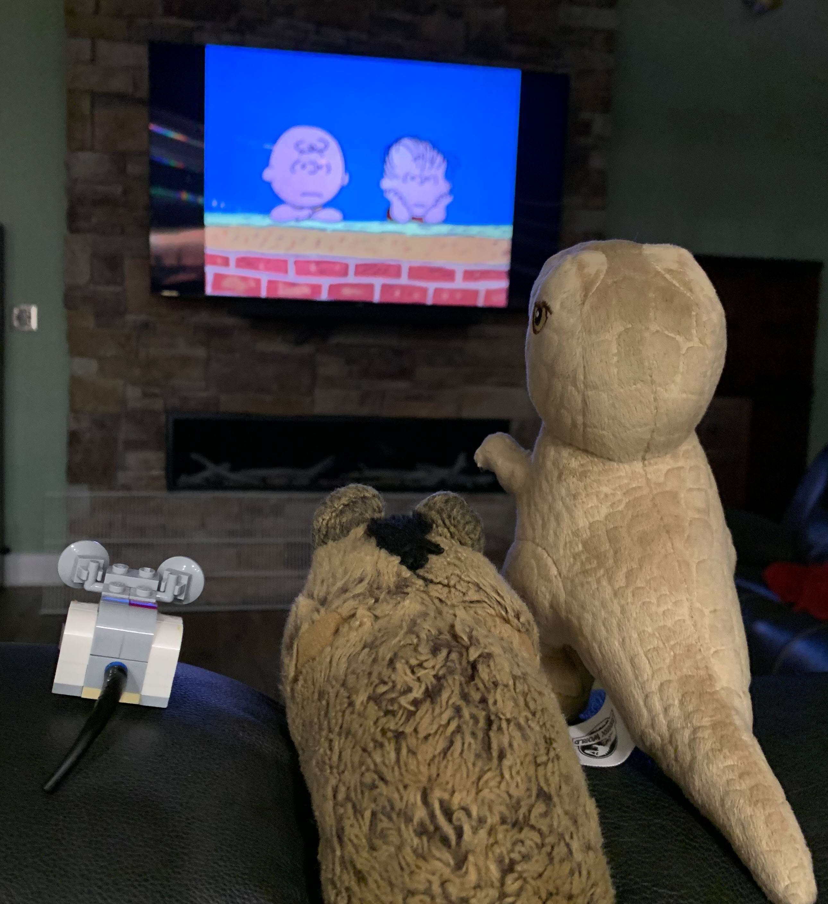

# Halloween
> November 1, 2024
> by Piggie

This is Mr. T's first Halloween with us, so we are pulling out all the stops.

First up is the Jack-o-lantern. We gotta clean out this pumpkin before we carve it. It looks kind of scary and slimy in there. Go ahead, Nibbles. Climb in and show us how to do it!

Excellent teamwork, fellas. We got rid of the pumpkin guts and saved a bowl of seeds. We also gathered our carving tools and a book of patterns.

No, Nibbles, those aren't for the pumpkin - those are cookie cutters. We'll get to those later.

Let's get these seeds into the oven. They can roast while we carve the pumpkin. I like to leave some of the stringy insides on the seeds - they add a tangy flavor. Nibbles insists on the finest Himalayan pink salt for all roasted nuts and seeds. He is our expert on spices.

Now, to carve the pumpkin! Since this is T's first Jack-o-lantern, we'll stick with a simple, smiling face. T really likes the snaggle-toothed face in the pattern book. But the pattern is a little small for our big pumpkin. Let's draw this out the old-fashioned way.

We found an LED headlamp in one of the kitchen drawers. The lighting is perfect. Nice work, guys! It looks great! Next time, we'll use a whiteboard marker instead of a Sharpie. We had a tough time cleaning the uncut black lines.

Costumes, everyone! Let's get ready for trick-or-treating! With the help of half a roll of toilet paper, I'm going as Mummy Piggie. Mr. T went with a classic - the traditional white-sheet ghost. He added a single googly-eye from our crafts drawer. Cyclops Ghost! Very creative!

What are you doing there, Nibbles? He wrapped himself up in aluminum foil; he's going as leftovers.

We went to the neighbor's house across the street. They were scared of us at first, but then they figured out who we were. They gave us sweet tarts and bubblegum.

Now for my favorite part of Halloween - making cookies! You guys grab a cutter, and I'll roll out the dough.

Hmmmm. We must have missed a step in the directions. They don't look like the pictures that came with the cutters. That big blob in the middle is supposed to be a pumpkin - I can kind of see it. Oh well, they smell and taste great!

Come on — let's take our milk and cookies to the couch and watch TV. Yes! It's the Great Pumpkin, Charlie Brown! This is a classic, but Mr. T hasn't seen it. I won't spoil the ending.

> Comments

>> Suzy
>> November 3, 2024
This is the funnest Halloween ever. I wish I could play with you two.

>>> Piggie
>>> November 3, 2024
You are always welcome in our fun!

>> Susan
>> November 3, 2024
It looks like the fellas had a great Halloween! Walter is sad he missed it.
