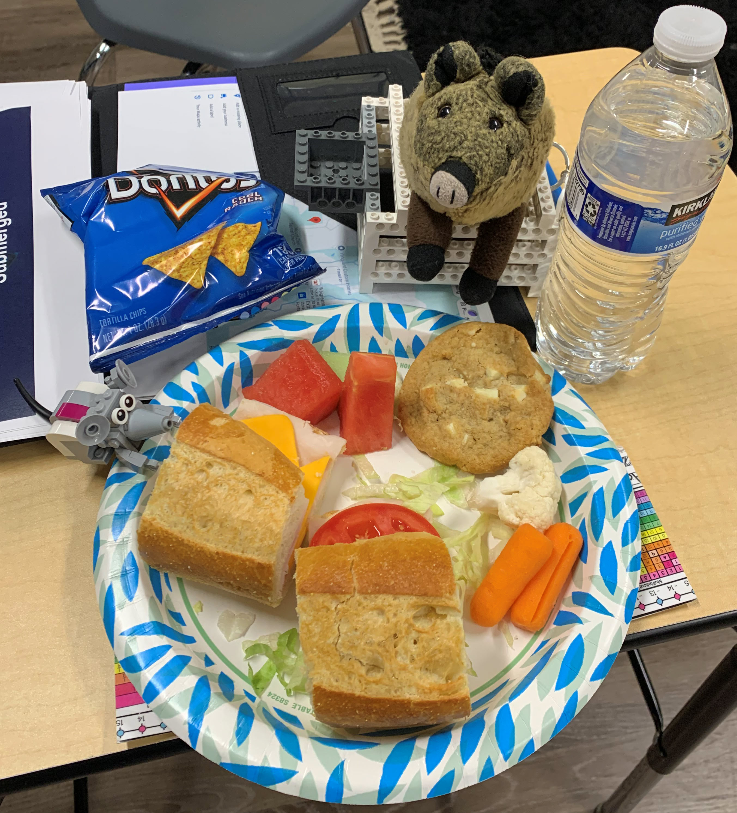

# FIRST Lego Robotics Judging
> November 23, 2024
> by Piggie

Nibbles and I were official judges at the Westminster FIRST Lego League Qualifier! It was a big day that started well before the sun came up.

FIRST Judges like to wear funny hats. We found this flashy hat at Party City! I added seat belts so we wouldn't fall off. Nibbles made an elaborate system of pulleys and ropes that clip onto Chris's ears. We pull one rope to turn left and the other to turn right. We pull both at the same time to stop or start walking. It's pretty ingenious. Excellent work, Nibbles.

We got to the event early to help set up the field. One of the robot's missions is to push a yellow lever to send the tagged shark back to the ocean. I gave it a test push. 20 points for me! Nibbles felt right at home with all the Lego models.

Westminster Christian Academy donated its campus for the event. Nibbles and I had some time before judging to explore the school. Our favorite room was the K4 pre-kindergarten class. We met one of the students hanging on the sign.

Come on, Nibbles; it's time for us to get to work. Here we are in Judging Room B with our co-judges. Each team spent 30 minutes with us, sharing their innovation project and robot design. Nibbles and I asked them about their fun activities throughout the season. Fun is part of the FIRST core values; it just happens to be our specialty.

All the teams were outstanding, but where did the morning go? The scoring is done. Now it's time for lunch! Maybe we'll eat this whole box of chips.

Look, Nibbles, there are sandwiches over there! And seriously, who put the cookies this close to the veggies?

I think we made a tasty plate with lots of good choices. We had soda earlier in the morning, and the caffeine made Nibbles bug-eyed and jittery, so we went with water for lunch. 

The robot matches started after lunch. We watched several matches. Only a few team members are allowed at a table during a match, so the rest of this team watched via live stream on a big TV.

Then, we visited the pits, where teams hang out between matches. They tweak their robots and test them on the practice tables. 

That's where we met this bunch of weirdos. No, we aren't insulting them - that is their team name! I checked out this guy's hat design to get ideas for next year. I do like the goggles.

This kid was happy to visit with us ...

... until I told him that as an official judge, I'd have to confiscate his popcorn.

He told us about the fantastic machine around the corner that cranks out gallons of popcorn. I think he's pulling my leg to keep his snack. But come on, Nibbles, let's investigate.

I think I'm in heaven! It's raining popcorn. I'm going to get in there and take a swim!

It was time for judge deliberations. Nibbles and I took our nine bags of popcorn to the judging room. This is when the judges look at all the scores from the presentations and robot matches and identify the award winners. I wish everyone could win - all the teams were so amazing.

Then, we headed to the gym for the closing ceremony. When we got there, there was a dance party going on! All the kids (and many parents) were out on the floor dancing to tunes played over the PA system.

We joined them for YMCA and a line dance or two. But we got distracted by this giant robot the older kids demonstrated. This robot is from FIRST Tech Challenge, the next step up from Lego Robotics. Nibbles and I are definitely in, err, on!

It was time to hand out the awards. No, Nibbles, I don't see an award for eating the most popcorn.

The judges and volunteers lined up and handed out the awards as the teams were announced. The winners ran down the line, giving everyone high-fives, and collected their trophies at the end.

Whew, what a day! Nibbles and I were exhausted when we finally climbed into bed. I got out the fuzzy blanket for us. Nibbles fluffed up his plush Minecraft bale of hay. Oh, wait! One more thing ...

I dove under the covers and rooted around for a minute. I came back with one of Mom's fuzzy socks to snuggle with. Ahhhhh! Still warm - I took it right off her foot. Good night, Nibbles.

> Comments

>> Suzy
>> November 28, 2024
What a joyful day with happy children.
