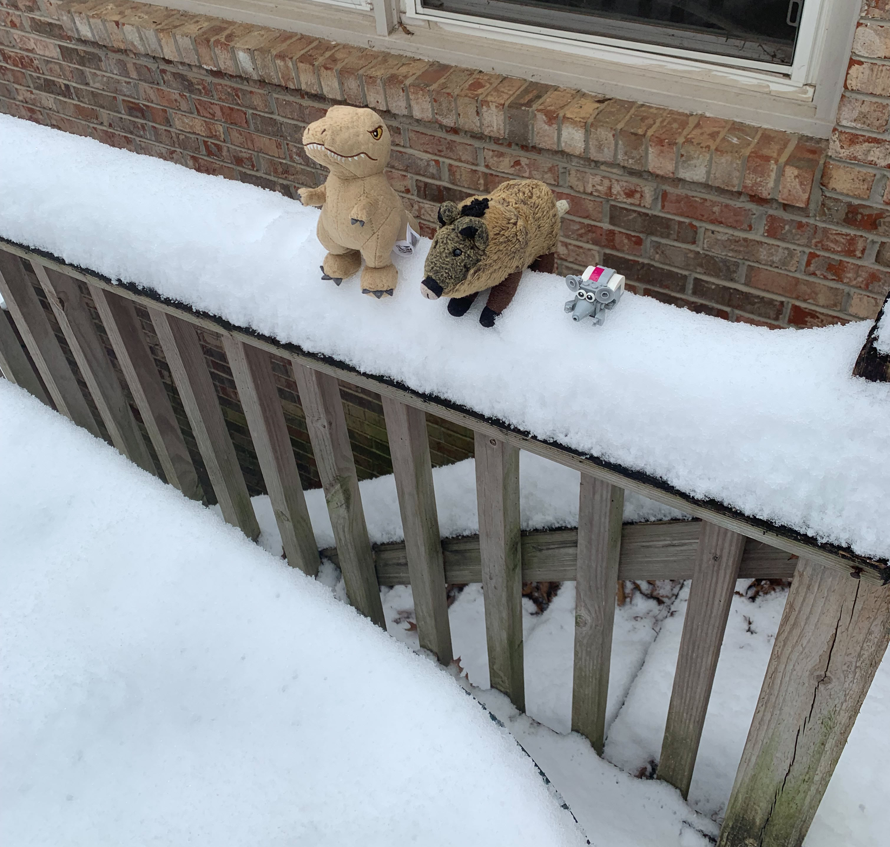
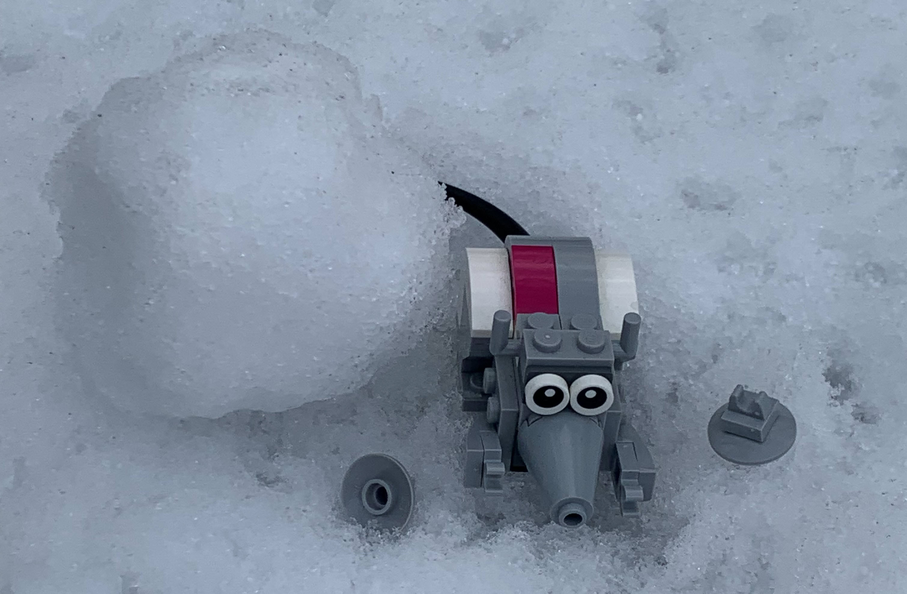

# Snow Day
> January 11, 2025
> by Piggie

It's snowing! We are headed outside to have fun!

There is no need for us to bundle up; we are covered in fur. Well, I am. And Mr. T is, for some reason. Nibbles assures me he is OK.

Let's start by making the traditional snow angel. Face down, Mr. T? That's a bold strategy. Spread those limbs, fellas. Back and forth.

These don't look like what we saw on the internet. Nibbles, did you just thrash around in a circle?

Not a bad snowman, if I say so myself! We used movie magic for the arms, hat, and face. We couldn't find a one-inch top hat around the house, but we'll be ready next time.

Now for some sledding with our friends down the street!

Our friends have professional sleds! We just grabbed a plastic bowl out of the cupboard. Scootch over, Mr. T, I'm falling out.

Step aside, friends! We'll put on a sledding clinic for you!

YES! That was AWESOME! We nailed the landing! Mr. T, help me find Nibbles, and we'll do it again.

Now for my favorite part of snow - eating it! Let me show you how to make my world-famous **Piggie's Snow Shake**.

First, gather some clean snow in a large container. Carefully scoop up just the top layer so you don't get leaves and dirt.

This is an important step. Once you have enough snow in your container, set it aside and make a few snowballs. Toss them at your friends - but not too hard. I accidentally splatted Nibbles' ears off. Sorry about that, buddy. Let me pop those back on for you.

Gather your tools. You'll need a small glass and a spoon.

Gather your ingredients. You'll need milk and vanilla extract. Vanilla "extract"; that's just a fun word to say. "EX-tract". When you ask your mom where to find it, stress that first part and draw it out.

Graham crackers go well with snow cream, but we are all out. I found some graham cracker crumbs mom used for pies over the holidays. I'll sprinkle those over the top for garnish.

Oh yes. Mr. T has a bit of a sweet tooth. You might want a little sugar in your shake.

Fill your glass halfway with milk. Stir in a spoonful (or two) of sugar. Add a couple of drops of vanilla EX-tract for a traditional flavor. You don't need much, and say it again as you stir it into the milk: EX-tract.

Now, stir in the fresh, clean snow to make a milkshake slushie about three-quarters of the way up. Top the glass off with fresh snow - kind of like whipped cream. Grab a couple of graham crackers to eat with it, or crumble your crackers on top of the snow.

Take your spoon and dig in! Delicious!

Nibbles made a couple of snowballs from the leftover snow. I guess he hasn't forgotten about the "ears" event earlier.