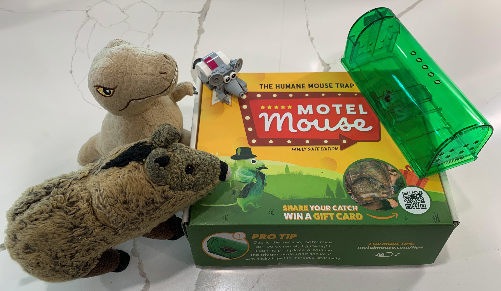
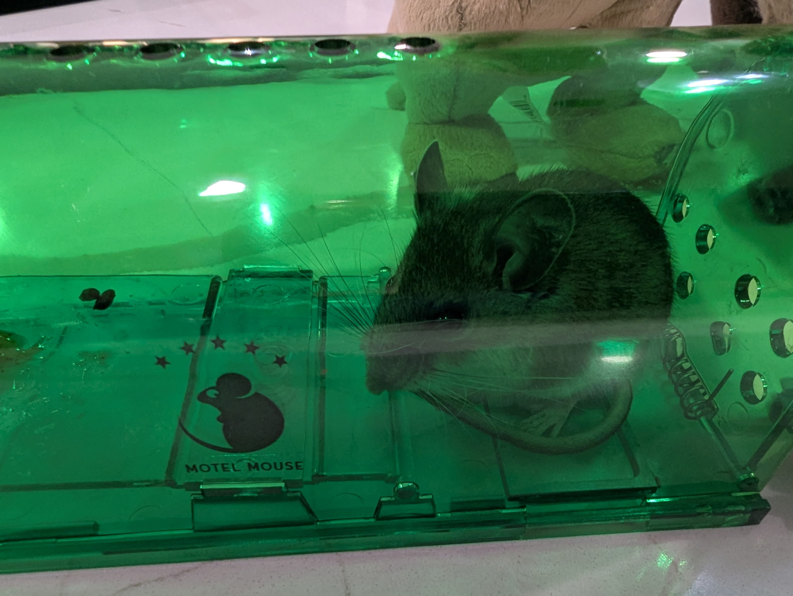
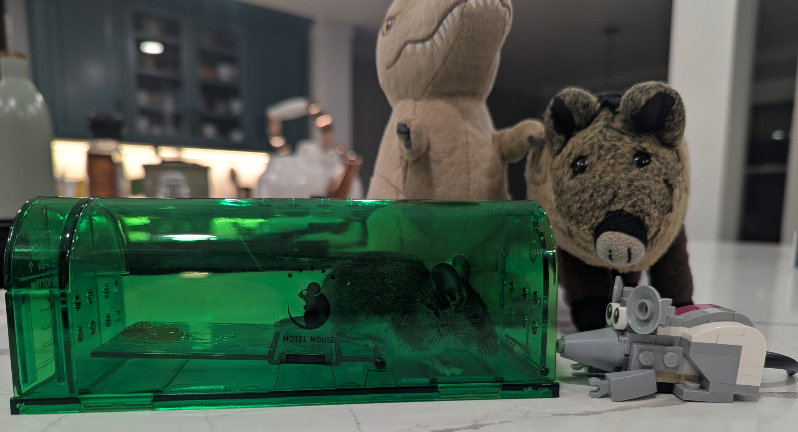
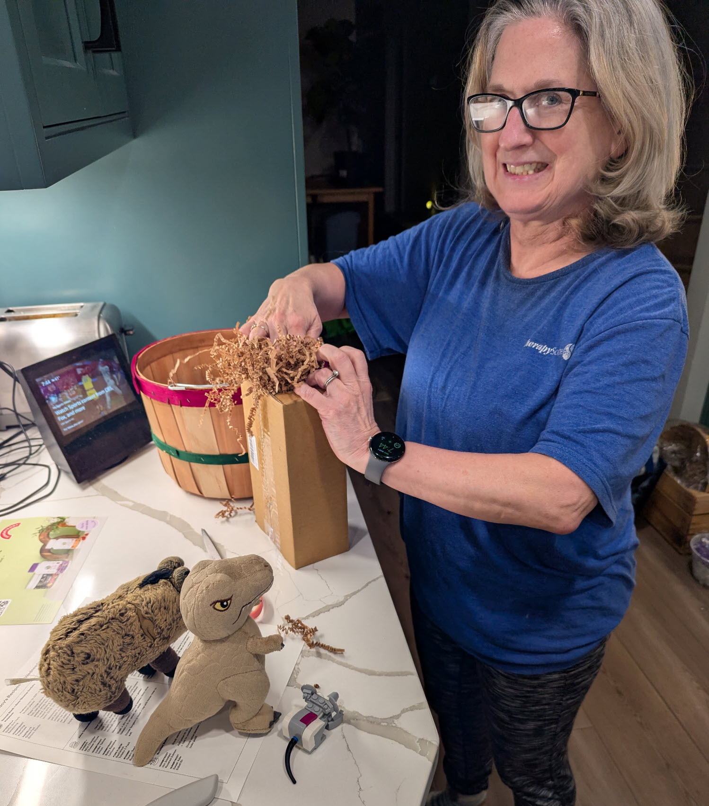

# Of Mice and Piggies
> March 11, 2025
> by Piggie

We have a mouse in the house!

I'm not talking about Nibbles. A cute, tiny, brown house mouse has taken up residence behind a bookshelf in our TV room. He poked his head out one night while we were watching TV.

Mom and Dad pointed and went on and on about how cute he was with the round eyes and big ears. Pfft. They started with the ooos and ahhs, but soon came the screaming and jumping when he ran under the sofa.

The next day, we researched no-harm catch-and-release mousetraps.

"Don't ask me!" Nibbles insisted. "I don't know anything about traps!"

But then he got excited by the five-star Motel Mouse!

A little dab of almond butter was all it took! Within ten minutes, our guest checked into his green-tinted room.

"Nibbles!" I said, "Go over there and talk to him."

Nibbles knocked on the motel door. We heard muffled whispers, with Nibbles mostly listening and agreeing with an occasional "uh huh, yes, uh huh".

Finally, he rejoined Mr. T and me.

"Well," I asked impatiently, "what did he say?"

"He asked if we had a pool and a fitness center. He thinks I'm the bellhop. He ordered room service: the large charcuterie, heavy on the cheese. And our finest bottle of grape Kool-Aid."

I looked at Mr. T, and Mr. T nodded back.

"That sounds great!" I said. "We'll take one too. Hop to it, my man, chop chop!"

Mom insisted our new friend had to go outside. She helped us make him a cozy, warm home in a cardboard box with lots of paper shavings. We prepared a small plate of nuts and berries, which wasn't exactly a charcuterie; probably no tip for Nibbles.

We took the motel (with mouse inside), the food, and the cozy box to the front yard. We waved goodbye to our new friend as he scampered into the trees. He's probably going to tell his friends about our world-class motel. We'll need to get Nibbles a bellhop uniform - and a bell.

> Comments

>> Suzy
>> March 11, 2025
This is one of the best stories ever! These need to be turned into a children's book. (Or a parents' book!)
